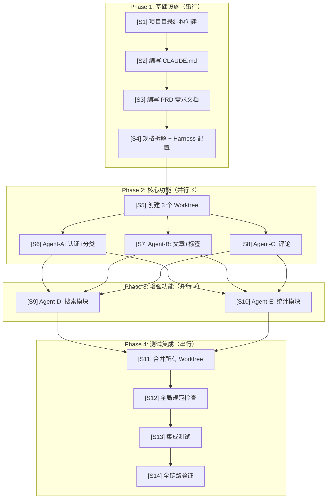

# Harness Engineering 完整指南

> 以 Spring Boot 博客系统为例，从概念到实战，完整演示 AI 工程化全流程。
>
> 来源整合自 Martin Fowler 的 Harness Engineering 文章 + 博客项目实战系列。

---

# 1. 流程总览

## 1.1 这个流程在干什么？

用 AI Agent 开发一个完整的 Spring Boot 博客系统。不是让 AI 随意写代码，而是**先搭建控制环境（Harness），再让 Agent 在约束下编码**。

整个流程分 4 个 Phase、14 个 Step：



## 1.2 各 Phase 做什么？

| Phase | 做什么 | 预估时间 | Harness 投入 | 一句话 |
|-------|--------|---------|-------------|--------|
| Phase 1 | 搭建 Harness 基础设施 | 1~2 小时 | 100% | 建好约束环境，后续只复用 |
| Phase 2 | 多 Agent 并行开发核心功能 | 2~4 小时 | 20% | Agent 在约束下各自编码 |
| Phase 3 | 增量开发增强功能 | 1~2 小时 | 10% | 复用 Phase 1 的 Harness |
| Phase 4 | 合并、测试、验证 | 1~2 小时 | 30% | Feedback 集中生效 |
| **合计** | | **8~10 小时** | | 传统方式估计 3~5 天 |

> Phase 1 投入最大，但后续 Phase 直接复用——这正是 Harness 的价值：**一次搭建，持续收益**。

---

# 2. 核心概念：Harness Engineering

> 来源：[Martin Fowler — Harness Engineering for Coding Agent Users](https://martinfowler.com/articles/harness-engineering.html)
>
> 核心观点：2025 年证明了 AI Agent 能写代码，2026 年发现 **Harness（而非模型）才是最难也最重要的部分**。

## 2.1 核心公式

```
Agent = Model + Harness
```

| 组成 | 说明 | 类比 |
|------|------|------|
| **Model** | 大语言模型本身（Claude、GPT 等） | 发动机 |
| **Harness** | 模型之外的所有控制环境 | 底盘 + 方向盘 + 仪表盘 |

**Harness 分三层：**

```
User Harness（用户层 — 我们要建设的）
├── CLAUDE.md          ← 宪法
├── Specs              ← 合同
├── Prompts            ← 工作手册
├── Hooks              ← 自动质检员
└── Skills             ← 快捷命令
        ↓ 运行在
Builder Harness（构建层 — Claude Code 内置）
├── 系统提示词
├── 代码检索
└── 编排系统
        ↓ 调用
Model（模型核心）
└── Claude / GPT / Gemini
```

## 2.2 User Harness 5 组件

| 组件 | 角色 | 一句话 |
|------|------|--------|
| **CLAUDE.md** | 宪法 | 定义"在这个项目里怎么写代码"，Agent 启动时第一个读 |
| **Specs** | 合同 | 定义"做什么"，Agent 编码的唯一依据 |
| **Prompts** | 工作手册 | 定义"怎么想"——角色 + 规范 + 任务指令 |
| **Hooks** | 自动质检员 | Agent 每次写文件自动检查，过不了就拦住 |
| **Skills** | 快捷命令 | 把重复操作封装成 `/xxx`，一键执行 |

**配合关系：**

```
编码前：CLAUDE.md + Specs + Prompts → 告诉 Agent 规则和目标（Guide）
编码中：Hooks → 自动检查，不合格就拦截（Sensor）
编码后：Skills → 批量检查、测试、同步状态（Sensor）
```

## 2.3 两大控制机制

### Guides（引导）— Feedforward 事前控制

在 Agent 行动之前就约束它，提高第一次就做对的概率。

```
   Guides 生效            Agent 行动            Sensors 检测
       ↓                      ↓                      ↓
  "命名用驼峰"   →   Agent 写代码   →   检查命名是否合规
  "接口用 REST"  →                  →   检查路径是否正确
       ↑                                            ↑
     事前预防                                      事后检测
```

### Sensors（传感器）— Feedback 事后控制

Agent 行动之后检测问题，帮助它自我纠正。Sensor 的报错信息可以是**专门为 LLM 优化的**——包含修复指令。

### 两者缺一不可

| 只有 Feedforward | 只有 Feedback |
|-----------------|--------------|
| Agent 编码了规则但永远不知道规则是否生效 | Agent 反复犯同样的错，每次都要纠正 |
| 好比只有交规没有交警 | 好比只有交警没有交规 |

## 2.4 三种 Harness 类别

| 类别 | 解决什么问题 | AI 编程中的表现 | 对应组件 |
|------|-------------|----------------|---------|
| **Maintainability**（可维护性） | 代码质量 | Agent 写的代码命名混乱、风格不统一、缺测试 | CLAUDE.md 命名规范 + Hooks 自动检查 + check-style Skill |
| **Architecture Fitness**（架构） | 架构跑偏 | Agent 把认证逻辑写在 Controller 里、改了公共模块不通知其他 Agent | CLAUDE.md 包结构 + Worktree 隔离 + on-code-change Hook |
| **Behaviour**（行为正确性） | 功能做错了 | Agent 理解错需求、接口返回格式不一致、边界情况没处理 | PRD + API Spec + DB Schema + impl 规格 + run-tests Skill |

> **建设顺序：** 先 Maintainability（最容易，有现成工具）→ 再 Architecture（中等，需要设计）→ 最后 Behaviour（最难，需要人工参与）。

## 2.5 Steering Loop（转向循环）

Harness 不是一次搭好的，是迭代出来的：

```
        人类发现问题
              ↓
    ┌────────────────────┐
    │  改进 Guides/Sensors │  ← 用 AI 帮你改进 Harness
    └────────┬─────────────┘
             ↓
    ┌────────────────────┐
    │   Agent 再次执行     │
    │   出错概率降低        │
    └────────┬─────────────┘
             ↓
      问题是否重复出现？
       ├── 是 → 继续改进 Harness
       └── 否 → Harness 足够成熟
```

**核心原则：** 问题重复出现（≥2 次）→ 必须改进 Harness 使其不再发生。

---

# 3. Step 1：创建项目目录结构

> **Harness 类型：** Architecture Fitness — 目录结构本身就是架构约束的物理体现

```bash
mkdir -p blog-system && cd blog-system
git init

# === Harness 层目录（控制 Agent 的"操作系统"） ===
mkdir -p specs            # 规格文档：PRD、API、数据库、实现规格
mkdir -p prompts/agents   # Agent 角色定义（"你是谁"）
mkdir -p prompts/shared   # 共享规范片段（"所有人都要遵守"）
mkdir -p prompts/impl     # 任务执行指令（"这次做什么"）

# === Claude Code 配置 ===
mkdir -p .claude/skills   # 可复用 Skill 定义
mkdir -p .claude/hooks    # Hook 脚本

# === 追踪文件 ===
mkdir -p tasks            # 任务进度、阻塞项、测试追踪

# === 代码模块（Maven 多模块） ===
mkdir -p blog-api         # 前台 API 模块（游客 + 博主接口）
mkdir -p blog-admin       # 后台管理模块（管理员接口）
mkdir -p blog-common      # 公共模块（Entity、Utils、统一响应）
```

**完整初始文件结构（含后续步骤将创建的所有文件）：**

```
blog-system/
├── CLAUDE.md                  ← S2 编写 — 整个 Harness 的"宪法"
│
├── specs/                     ← 规格层：定义"做什么"
│   ├── PRD.md                 ← S3 编写
│   ├── api-spec.md            ← S4c 编写
│   ├── db-schema.md           ← S4c 编写
│   └── impl-t04-*.md ~ t11-*.md  ← S4b 生成（8份）
│
├── prompts/                   ← 提示词层：定义 Agent"怎么想"
│   ├── agents/backend.md      ← 角色层（稳定，不常改）
│   ├── shared/naming.md       ← 规范层（跟随 CLAUDE.md 更新）
│   ├── shared/error-handling.md
│   └── impl/t04-*.md ~ t11-*.md  ← 任务层（每个任务一份）
│
├── .claude/                   ← Claude Code 配置
│   ├── settings.json          ← S4e — Hook 配置
│   ├── skills/                ← S4f — 可复用 Skill
│   └── hooks/                 ← S4e — Hook 脚本
│
├── tasks/                     ← 追踪文件
│   ├── TASKS.md               ← 任务看板
│   └── BLOCKERS.md            ← 阻塞项记录
│
├── blog-api/                  ← Maven 模块
├── blog-admin/
├── blog-common/
└── pom.xml
```

**为什么要这样设计目录？**

| 目录 | Harness 角色 | 设计意图 |
|------|-------------|---------|
| `specs/` | Feedforward Guide | Agent 编码前必须读取，确保理解一致 |
| `prompts/agents/` | 角色约束 | 限制 Agent 的职责范围，防止越界 |
| `prompts/shared/` | 规范复用 | DRY 原则——规范只写一次，所有 Agent 引用 |
| `prompts/impl/` | 任务指令 | 每个任务一份，可独立迭代 |
| `.claude/hooks/` | Feedback Sensor | 自动触发，Agent 无法绕过 |
| `.claude/skills/` | 可复用操作 | 把重复工作封装成命令 |
| `tasks/` | 进度追踪 | 人类看一眼就知道项目状态 |

---

# 4. Step 2：编写 CLAUDE.md — Harness 的"宪法"

> **Harness 类型：** Maintainability + Architecture Fitness — **Feedforward Guide (Inferential)**
>
> CLAUDE.md 是整个 Harness 的**核心入口**——所有 Agent 启动时最先读取的文件，定义了"在这个项目里怎么写代码"。

## 4.1 完整 CLAUDE.md

````markdown
# CLAUDE.md

## 项目概述
个人博客系统。技术栈：Spring Boot 3.2 + MySQL 8.0 + Redis 7 + Spring Security 6 + JWT (jjwt 0.12)
构建工具：Maven 3.9，JDK 17，多模块项目

## 命名规范

### Java 类命名
| 层级 | 命名规则 | 示例 |
|------|---------|------|
| Controller | `{Entity}Controller` | `ArticleController` |
| Service 接口 | `{Entity}Service` | `ArticleService` |
| Service 实现 | `{Entity}ServiceImpl` | `ArticleServiceImpl` |
| Mapper | `{Entity}Mapper` | `ArticleMapper` |
| 实体类 | 大驼峰，与表名对应 | `Article`、`ArticleTag` |
| Request DTO | `{Entity}{Action}Request` | `ArticleCreateRequest` |
| Response DTO | `{Entity}{Action}Response` | `ArticleDetailResponse` |
| VO (视图对象) | `{Entity}VO` | `ArticleVO`、`CommentTreeVO` |
| 枚举类 | 大驼峰 + `Enum` 后缀 | `ArticleStatusEnum` |
| 工具类 | `{功能}Utils` | `JwtUtils`、`RedisUtils` |
| 常量类 | `{模块}Constants` | `RedisConstants` |

### 数据库命名
- 表名：小写 + 下划线，单数（`article` 不是 `articles`）
- 关联表：`{表A}_{表B}` 按字母序（`article_tag`）
- 字段名：小写 + 下划线（`created_at`、`author_id`）
- 主键：`id` BIGINT AUTO_INCREMENT
- 必备字段：`created_at` DATETIME、`updated_at` DATETIME、`is_deleted` TINYINT(1) DEFAULT 0

### API 设计
- RESTful：GET/POST/PUT/DELETE `/api/{resources}`
- 统一响应：`{ "code": 200, "message": "ok", "data": {} }`
- 分页参数：`page`（从1开始）+ `size`（默认10，最大100）
- 分页响应：`{ "code": 200, "data": { "records": [...], "total": 100, "page": 1, "size": 10 } }`
- 错误码：业务错误 4xxxx，系统错误 5xxxx

### 包结构
```
com.blog.{module}.{layer}

模块划分（对应 Maven 子模块）：
├── com.blog.common        ← blog-common 模块（Entity、Utils、统一响应）
├── com.blog.api            ← blog-api 模块（前台接口）
│   ├── com.blog.api.article    → controller / service / mapper / entity / dto
│   ├── com.blog.api.category
│   ├── com.blog.api.tag
│   ├── com.blog.api.comment
│   └── com.blog.api.auth
└── com.blog.admin          ← blog-admin 模块（后台接口）
    ├── com.blog.admin.article
    └── com.blog.admin.system
```

## 编码规范

### 必须遵守（违反会被 Hook 拦截）
1. Controller 只做参数校验 + 调用 Service，**不允许包含业务逻辑**
2. Service 层方法必须加 `@Transactional`（读操作用 `@Transactional(readOnly = true)`）
3. 统一异常处理用 `@RestControllerAdvice`，**禁止**在 Controller 中 try-catch
4. 日志用 Lombok `@Slf4j`，**禁止** `System.out.println` 和 `printStackTrace()`
5. Redis key 格式：`blog:{module}:{business}:{id}`，如 `blog:article:view:123`
6. 数据库操作只用 MyBatis XML，**不允许**在 Mapper 接口中用注解写 SQL
7. 日期字段（created_at、updated_at）用 `LocalDateTime`，不用 `Date`

### 建议遵守
- 更新操作使用乐观锁（version 字段）
- 列表查询默认按 `created_at DESC` 排序
- 密码存储使用 BCryptPasswordEncoder
- JSON 序列化：Long 类型 ID 转 String 防止前端精度丢失

### 禁止事项（绝对不允许）
- 在 Controller 中直接操作 Mapper
- SQL 拼接（必须用参数化查询或 MyBatis `#{}` 占位符）
- 在循环中执行数据库操作（用批量方法替代）
- 硬编码配置（必须用 `application.yml` + `@ConfigurationProperties`）

## 模块依赖

```
blog-common  ← 被 blog-api 和 blog-admin 共同依赖
blog-api     ← 前台接口模块
blog-admin   ← 后台管理模块

重要规则：
- blog-common 不依赖任何其他模块
- blog-api 和 blog-admin 不直接互相依赖
- 修改 blog-common → 必须在 tasks/BLOCKERS.md 中记录，通知所有 Agent 重新编译
- 模块间通信通过 API 调用，不通过直接引用
```

## 技术栈细节

### Maven 依赖版本（关键项）
| 依赖 | 版本 | 用途 |
|------|------|------|
| spring-boot-starter-parent | 3.2.x | 父 POM |
| mybatis-spring-boot-starter | 3.0.x | MyBatis |
| mysql-connector-j | 8.0.x | MySQL 驱动 |
| jjwt-api | 0.12.x | JWT |
| spring-boot-starter-data-redis | 3.2.x | Redis |
| springdoc-openapi-starter-webmvc-ui | 2.3.x | API 文档 |
| hutool-all | 5.8.x | 工具库 |

### application.yml 结构
- 公共配置放 `blog-common/src/main/resources/`
- 各模块特有配置放各自 `resources/`
- 敏感信息（密码、密钥）用环境变量 `${ENV_VAR}`

## 测试规范
- 单元测试：JUnit 5 + Mockito，测试 Service 层业务逻辑
- Mapper 测试：@MybatisTest + H2 内存数据库
- Controller 测试：@WebMvcTest + MockMvc
- 命名：`{被测类名}Test`
- 覆盖率目标：Service 层 > 80%，总体 > 60%
````

## 4.2 CLAUDE.md 中各部分的 Harness 分类

| 段落 | Harness 类别 | 作用 | 为什么用 Inferential |
|------|-------------|------|---------------------|
| 命名规范 | Maintainability | 约束命名模式 | 规则需要 AI 理解语义并应用 |
| 包结构 | Architecture Fitness | 约束代码组织 | 需要 AI 判断"这个类应该放哪" |
| 编码规范（必须） | Maintainability | 硬性约束 | Hook 负责 Computational 检查，CLAUDE.md 负责 Inferential 引导 |
| 编码规范（禁止） | Maintainability | 红线 | 防止 AI 走捷径（如直接用 Mapper） |
| 模块依赖 | Architecture Fitness | 架构边界 | 定义模块间的允许/禁止依赖方向 |
| API 设计 | Behaviour | 行为约束 | 定义接口长什么样 |

---

# 5. Step 3：编写 PRD 需求文档

> **Harness 类型：** Behaviour — **Feedforward Guide (Inferential)**
>
> PRD 是所有后续规格的**源头**——任务拆解、实现规格、测试用例都从 PRD 衍生。
> 写 PRD 时要有意识：**这份文档是给 AI Agent 看的**，不是给产品经理看的。

## 5.1 完整 PRD

````markdown
# 博客系统 PRD v1.0

## 1. 项目背景与目标
个人技术博客系统，用于发布技术文章、管理分类标签、与读者互动。
**目标：** 支持 500+ 文章、日均 1000 PV、管理后台一站式操作。

## 2. 用户角色与权限矩阵

| 操作 | 游客 | 博主 | 管理员 |
|------|------|------|--------|
| 浏览文章列表/详情 | ✅ | ✅ | ✅ |
| 全文搜索文章 | ✅ | ✅ | ✅ |
| 发表评论 | ✅ (需审核) | ✅ (免审核) | ✅ |
| 删除自己的评论 | ❌ | ✅ | ✅ |
| 登录后台 | ❌ | ✅ | ✅ |
| 文章 CRUD | ❌ | ✅ | ✅ |
| 分类/标签管理 | ❌ | ✅ | ✅ |
| 评论审核（通过/拒绝） | ❌ | ✅ | ✅ |
| 查看统计数据 | ❌ | ✅ | ✅ |
| 用户管理 | ❌ | ❌ | ✅ |
| 系统配置 | ❌ | ❌ | ✅ |

## 3. 功能模块详情

### 3.1 文章模块（P0 核心）

**前端需求：**
- 文章列表页：封面图 + 标题 + 摘要(200字截断) + 分类 + 标签 + 发布时间 + 阅读量
- 文章详情页：标题 + 分类 + 标签 + 发布时间 + 更新时间 + Markdown 渲染正文 + 上一篇/下一篇
- 文章列表支持按分类/标签/关键词筛选
- 分页加载，每页 10 条，按发布时间倒序

**后台需求：**
- 文章列表：表格形式，支持按标题/分类/状态/日期范围搜索
- 文章编辑器：Markdown 编辑器，支持实时预览
- 状态管理：草稿 / 已发布 / 已归档
- 支持定时发布（指定发布时间）
- 文章置顶功能

**数据字段：**
```
article 表：
id, title(标题, 最长200), slug(URL友好名, 唯一),
content(Markdown原文), html_content(渲染后HTML),
summary(摘要, 最长500), cover_image(封面图URL),
category_id(分类ID), author_id(作者ID),
status(状态: DRAFT/PUBLISHED/ARCHIVED),
is_top(是否置顶), view_count(浏览量),
published_at(发布时间), created_at, updated_at, is_deleted
```

### 3.2 分类模块（P0）

- 分类是**树形结构**，支持一级分类 + 二级分类（parent_id 自关联）
- 每个分类有 name + slug(唯一) + sort_order(排序)
- 一篇文章只属于一个分类
- 删除分类前检查是否有关联文章

### 3.3 标签模块（P0）

- 标签是**扁平结构**，无层级
- 每个标签有 name + slug(唯一)
- 一篇文章可以有多个标签（多对多，关联表 article_tag）
- 标签有使用次数统计（use_count）

### 3.4 评论模块（P1）

- 游客填写昵称 + 邮箱 + 网址(可选) 即可评论
- 博主登录后评论自动用博主身份
- **支持回复**：可以回复文章（一级评论），也可以回复其他评论（二级评论，最多两级）
- 评论列表：按时间正序，树形展示（一级评论 + 其下的回复）
- **审核机制**：游客评论默认状态 `PENDING`，博主审核后 `APPROVED`/`REJECTED`
- 博主可删除任何评论（软删除）

### 3.5 用户认证模块（P0）

- 博主登录：用户名 + 密码 → JWT Token（access + refresh）
- access_token 有效期 2 小时，refresh_token 有效期 7 天
- Token 刷新接口：用 refresh_token 换新的 access_token
- 接口权限：
  - 公开接口（无需登录）：文章列表/详情、分类/标签列表、评论列表、搜索
  - 需登录：文章增删改、分类/标签管理、评论审核、统计
  - 需管理员：用户管理、系统配置

### 3.6 搜索模块（P1）

- 全文检索（标题 + 内容），返回高亮片段
- 支持按分类/标签/时间范围筛选
- 搜索结果按相关度排序
- 搜索历史记录（存 Redis，最近 10 条）

### 3.7 统计模块（P2）

- 文章浏览量：每次访问详情页 +1，Redis 计数，定时（每 5 分钟）批量落库
- 热门文章：按浏览量排名 TOP 10（近 7 天 + 全部）
- 标签统计：每个标签下的文章数
- 仪表盘：总文章数、总评论数、今日访问量、待审核评论数

## 4. 非功能需求（NFR）

| 维度 | 要求 | 衡量方式 |
|------|------|---------|
| 响应时间 | 列表接口 < 200ms，详情接口 < 150ms | JMeter 压测 |
| 并发 | 峰值 100 QPS | 压测 |
| 缓存命中率 | > 80% | Redis INFO stats |
| 可用性 | 99.5% | 监控 |
| 安全 | XSS 防护、CSRF 防护、SQL 注入防护 | 安全扫描 |

## 5. ER 关系概要

```
User (博主/管理员)
 ├── 1:N → Article (一个用户发布多篇文章)
 │          ├── N:1 → Category (一篇文章属于一个分类)
 │          └── N:N → Tag (一篇文章有多个标签，一个标签下有多篇文章)
 ├── 1:N → Comment (一个用户可以发表多条评论)
 │          └── N:1 → Article (一条评论属于一篇文章)
 │          └── 1:N → Comment (一条评论可以有多个回复，自关联 parent_id)
 │
Category
 └── 1:N → Category (分类自关联，parent_id 实现层级)
```
````

## 5.2 PRD 与 Harness 的关系

```
PRD 中的每一部分 → 后续生成什么：

PRD §3.1 文章模块
  ├── specs/api-spec.md §1 文章接口
  ├── specs/db-schema.md article 表
  ├── specs/impl-t07-article.md 实现规格
  └── prompts/impl/t07-article.md 执行指令

PRD §3.5 认证模块
  ├── specs/api-spec.md §5 认证接口
  ├── specs/db-schema.md user 表
  ├── specs/impl-t04-auth.md 实现规格
  └── prompts/impl/t04-auth.md 执行指令

...以此类推
```

> **关键原则：** PRD 中的每一句话，都应该能在后续的 specs/ 或 prompts/ 中找到对应。如果 PRD 里写了但后续没有，那就会漏掉——Agent 不会主动补全需求。

---

# 6. Step 4：规格拆解 + Harness 基础设施配置

> **本步是整个流程中最核心的 Harness 搭建步骤**，涉及 6 个子步骤（4a~4f）。
> 做完这一步，后续的编码工作就是"拿着规格执行"——Agent 不需要猜测任何东西。

## 6.0 Step 4 全景：6 个子步骤在做什么？

> **用工厂的比喻理解：** 你开了一家汽车工厂，Step 4 就是在**造生产线之前，先把图纸、操作手册、质检规则、报警装置全部装好**。之后工人（Agent）来了直接干活。

| 子步骤 | 一句话说明 | 工厂比喻 | 产出文件 |
|--------|-----------|---------|---------|
| **4a** 拆任务 | 把大需求拆成小任务卡片 | 项目经理排甘特图 | `tasks/TASKS.md` |
| **4b** 写实现规格 | 每个任务写清楚"要写哪些文件、什么方法签名" | 给工人的零件清单 | `specs/impl-t{xx}.md`（8份） |
| **4c** 写 API + DB 契约 | 所有接口和表结构的"宪法" | 建筑蓝图，所有人必须照着来 | `specs/api-spec.md` + `specs/db-schema.md` |
| **4d** 写提示词 | 给 Agent 的角色、规范、执行指令 | 员工手册 + SOP | `prompts/` 目录下三类文件 |
| **4e** 配 Hooks | Agent 每次保存文件自动触发检查 | 流水线上的自动质检机 | `.claude/settings.json` + `.claude/hooks/*.sh` |
| **4f** 写 Skills | 封装常用操作为可复用命令 | 工具箱里的专用工具 | `.claude/skills/*.md` |

---

## 6.1 4a. 用 split-task Skill 拆解任务 → Architecture Feedforward

> **做什么？** 把 PRD（产品需求文档）拆成一张**任务看板**。
>
> **为什么需要？** 一个"博客系统"太大了，AI 一次做不完。必须拆成小任务，标注谁做、先后顺序、哪些可以同时做。

**`.claude/skills/split-task.md` 的内容：**

```markdown
---
name: split-task
description: 将 PRD 拆解成可并行的子任务
---
读取 specs/PRD.md。按模块依赖关系拆分任务到 tasks/TASKS.md。
规则：
1. 按 Phase 组织：基础依赖 → 核心功能 → 增强功能 → 测试
2. 标注每个任务：编号、名称、负责Agent、优先级、依赖关系、可并行性
3. 依赖关系必须精确到"T04 → T07"粒度
4. 可并行的任务放在同一 Phase 并列标注 ⚡
5. 输出完整的 TASKS.md
```

**执行：**

```bash
claude "/split-task"
```

**生成结果 `tasks/TASKS.md`：**

```markdown
# 任务看板

> 自动生成于 S4，每次 Agent 完成任务后更新勾选状态

## Phase 1：基础设施（串行，约 0.5h）
- [ ] T01: Maven 多模块初始化（父 POM + blog-common）
  - 交付物：pom.xml、Application.java、基础配置
- [ ] T02: 数据库 DDL + 初始数据
  - 交付物：schema.sql、data.sql
- [ ] T03: 统一响应/异常框架 + 基础工具类
  - 交付物：Result.java、GlobalExceptionHandler.java、JwtUtils.java
  - 位置：blog-common 模块

## Phase 2：核心功能（并行 ⚡，约 2~4h）
- [ ] T04: 用户认证模块 → Agent-A
  - 依赖：T03 / 规格：specs/impl-t04-auth.md / 包：com.blog.api.auth
- [ ] T05: 分类管理模块 → Agent-A
  - 依赖：T03 / 规格：specs/impl-t05-category.md / 包：com.blog.api.category
- [ ] T06: 标签管理模块 → Agent-B
  - 依赖：T03 / 规格：specs/impl-t06-tag.md / 包：com.blog.api.tag
- [ ] T07: 文章管理模块 → Agent-B
  - 依赖：T04, T05, T06 / 规格：specs/impl-t07-article.md / 包：com.blog.api.article
- [ ] T08: 评论模块 → Agent-C
  - 依赖：T07, T04 / 规格：specs/impl-t08-comment.md / 包：com.blog.api.comment

## Phase 3：增强功能（并行 ⚡，约 1~2h）
- [ ] T09: 全文搜索 → Agent-D
  - 依赖：T07 / 规格：specs/impl-t09-search.md
- [ ] T10: 浏览量统计 → Agent-E
  - 依赖：T07 / 规格：specs/impl-t10-statistics.md
- [ ] T11: 热门文章/标签统计 → Agent-E
  - 依赖：T10 / 规格：specs/impl-t11-hot-rank.md

## Phase 4：测试 + 集成（串行，约 1~2h）
- [ ] T12: 全局规范检查
- [ ] T13: 集成测试（全链路）
- [ ] T14: API 全链路验证

## 依赖关系图
```
T01 → T02 → T03
              ↓
     ┌────────┼──────────┐
     ↓        ↓          ↓
    T04     T05/T06     (认证/分类/标签分别独立)
     └────────┼──────────┘
              ↓
          T07 (文章)
              ↓
     ┌────────┼──────────┐
     ↓        ↓          ↓
    T08      T09        T10
   (评论)   (搜索)     (统计)     ← 三个可并行
                        ↓
                    T11 (排行)
```
```

**拆解的关键决策（人类要做）：**

| 决策 | 选项 | 本项目选择 | 原因 |
|------|------|-----------|------|
| T04+T05 给同一个 Agent？ | 分开 / 合并 | 合并给 Agent-A | 认证和分类都简单，一个 Agent 能搞定 |
| T06+T07 放一起？ | 分开 / 合并 | 合并给 Agent-B | 标签是文章的属性，一起做上下文更完整 |
| Phase 3 用新 Agent？ | 复用 / 新的 | 新 Agent-D/E | 任务性质不同（搜索/统计） |

> **拆解三大原则：**
> 1. **依赖多的模块尽早做** — T04（认证）是基础，T07 和 T08 都依赖它
> 2. **能并行的不要串行** — T04、T05、T06 之间没有依赖，可以同时开工
> 3. **一个 Agent 最多负责 2 个任务** — AI 的上下文窗口有限，任务太多会"遗忘"

---

## 6.2 4b. 用 create-spec Skill 生成详细实现规格 → Behaviour Feedforward

> **做什么？** 对每个任务，生成一份详细规格文件，把文件清单、方法签名、业务逻辑全部定死。
>
> **怎么理解？** 就像盖楼——任务名是"盖卫生间"，规格文件是"卫生间有几个水管、电线走哪里、瓷砖贴什么颜色"的详细图纸。

**`.claude/skills/create-spec.md` 的内容：**

```markdown
---
name: create-spec
description: 根据 PRD 生成指定模块的详细实现规格
---
读取：
- specs/PRD.md（需求来源）
- specs/api-spec.md（接口契约）—— 如果已存在
- specs/db-schema.md（数据库契约）—— 如果已存在
- CLAUDE.md（命名和编码规范）

为指定任务（如 T04）生成 specs/impl-t{xx}.md，包含：
1. 涉及文件清单（每个 Java 类的完整路径）
2. 核心方法签名（Service 接口和 Controller 端点）
3. 业务逻辑要点（校验规则、边界条件、异常情况）
4. 依赖接口列表（需要其他模块提供什么）
5. 测试清单（正常流 + 异常流 + 边界值）

所有命名必须符合 CLAUDE.md 规范。
```

**执行：**

```bash
claude "/create-spec T04 用户认证模块"
claude "/create-spec T05 分类管理模块"
claude "/create-spec T06 标签管理模块"
claude "/create-spec T07 文章管理模块"
claude "/create-spec T08 评论模块"
claude "/create-spec T09 搜索模块"
claude "/create-spec T10 浏览量统计模块"
claude "/create-spec T11 热门排行模块"
```

**以 T04 为例，生成结果 `specs/impl-t04-auth.md`：**

```markdown
# T04: 用户认证模块 — 实现规格

## 1. 涉及文件清单

| 文件路径 | 类型 | 说明 |
|---------|------|------|
| blog-common/.../entity/User.java | Entity | 用户实体 |
| blog-api/.../auth/mapper/UserMapper.java | Mapper | 用户数据访问 |
| blog-api/.../resources/mapper/UserMapper.xml | XML | MyBatis SQL |
| blog-common/.../utils/JwtUtils.java | Utils | JWT 生成/验证 |
| blog-api/.../auth/service/AuthService.java | Interface | 认证服务接口 |
| blog-api/.../auth/service/impl/AuthServiceImpl.java | Impl | 认证服务实现 |
| blog-api/.../auth/controller/AuthController.java | Controller | 认证接口 |
| blog-api/.../auth/dto/LoginRequest.java | DTO | 登录请求 |
| blog-api/.../auth/dto/LoginResponse.java | DTO | 登录响应（含 Token） |
| blog-api/.../auth/dto/RefreshTokenRequest.java | DTO | 刷新 Token 请求 |
| blog-api/.../config/SecurityConfig.java | Config | Spring Security 配置 |
| blog-api/.../config/JwtAuthFilter.java | Filter | JWT 校验过滤器 |
| blog-api/.../test/.../auth/service/AuthServiceTest.java | Test | 单元测试 |
| blog-api/.../test/.../auth/controller/AuthControllerTest.java | Test | 单元测试 |

## 2. 核心方法签名

### AuthService
```java
public interface AuthService {
    LoginResponse login(LoginRequest request);
    LoginResponse refreshToken(RefreshTokenRequest request);
    void logout(Long userId);
}
```

### AuthController
```java
@RestController
@RequestMapping("/api/auth")
public class AuthController {
    @PostMapping("/login")
    Result<LoginResponse> login(@Valid @RequestBody LoginRequest request);

    @PostMapping("/refresh")
    Result<LoginResponse> refreshToken(@Valid @RequestBody RefreshTokenRequest request);

    @PostMapping("/logout")
    @PreAuthorize("isAuthenticated()")
    Result<Void> logout();
}
```

## 3. 业务逻辑要点

### 登录
1. 参数校验：用户名和密码非空
2. 查询用户：UserMapper.selectByUsername(username)
3. 用户不存在 → 抛出 AuthException("用户名或密码错误")
   （**不区分"用户不存在"和"密码错误"，防止撞库**）
4. BCryptPasswordEncoder.matches(明文密码, 数据库密文) → 不匹配抛异常
5. JwtUtils.generate(userId, username) → 生成 access_token(2h) + refresh_token(7d)
6. 将 userId 存入 SecurityContext
7. 返回 LoginResponse(accessToken, refreshToken, expiresIn)

### Token 刷新
1. 验证 refresh_token 有效性（签名 + 过期时间）
2. 检查 refresh_token 是否在黑名单中（Redis: `blog:auth:blacklist:{token}`）
3. 生成新的 access_token + refresh_token
4. 将旧的 refresh_token 加入黑名单

## 4. 异常定义
| 异常类 | HTTP 状态码 | 错误码 | 触发条件 |
|--------|-----------|--------|---------|
| AuthException | 401 | 40100 | 用户名或密码错误 |
| TokenExpiredException | 401 | 40101 | access_token 过期 |
| TokenInvalidException | 401 | 40102 | Token 签名无效/被篡改 |
| TokenBlacklistedException | 401 | 40103 | Token 已被加入黑名单 |

## 5. 依赖接口
- 无上游依赖（T04 是基础模块）
- 提供给下游：SecurityContextHolder 中可获取当前登录用户 userId

## 6. 测试清单
- [ ] login_成功_返回Token对
- [ ] login_用户名错误_返回401
- [ ] login_密码错误_返回401
- [ ] login_空参数_返回参数校验失败
- [ ] refreshToken_有效Token_返回新Token对
- [ ] refreshToken_过期Token_返回401
- [ ] refreshToken_被黑名单Token_返回401
- [ ] logout_清除Token
- [ ] 未认证访问受保护接口_返回401
- [ ] 认证后访问受保护接口_正常返回
```

> **规格文件的核心价值：** Agent 拿到这份规格后，**不需要做任何设计决策**——写几个文件、每个文件叫什么名字、方法签名是什么、业务逻辑的每一步、异常怎么处理、测试用例的名字，全部定死了。

---

## 6.3 4c. 编写 API + DB 规格 → Behaviour Feedforward

> **做什么？** 定义**所有模块必须遵守的契约**。多个 Agent 并行开发时，这是防止"合并地狱"的关键。
>
> **怎么理解？** 这是整个项目的"宪法"。4b 的实现规格是每个 Agent 的"工作图纸"，而 4c 是所有 Agent 共同遵守的"总则"。

### specs/api-spec.md（接口契约）

```markdown
# 博客系统 API 规格 v1.0

## 通用规范
- Base URL：`http://localhost:8080/api`
- 统一响应：`{ "code": 200, "message": "ok", "data": {} }`
- 分页响应：`{ "code": 200, "data": { "records": [...], "total": 100, "page": 1, "size": 10 } }`
- 认证 Header：`Authorization: Bearer {access_token}`

## 1. 认证接口

### POST /api/auth/login
Request: { "username": "admin", "password": "123456" }
Response: { "code": 200, "data": { "accessToken": "...", "refreshToken": "...", "expiresIn": 7200 } }
Errors: 40100 用户名或密码错误

### POST /api/auth/refresh
Request: { "refreshToken": "eyJhbG..." }
Response: { "code": 200, "data": { "accessToken": "...", "refreshToken": "...", "expiresIn": 7200 } }
Errors: 40101 Token 过期, 40102 Token 无效

### POST /api/auth/logout
Headers: Authorization: Bearer {access_token}
Response: { "code": 200, "data": null }

## 2. 分类接口

### GET /api/categories — 树形列表（公开）
Response: { "code": 200, "data": [{ "id": 1, "name": "后端开发", "children": [...] }] }
### POST /api/categories — 创建（需认证）
### PUT /api/categories/{id} — 更新（需认证）
### DELETE /api/categories/{id} — 删除（需认证，有关联文章时返回 409）

## 3. 标签接口

### GET /api/tags — 分页列表（公开）
Query: ?page=1&size=20&keyword=Java
### POST /api/tags — 创建（需认证）
### PUT /api/tags/{id} — 更新（需认证）
### DELETE /api/tags/{id} — 删除（需认证，有文章关联时返回 409）

## 4. 文章接口

### GET /api/articles — 列表（公开）
Query: ?page=1&size=10&categoryId=2&tagId=5&keyword=Spring&status=PUBLISHED
Response: { "code": 200, "data": { "records": [{ "id": 1, "title": "...", "summary": "...", "category": {...}, "tags": [...], "viewCount": 1234 }], "total": 100 } }

### GET /api/articles/{slug} — 详情（公开）
Response: { "code": 200, "data": { "id": 1, "title": "...", "content": "...", "htmlContent": "...", "category": {...}, "tags": [...], "prevArticle": {...}, "nextArticle": {...} } }

### POST /api/articles — 创建（需认证）
Request: { "title": "...", "slug": "...", "content": "...", "categoryId": 2, "tagIds": [5,6], "status": "DRAFT"|"PUBLISHED", "publishedAt": "..." }

### PUT /api/articles/{id} — 更新（需认证）
### DELETE /api/articles/{id} — 删除（需认证，软删除）

## 5. 评论接口

### GET /api/articles/{articleId}/comments — 树形评论列表（公开）
Response: { "code": 200, "data": { "records": [{ "id": 1, "content": "...", "nickname": "...", "replies": [...] }] } }

### POST /api/articles/{articleId}/comments — 发表评论
Request: { "content": "...", "nickname": "...", "email": "...", "website": "...", "parentId": null }
游客评论默认 PENDING 状态，需审核

### PUT /api/admin/comments/{id}/audit — 审核（需认证）
### DELETE /api/admin/comments/{id} — 删除（需认证）

## 6. 搜索接口

### GET /api/search — 全文搜索
Query: ?keyword=Spring&categoryId=2&page=1&size=10
Response: { "code": 200, "data": { "records": [{ "id": 1, "title": "...", "highlightTitle": "...", "highlightContent": "..." }], "total": 25 } }

### GET /api/search/history — 搜索历史（需认证）
### DELETE /api/search/history — 清除历史（需认证）

## 7. 统计接口

### GET /api/statistics/dashboard — 仪表盘（需认证）
Response: { "code": 200, "data": { "totalArticles": 150, "totalComments": 2340, "todayViews": 356, "pendingComments": 5 } }

### GET /api/statistics/articles/hot — 热门文章 TOP 10
Query: ?period=WEEK|ALL

### GET /api/statistics/tags — 标签使用统计

## 错误码汇总

| 错误码 | HTTP 状态 | 说明 |
|--------|----------|------|
| 200 | 200 | 成功 |
| 40000 | 400 | 参数校验失败 |
| 40100 | 401 | 用户名或密码错误 |
| 40101 | 401 | Token 过期 |
| 40102 | 401 | Token 无效 |
| 40103 | 401 | Token 已被加入黑名单 |
| 40300 | 403 | 无权限 |
| 40400 | 404 | 资源不存在 |
| 40900 | 409 | 资源冲突 |
| 50000 | 500 | 系统内部错误 |
```

### specs/db-schema.md（数据库契约）

```markdown
# 博客系统数据库规格 v1.0

## 通用约定
- 引擎：InnoDB / 字符集：utf8mb4
- 主键：id BIGINT AUTO_INCREMENT
- 必备字段：created_at DATETIME + updated_at DATETIME + is_deleted TINYINT(1) DEFAULT 0
- 索引命名：idx_{表名}_{字段名} / 唯一索引：uk_{表名}_{字段名}

## DDL（6 张表）

### user 表
CREATE TABLE `user` (
  `id` BIGINT AUTO_INCREMENT, `username` VARCHAR(50) NOT NULL,
  `password` VARCHAR(200) NOT NULL, `nickname` VARCHAR(50),
  `email` VARCHAR(100), `avatar` VARCHAR(500),
  `role` VARCHAR(20) NOT NULL DEFAULT 'BLOGGER',
  `created_at` DATETIME NOT NULL DEFAULT CURRENT_TIMESTAMP,
  `updated_at` DATETIME NOT NULL DEFAULT CURRENT_TIMESTAMP ON UPDATE CURRENT_TIMESTAMP,
  `is_deleted` TINYINT(1) NOT NULL DEFAULT 0,
  PRIMARY KEY (`id`), UNIQUE KEY `uk_user_username` (`username`)
);

### category 表
CREATE TABLE `category` (
  `id` BIGINT AUTO_INCREMENT, `name` VARCHAR(50) NOT NULL,
  `slug` VARCHAR(50) NOT NULL, `parent_id` BIGINT DEFAULT NULL,
  `sort_order` INT NOT NULL DEFAULT 0, `article_count` INT DEFAULT 0,
  `created_at` DATETIME, `updated_at` DATETIME, `is_deleted` TINYINT(1) DEFAULT 0,
  PRIMARY KEY (`id`), UNIQUE KEY `uk_category_slug` (`slug`),
  KEY `idx_category_parent_id` (`parent_id`)
);

### tag 表
CREATE TABLE `tag` (
  `id` BIGINT AUTO_INCREMENT, `name` VARCHAR(50) NOT NULL,
  `slug` VARCHAR(50) NOT NULL, `use_count` INT DEFAULT 0,
  `created_at` DATETIME, `updated_at` DATETIME, `is_deleted` TINYINT(1) DEFAULT 0,
  PRIMARY KEY (`id`), UNIQUE KEY `uk_tag_name` (`name`), UNIQUE KEY `uk_tag_slug` (`slug`)
);

### article 表
CREATE TABLE `article` (
  `id` BIGINT AUTO_INCREMENT, `title` VARCHAR(200) NOT NULL,
  `slug` VARCHAR(200) NOT NULL, `content` LONGTEXT NOT NULL,
  `html_content` LONGTEXT, `summary` VARCHAR(500),
  `cover_image` VARCHAR(500), `category_id` BIGINT NOT NULL,
  `author_id` BIGINT NOT NULL, `status` VARCHAR(20) DEFAULT 'DRAFT',
  `is_top` TINYINT(1) DEFAULT 0, `view_count` INT DEFAULT 0,
  `comment_count` INT DEFAULT 0, `published_at` DATETIME,
  `created_at` DATETIME, `updated_at` DATETIME, `is_deleted` TINYINT(1) DEFAULT 0,
  PRIMARY KEY (`id`), UNIQUE KEY `uk_article_slug` (`slug`),
  KEY `idx_article_category_id` (`category_id`),
  KEY `idx_article_status_published_at` (`status`, `published_at`),
  FULLTEXT KEY `ft_article_title_content` (`title`, `content`)
);

### article_tag 关联表
CREATE TABLE `article_tag` (
  `id` BIGINT AUTO_INCREMENT, `article_id` BIGINT NOT NULL, `tag_id` BIGINT NOT NULL,
  `created_at` DATETIME, PRIMARY KEY (`id`),
  UNIQUE KEY `uk_article_tag` (`article_id`, `tag_id`)
);

### comment 表
CREATE TABLE `comment` (
  `id` BIGINT AUTO_INCREMENT, `article_id` BIGINT NOT NULL,
  `user_id` BIGINT, `parent_id` BIGINT, `reply_to` VARCHAR(50),
  `nickname` VARCHAR(50) NOT NULL, `email` VARCHAR(100) NOT NULL,
  `website` VARCHAR(200), `content` TEXT NOT NULL,
  `status` VARCHAR(20) DEFAULT 'PENDING', `ip` VARCHAR(45),
  `user_agent` VARCHAR(500), `created_at` DATETIME, `updated_at` DATETIME,
  `is_deleted` TINYINT(1) DEFAULT 0, PRIMARY KEY (`id`),
  KEY `idx_comment_article_id` (`article_id`)
);

## Redis Key 设计

| Key 格式 | 类型 | TTL | 说明 |
|---------|------|-----|------|
| `blog:auth:token:{userId}` | String | 2h | access_token |
| `blog:auth:refresh:{userId}` | String | 7d | refresh_token |
| `blog:auth:blacklist:{tokenHash}` | String | 7d | 黑名单 |
| `blog:article:view:{articleId}` | String | 无 | 文章浏览量 |
| `blog:article:view:daily:{date}` | Hash | 30d | 每日访问统计 |
| `blog:search:history:{userId}` | List | 7d | 搜索历史 |
```

---

## 6.4 4d. 编写提示词体系 → Inferential Feedforward

> **做什么？** 写三**层**提示词文件，让 Agent 知道"我是谁"、"规范是什么"、"这次具体做什么"。
>
> **为什么分三层？** 角色层写一次所有 Agent 共享，规范层写一次所有 Agent 共享，任务层每个任务一份但引用前两层。改命名规范只需要改一个文件。

| 层级 | 目录 | 回答的问题 | 改动频率 |
|------|------|-----------|---------|
| **第1层：角色层** | `prompts/agents/backend.md` | "我是谁？工作流程是什么？" | 很低 |
| **第2层：规范层** | `prompts/shared/naming.md` 等 | "命名怎么取？异常怎么处理？" | 偶尔 |
| **第3层：任务层** | `prompts/impl/t04-auth.md` 等 | "这个任务要读哪些文件、按什么顺序做？" | 每个任务重新生成 |

### prompts/agents/backend.md（Agent 角色定义）

```markdown
# 角色：Spring Boot 后端开发专家

你是 Spring Boot 后端开发专家，严格遵循规范编码。

## 核心职责
1. 根据 specs/ 下的规格文档实现 Java 代码
2. 严格遵循 CLAUDE.md 中的命名规范、编码规范、包结构
3. 每完成一个接口后更新 tasks/TASKS.md 中的进度

## 工作流程（每个任务都按这个顺序）
1. **读取规格** —— 先读 specs/impl-t{xx}.md
2. **确认依赖** —— 检查依赖的模块是否已实现
3. **按顺序编码** —— Entity → Mapper → Service → Controller → Test
4. **自检** —— 编译 + 测试 + 命名自查
5. **更新进度** —— 勾选 tasks/TASKS.md

## 约束
- 只修改自己负责的包
- 数据库操作必须用 MyBatis XML，不允许 Mapper 注解写 SQL
- 每个 Service 方法必须加 @Transactional
- Controller 只做参数校验 + 调用 Service
- 必须写单元测试

## 不要做的事
- 不要修改非自己模块的文件
- 不要跳过测试
- 不要不使用 CLAUDE.md 规范就动手
```

### prompts/shared/naming.md（命名检查清单）

```markdown
# 命名检查清单

## Java 命名
- [ ] Controller：`{Entity}Controller`
- [ ] Service 接口：`{Entity}Service`
- [ ] Service 实现：`{Entity}ServiceImpl`
- [ ] Request DTO：`{Entity}{Action}Request`
- [ ] Response DTO：`{Entity}{Action}Response`

## 数据库命名
- [ ] 表名：小写下划线单数（`article` 不是 `articles`）
- [ ] 列名：小写下划线（`created_at` 不是 `createdAt`）

## API 命名
- [ ] 路径：`/api/{resources}`
- [ ] GET 列表、GET {slug} 详情、POST 创建、PUT 更新、DELETE 删除

## Redis Key
- [ ] 格式：`blog:{module}:{business}:{id}`
- [ ] 正确：`blog:article:view:123` / 错误：`article:123`

## 方法命名
| 操作 | 前缀 | 示例 |
|------|------|------|
| 查询单条 | get | getUserById |
| 查询列表 | list | listArticles |
| 分页查询 | page | pageArticles |
| 创建 | create | createArticle |
| 更新 | update | updateArticle |
| 删除 | delete | deleteArticle |
```

### prompts/shared/error-handling.md（异常处理规范）

```markdown
# 异常处理规范

- 业务异常继承 BusinessException（RuntimeException），包含 errorCode 和 message
- 错误码：4xxxx 客户端错误，5xxxx 服务端错误
- 用 @RestControllerAdvice 统一处理
- 禁止在 Controller 中用 try-catch 吞异常
- 禁止 return null 表示"没找到"
- 禁止 e.printStackTrace()
```

### prompts/impl/t04-auth.md（任务执行指令示例）

```markdown
# T04: 用户认证模块 — 执行指令

## 角色设定
加载 prompts/agents/backend.md

## 目标
实现 JWT 认证：登录签发 Token、Token 刷新、接口鉴权。

## 必需读取的文件
1. specs/impl-t04-auth.md — 详细实现规格
2. specs/api-spec.md — 接口定义
3. specs/db-schema.md — user 表结构
4. CLAUDE.md — 命名和编码规范

## 必需遵守的规范
加载 prompts/shared/naming.md
加载 prompts/shared/error-handling.md

## 实现顺序（严格执行）
1. Entity(User)
2. Mapper(UserMapper + XML)
3. JwtUtils
4. SecurityConfig
5. JwtAuthFilter
6. AuthService / AuthServiceImpl
7. AuthController
8. DTO
9. 单元测试

## 完成标准
- [ ] mvn compile 通过
- [ ] mvn test 通过
- [ ] 命名符合 CLAUDE.md
- [ ] Redis key 符合 `blog:auth:*` 格式
- [ ] 更新 tasks/TASKS.md 勾选 T04
```

---

## 6.5 4e. 配置 Hooks → Computational Feedback

> **做什么？** 在 `.claude/settings.json` 中配置钩子脚本，Agent 每次保存文件时**自动触发检查**。
>
> **和 4f Skills 的区别：**
> - **Hooks** = 自动触发（Agent 每次保存文件自动跑，Agent 无法绕过）
> - **Skills** = 手动触发（你觉得需要时敲 `/check-style`）

| 钩子脚本 | 触发时机 | 做什么 | 不通过会怎样 |
|---------|---------|--------|-------------|
| `check-naming.sh` | **写入前**（PreToolUse） | 检查文件名、包路径、类命名是否符合规范 | ❌ 直接拒绝写入 |
| `check-schema-sync.sh` | **写入前**（PreToolUse） | 改 Entity 时提醒同步 DB 规格和 Mapper | ⚠️ 警告提示 |
| `on-code-change.sh` | **写入后**（PostToolUse） | 检测跨模块影响，改公共模块时记录到 BLOCKERS.md | ⚠️ 记录 + 提醒 |

### .claude/settings.json

```json
{
  "hooks": {
    "PreToolUse": [
      {
        "matcher": "Edit|Write",
        "hooks": [{
          "type": "command",
          "command": "bash .claude/hooks/check-naming.sh \"$CLAUDE_FILE_PATH\""
        }]
      },
      {
        "matcher": "Edit|Write",
        "hooks": [{
          "type": "command",
          "command": "bash .claude/hooks/check-schema-sync.sh \"$CLAUDE_FILE_PATH\""
        }]
      }
    ],
    "PostToolUse": [
      {
        "matcher": "Edit|Write",
        "hooks": [{
          "type": "command",
          "command": "bash .claude/hooks/on-code-change.sh \"$CLAUDE_FILE_PATH\""
        }]
      }
    ]
  }
}
```

### .claude/hooks/check-naming.sh（写入前命名检查）

> 检查 7 项：Controller 类名、Service 接口名、ServiceImpl 名、DTO 名、包路径、模块归属、Redis Key 格式。

```bash
#!/bin/bash
# Harness: Maintainability — Computational Feedback Sensor
FILE="$1"
ERRORS=0

# 1. Controller 命名检查
if echo "$FILE" | grep -q "Controller\.java$"; then
    FILENAME=$(basename "$FILE")
    if ! echo "$FILENAME" | grep -qE "^[A-Z][a-zA-Z]+Controller\.java$"; then
        echo "❌ [命名检查] Controller 命名违规: $FILENAME"
        echo "   示例: ArticleController ✅ | article_controller.java ❌"
        ERRORS=$((ERRORS + 1))
    fi
fi

# 2. Service 接口检查
if echo "$FILE" | grep -q "service.*Service\.java$" && ! echo "$FILE" | grep -q "ServiceImpl"; then
    FILENAME=$(basename "$FILE")
    if ! echo "$FILENAME" | grep -qE "^[A-Z][a-zA-Z]+Service\.java$"; then
        echo "❌ [命名检查] Service 接口命名违规: $FILENAME"
        ERRORS=$((ERRORS + 1))
    fi
fi

# 3. Service 实现类检查
if echo "$FILE" | grep -q "ServiceImpl\.java$"; then
    FILENAME=$(basename "$FILE")
    if ! echo "$FILENAME" | grep -qE "^[A-Z][a-zA-Z]+ServiceImpl\.java$"; then
        echo "❌ [命名检查] ServiceImpl 命名违规: $FILENAME"
        ERRORS=$((ERRORS + 1))
    fi
fi

# 4. DTO 命名检查
if echo "$FILE" | grep -qE "(Request|Response)\.java$"; then
    FILENAME=$(basename "$FILE")
    if ! echo "$FILENAME" | grep -qE "^[A-Z][a-zA-Z]+(Request|Response)\.java$"; then
        echo "❌ [命名检查] DTO 命名违规: $FILENAME"
        echo "   示例: ArticleCreateRequest ✅ | ArticleReq ❌"
        ERRORS=$((ERRORS + 1))
    fi
fi

# 5. 包路径检查
if echo "$FILE" | grep -q "src/main/java/"; then
    if ! echo "$FILE" | grep -q "com/blog/"; then
        echo "❌ [架构检查] 包路径违规: 所有 Java 文件必须在 com.blog 下"
        ERRORS=$((ERRORS + 1))
    fi
fi

# 6. 模块归属检查
if echo "$FILE" | grep -q "src/main/java/"; then
    if ! echo "$FILE" | grep -qE "com/blog/(common|api|admin)/"; then
        echo "❌ [架构检查] 模块归属不明"
        echo "   允许的包: com.blog.common.* / com.blog.api.* / com.blog.admin.*"
        ERRORS=$((ERRORS + 1))
    fi
fi

# 7. Redis key 格式检查
if echo "$FILE" | grep -q "\.java$"; then
    BAD_KEYS=$(grep -oP '"[^"]*"' "$FILE" 2>/dev/null | grep -iE '(redis|cache|key)' | grep -v 'blog:' || true)
    if [ -n "$BAD_KEYS" ]; then
        echo "⚠️  [Redis 检查] 发现可能不符合规范的 Redis key"
        echo "   规则: blog:{module}:{business}:{id}"
    fi
fi

if [ $ERRORS -gt 0 ]; then
    echo "🚫 命名检查未通过 ($ERRORS 个问题)。请修改后重试。"
    exit 1
fi

echo "✅ 命名检查通过: $FILE"
```

### .claude/hooks/check-schema-sync.sh（数据库同步检查）

```bash
#!/bin/bash
# Harness: Behaviour — Computational Feedback Sensor
FILE="$1"

# Entity 变更 → 提示检查 db-schema.md
if echo "$FILE" | grep -q "/entity/"; then
    ENTITY=$(basename "$FILE" .java)
    echo "ℹ️  [Schema 同步] Entity 变更: $ENTITY"
    echo "   请确认: 1) specs/db-schema.md 2) Mapper XML 3) DDL 脚本"
fi

# db-schema.md 变更 → 提示同步 Entity
if echo "$FILE" | grep -q "db-schema\.md"; then
    echo "⚠️  [Schema 同步] 数据库规格变更！需同步 Entity / Mapper XML / DTO / DDL"
    echo "SCHEMA_CHANGE: $FILE $(date)" >> tasks/BLOCKERS.md
fi

# application.yml 变更 → 提示检查配置类
if echo "$FILE" | grep -q "application.*\.yml"; then
    echo "ℹ️  [配置变更] 请检查 @ConfigurationProperties 绑定类"
fi
```

### .claude/hooks/on-code-change.sh（跨模块影响检测）

```bash
#!/bin/bash
# Harness: Architecture Fitness — Computational Feedback Sensor
FILE="$1"

# blog-common 变更 → 记录到 BLOCKERS
if echo "$FILE" | grep -q "blog-common"; then
    echo "⚠️  [架构] 公共模块(blog-common)变更！所有模块需重新编译"
    echo "BLOCKER: blog-common changed at $FILE $(date)" >> tasks/BLOCKERS.md
fi

# Entity 变更 → 提示检查关联层
if echo "$FILE" | grep -q "/entity/"; then
    echo "ℹ️  [影响分析] Entity 变更，需检查 DTO / Mapper XML / Service"
fi

# Mapper 接口变更 → 提示检查 XML
if echo "$FILE" | grep -q "/mapper/" && echo "$FILE" | grep -q "\.java$"; then
    echo "ℹ️  [影响分析] Mapper 接口变更，需检查对应 XML"
fi

# API 规格变更 → 记录
if echo "$FILE" | grep -q "api-spec\.md"; then
    echo "⚠️  [契约变更] API 规格变更！依赖模块需同步"
    echo "API_CHANGE: $FILE $(date)" >> tasks/BLOCKERS.md
fi

echo "✅ 跨模块影响检查完成: $FILE"
```

---

## 6.6 4f. 编写 Skills → 可复用的 Guide + Sensor

> **做什么？** 把常用的检查/操作封装成 `/命令`，随时可以手动触发。

| Skill 命令 | 做什么 | 什么时候用 |
|-----------|--------|-----------|
| `/check-style` | 全局代码规范检查，输出问题表格 | 写完代码后想全面检查 |
| `/run-tests` | 编译 + 跑测试 + 输出报告 | 想看测试结果 |
| `/sync-status` | 检查所有 worktree 的进度、编译状态、阻塞项 | 多 Agent 并行时看进度 |
| `/security-check` | SQL 注入、XSS、密码硬编码等安全检查 | 上线前 |

### .claude/skills/check-style.md

```markdown
---
name: check-style
description: 检查代码是否符合 CLAUDE.md 命名规范
---
# 全局代码规范检查

## 步骤
1. 读取 CLAUDE.md 中的所有命名规范和编码规范
2. 扫描 src/ 下所有 Java 文件
3. 逐项检查：
   - Controller / Service / ServiceImpl / DTO 命名
   - 包路径 com.blog.{module}.{layer}
   - Mapper 中是否有注解写 SQL
   - Controller 是否包含业务逻辑
   - Service 方法是否加 @Transactional
   - Redis key 格式

## 输出格式
| 文件 | 行号 | 问题类型 | 问题描述 | 修复建议 |
|------|------|---------|---------|---------|
```

### .claude/skills/run-tests.md

```markdown
---
name: run-tests
description: 运行测试并生成报告
---
# 执行测试并汇总结果

## 步骤
1. `mvn clean compile -DskipTests`
2. `mvn test`
3. 汇总结果

## 输出
- 编译状态 / 测试总数 / 通过 / 失败 / 耗时
- 失败分析（如有）：测试类 + 根因 + 修复建议
- 覆盖率：Service 层 > 80%？ 总体 > 60%？
```

### .claude/skills/sync-status.md

```markdown
---
name: sync-status
description: 同步所有 worktree 的开发进度
---
# 多 Agent 进度同步

## 步骤
1. `git worktree list`
2. 对每个 worktree：git log + TASKS.md 状态 + BLOCKERS.md + mvn compile

## 输出
| Worktree | Agent | 负责任务 | 进度 | 编译 | 阻塞项 |
|----------|-------|---------|------|------|--------|
```

### .claude/skills/security-check.md

```markdown
---
name: security-check
description: 代码安全检查
---
# 安全检查

## 检查项
1. SQL 注入：XML 中是否使用 `${}` 而非 `#{}`
2. XSS：用户输入是否做了 HTML 转义
3. 密码：是否使用 BCrypt
4. JWT：密钥是否硬编码
5. 敏感信息：密码/密钥/Token 是否在代码中
6. 日志：有无输出敏感信息
7. 权限：Controller 方法是否缺少 @PreAuthorize

## 输出格式
| 文件 | 行号 | 风险等级 | 问题 | 修复建议 |
```

---

## 6.7 Step 4 产出物总结

做完 Step 4 后，项目目录多出以下文件。这些就是 AI Agent 的"工作环境"：

```
.claude/
├── settings.json              ← Hook 配置（4e）
├── hooks/
│   ├── check-naming.sh        ← 命名检查（4e）
│   ├── check-schema-sync.sh   ← 数据库同步检查（4e）
│   └── on-code-change.sh      ← 跨模块影响检测（4e）
└── skills/
    ├── split-task.md           ← 拆任务（4a）
    ├── create-spec.md          ← 生成规格（4b）
    ├── check-style.md          ← 规范检查（4f）
    ├── run-tests.md            ← 跑测试（4f）
    ├── sync-status.md          ← 进度同步（4f）
    └── security-check.md       ← 安全检查（4f）

specs/
├── PRD.md                      ← Step 3 产出
├── api-spec.md                 ← API 契约（4c）
├── db-schema.md                ← 数据库契约（4c）
└── impl-t04-*.md ~ t11-*.md   ← 8 份实现规格（4b）

tasks/
├── TASKS.md                    ← 任务看板（4a）
└── BLOCKERS.md                 ← 阻塞项（运行时 Hook 自动写入）

prompts/
├── agents/backend.md           ← Agent 角色定义（4d）
├── shared/naming.md            ← 命名规范（4d）
├── shared/error-handling.md    ← 异常处理规范（4d）
└── impl/t04-*.md ~ t11-*.md   ← 各任务执行指令（4d）
```

> **一句话总结 Step 4：** 这些文件就是 AI Agent 的"工作环境"。建好之后，Agent 进来就知道要做什么、怎么做、做完怎么检查，完全不需要猜测。

---

# 7. Step 5~8：Phase 2 核心功能开发（多 Agent 并行）

> **Harness 类型：** Architecture Fitness — 通过 Worktree 物理隔离模块边界
>
> Phase 1 搭建好了所有 Harness 基础设施，Phase 2 开始真正"开车"——Agent 在 Harness 约束下并行编码。

## 7.1 Step 5：创建 Worktree（架构隔离）

每个 Agent 在独立的 git worktree 中工作，**物理上无法修改别人的文件**。

```bash
# 为每个 Agent 创建独立分支和 worktree
git checkout -b feature/auth-category   # Agent-A
git checkout main
git checkout -b feature/article-tag     # Agent-B
git checkout main
git checkout -b feature/comment         # Agent-C

# 创建 worktree
git worktree add .claude/worktrees/agent-a feature/auth-category
git worktree add .claude/worktrees/agent-b feature/article-tag
git worktree add .claude/worktrees/agent-c feature/comment
```

## 7.2 Step 6：Agent-A — 认证 + 分类模块（T04 + T05）

```bash
cd .claude/worktrees/agent-a
claude
```

**Agent-A 的提示词：**

```
加载 prompts/impl/t04-auth.md 并执行。
加载 prompts/impl/t05-category.md 并执行。

按顺序完成：
T04 — JWT 认证（login/refresh/logout + SecurityConfig + JwtAuthFilter）
T05 — 分类 CRUD + 树形结构

你只能修改 com.blog.api.auth 和 com.blog.api.category 包下的文件。
```

**Agent-A 的工作流程（由 Harness 约束）：**
1. 启动时自动读取 CLAUDE.md → 理解命名规范和包结构
2. 读取 specs/impl-t04-auth.md → 知道要创建 14 个文件、方法签名、业务逻辑
3. 编码过程中每次保存文件 → Hook 自动检查命名 + 架构
4. 完成后执行 `mvn test` → 所有测试通过
5. 更新 tasks/TASKS.md → 勾选 T04、T05

## 7.3 Step 7：Agent-B — 标签 + 文章模块（T06 + T07）

```bash
cd .claude/worktrees/agent-b
claude
```

```
加载 prompts/impl/t06-tag.md 并执行。
加载 prompts/impl/t07-article.md 并执行。

按顺序完成：
T06 — 标签 CRUD + 多对多关联
T07 — 文章 CRUD + Markdown 渲染 + 分页列表

注意：T07 依赖 T04（认证）和 T05（分类），
如果相关接口未实现，用 mock/stub 替代，记录到 BLOCKERS.md。
```

## 7.4 Step 8：Agent-C — 评论模块（T08）

```bash
cd .claude/worktrees/agent-c
claude
```

```
加载 prompts/impl/t08-comment.md 并执行。

完成：评论/回复 + 树形列表 + 审核机制
注意：依赖 T07（文章）和 T04（认证），未实现部分用 mock。
```

> **Phase 2 关键点：** 三个 Agent 各自在独立 worktree 中工作，物理隔离 + Harness 约束 = 零冲突。Agent 遇到依赖未实现时自动用 mock/stub 替代，不会卡住。

---

# 8. Step 9~10：Phase 3 增强功能开发

> Phase 3 的 Agent 直接复用 Phase 1 搭建的 Harness——不需要重新搭建，只需要新的 worktree + 新的实现规格。

## 8.1 前置操作：合并 Phase 2 产出

```bash
cd /path/blog-system

# 依次合并 Phase 2 的 3 个分支
git merge feature/auth-category   # Agent-A
git merge feature/article-tag     # Agent-B
git merge feature/comment         # Agent-C

# 处理可能的冲突（通常在 blog-common 或共用 DTO）
git commit -m "merge: Phase 2 核心功能完成"

# 创建 Phase 3 的 worktree
git worktree add .claude/worktrees/agent-d feature/search
git worktree add .claude/worktrees/agent-e feature/statistics-hot
```

## 8.2 Step 9：Agent-D — 全文搜索模块（T09）

```bash
cd .claude/worktrees/agent-d
claude
```

```
加载 prompts/impl/t09-search.md 并执行。

实现 Elasticsearch 全文检索：
1. ElasticsearchConfig — ES 连接配置
2. ArticleDocument — ES 文档对象
3. 文章同步 — 发布/更新时同步到 ES
4. SearchService — 关键词搜索 + 分类筛选 + 高亮 + 分页
5. SearchController — GET /api/search
6. 搜索历史 — Redis List，最近10条，去重

依赖：已合并的 T07（文章数据）
```

## 8.3 Step 10：Agent-E — 统计模块（T10 + T11）

```bash
cd .claude/worktrees/agent-e
claude
```

```
加载 prompts/impl/t10-statistics.md 和 t11-hot-rank.md 并执行。

T10 — 浏览量统计：
1. Redis 计数器：blog:article:view:{articleId}
2. 每次详情接口调用 → Redis INCR
3. 定时任务 @Scheduled(每5分钟)：批量读取 Redis 计数 → UPDATE article.view_count

T11 — 热门排行：
1. 热门文章 TOP 10：从 Redis Sorted Set 取
2. 标签统计：SELECT tag_id, COUNT(*) FROM article_tag GROUP BY tag_id
3. 仪表盘接口：/api/statistics/dashboard
```

> **Phase 3 复用 Phase 1 Harness 的验证：** Agent-D 和 Agent-E 启动后会自动读取 CLAUDE.md、遵循 Hook 约束、使用 Skills——完全不需要重新配置。

---

# 9. Step 11~14：Phase 4 测试与集成

> 所有功能模块开发完成，进入验证阶段。这里是 Harness 的 **Feedback 集中生效**阶段。

## 9.1 Step 11：合并所有 Worktree

```bash
cd /path/blog-system

# 合并 Phase 3
git merge feature/search
git merge feature/statistics-hot

# 处理合并冲突（重点关注：pom.xml 依赖、application.yml 配置、Entity 字段变更）
git add -A && git commit -m "merge: Phase 3 增强功能完成"

# 清理不再需要的 worktree
git worktree remove .claude/worktrees/agent-a
git worktree remove .claude/worktrees/agent-b
git worktree remove .claude/worktrees/agent-c
git worktree remove .claude/worktrees/agent-d
git worktree remove .claude/worktrees/agent-e
```

**合并时的常见冲突及处理：**

| 冲突类型 | 表现 | 处理方式 |
|---------|------|---------|
| pom.xml 依赖冲突 | 两个 Agent 加了不同的依赖版本 | 手动统一版本号 |
| blog-common Entity 冲突 | Agent-A 改了 User，Agent-B 也改了 | 对比差异，合并字段 |
| application.yml 冲突 | 各自加了不同配置项 | 按模块分段合并，检查 key 不重复 |
| Mapper XML 冲突 | 不同 Agent 改了同一个 XML | 手动合并 |

## 9.2 Step 12：全局规范检查（T12）

> **Harness 类型：** Maintainability — **Feedback Sensor**

```bash
# 使用 check-style Skill
claude "/check-style"

# 使用 security-check Skill
claude "/security-check"

# 或执行完整检查
claude "
执行全局质量检查：
1. 读取 CLAUDE.md 命名规范，扫描所有 Java 文件，输出违规清单
2. 编码规范检查：Mapper 注解 SQL、Controller 业务逻辑、@Transactional、System.out.println
3. 安全检查：密码 BCrypt、JWT 硬编码、SQL 注入、XSS 防护
4. 输出违规清单（文件 + 行号 + 问题 + 修复建议）
"
```

**预期输出示例：**

```
全局规范检查报告
═══════════════════════════════════════════

命名检查：❌ 3 个问题
| # | 文件 | 问题 |
|---|------|------|
| 1 | BlogManager.java | 非法类名，应为 ArticleService 或 CategoryService |
| 2 | article_controller.java | 文件名应大驼峰: ArticleController.java |
| 3 | TagReq.java | DTO 应命名为 TagCreateRequest |

编码规范检查：❌ 2 个问题
| # | 文件 | 行号 | 问题 |
|---|------|------|------|
| 1 | ArticleController.java | 45 | Controller 中包含业务逻辑（直接操作 Mapper） |
| 2 | CommentServiceImpl.java | 78 | System.out.println（应用 log.info） |

安全检查：✅ 通过
架构检查：✅ 通过

总计：5 个问题需修复
```

> **发现违规怎么处理？**
> 1. 简单的（命名、格式）→ 直接让 Agent 修复
> 2. 复杂的（架构问题）→ 先分析根因，可能是 CLAUDE.md 或 Hook 有漏洞
> 3. 同类型问题 > 3 个 → 说明 Guide 不够明确或 Sensor 不够强 → 改进 Harness（Steering Loop）

## 9.3 Step 13：集成测试（T13）

> **Harness 类型：** Behaviour — **Feedback Sensor**

```bash
# 使用 run-tests Skill
claude "/run-tests"

# 或执行详细集成测试
claude "
执行完整集成测试：

## 环境准备
1. 使用 H2 内存数据库（测试环境）+ Embedded Redis
2. 执行 DDL（specs/db-schema.md）
3. 插入测试数据

## 测试执行（按依赖顺序）
Phase 1: 认证模块
  □ POST /api/auth/login — 正确凭据 → 200 + Token
  □ POST /api/auth/login — 错误密码 → 401
  □ POST /api/auth/refresh — 有效 refresh_token → 200
  □ POST /api/auth/refresh — 过期 Token → 401

Phase 2: 分类 + 标签 + 文章
  □ POST /api/categories → 200（含认证 Header）
  □ GET /api/categories → 200 + 树形结构
  □ POST /api/tags → 200
  □ POST /api/articles → 200 + 草稿
  □ PUT /api/articles/{id} → 更新为 PUBLISHED
  □ GET /api/articles → 200 + 分页 + 筛选
  □ GET /api/articles/{slug} → 200 + Markdown 内容 + 上一篇/下一篇

Phase 3: 评论
  □ POST /api/articles/{id}/comments — 游客 → 200 + PENDING
  □ POST /api/articles/{id}/comments — 回复评论 → 200
  □ GET /api/articles/{id}/comments → 200 + 树形结构
  □ PUT /api/admin/comments/{id}/audit → APPROVED → 200

Phase 4: 搜索 + 统计
  □ GET /api/search?keyword=Spring → 200 + 高亮
  □ GET /api/statistics/dashboard → 200 + 仪表盘数据
  □ GET /api/statistics/articles/hot → 200 + TOP 10

## 边界测试
  □ 分页越界（page=-1） → 400
  □ 超大 page size（size=9999） → 使用默认最大值
  □ 不存在的资源 → 404
  □ SQL 注入尝试 → 正常处理

## 输出
- 测试通过: X / 总数 Y
- 失败项: 列出 + 根因分析 + 修复建议
"
```

## 9.4 Step 14：全链路 API 验证脚本（T14）

```bash
# 生成 curl 测试脚本
claude "
根据 specs/api-spec.md 生成完整的 API 测试脚本。

输出文件：tests/api-tests.sh（可执行 curl 脚本）
要求：
1. 覆盖所有接口的正常流和至少一种异常流
2. 使用变量存储 token 并在后续请求中复用
3. 每个请求输出期望结果 vs 实际结果
4. 最后输出汇总：通过/失败数量
"
```

**生成的 `tests/api-tests.sh` 示例片段：**

```bash
#!/bin/bash
BASE_URL="http://localhost:8080/api"
PASS=0; FAIL=0

check() {
    local desc="$1" expected="$2" actual="$3"
    if echo "$actual" | grep -q "$expected"; then
        echo "✅ $desc"
        PASS=$((PASS + 1))
    else
        echo "❌ $desc (期望包含: $expected)"
        echo "   实际: $actual"
        FAIL=$((FAIL + 1))
    fi
}

echo "========== 1. 认证模块 =========="

# 登录
RESP=$(curl -s -X POST "$BASE_URL/auth/login" \
  -H "Content-Type: application/json" \
  -d '{"username":"admin","password":"123456"}')
TOKEN=$(echo "$RESP" | jq -r '.data.accessToken')
check "登录成功" '"code":200' "$RESP"

# 错误密码
RESP=$(curl -s -X POST "$BASE_URL/auth/login" \
  -H "Content-Type: application/json" \
  -d '{"username":"admin","password":"wrong"}')
check "错误密码返回401" '40100' "$RESP"

# ... 更多测试 ...

echo "========== 汇总 =========="
echo "通过: $PASS, 失败: $FAIL"
```

---

# 10. Steering Loop 实操：问题驱动的 Harness 迭代

> 核心思路：**问题重复出现 → 改进 Harness → 不再出现**。
>
> 以下 4 个真实案例演示 Steering Loop 如何运转。

## 10.1 案例 1：Redis Key 格式不一致

```
问题：Agent-B 反复把 Redis key 写成 article:1 或 blog_article_view_1，
      而不是规定的 blog:article:view:1

Steering Loop 过程：
Step 1: 发现问题重复出现（第三次）
Step 2: 分析根因 → CLAUDE.md 中写了规则但不够醒目
Step 3: 改进 Feedforward Guide：
  - 在 CLAUDE.md Redis key 规范处增加 ❌ 错误示例
  - 在 prompts/shared/naming.md 中增加醒目警告
Step 4: 改进 Feedback Sensor：
  - 在 check-naming.sh 中增加 Redis key 格式扫描
Step 5: 更新 Harness 文件 → 所有 Agent 立即生效（共享文件）
Step 6: 验证 → 新的 Agent 不再犯此错误
```

## 10.2 案例 2：Service 层忘记 @Transactional

```
问题：Agent-C 的 CommentServiceImpl 方法没加 @Transactional，
      Hook 只检查了命名，没检查注解

Steering Loop 过程：
Step 1: 在 /check-style 中发现 → 修复
Step 2: 第二次又出现
Step 3: 改进 check-naming.sh → 增加注解检查
Step 4: 问题不再出现
```

## 10.3 案例 3：规格文档没说清楚导致 Agent 卡住

```
问题：Agent-D 做搜索时，规格里说"高亮返回关键词"，但没说返回多长片段

Steering Loop 过程：
Step 1: Agent 在 BLOCKERS.md 中记录阻塞
Step 2: 人类看到 → 补充 specs/impl-t09-search.md
        "高亮片段：取关键词前后各 30 字，最多返回 3 个片段"
Step 3: Agent 继续（不需要重来，只需要补充规格）
Step 4: 问题解决 → 这也是一次 Harness 迭代（改进 Feedforward Guide）
```

## 10.4 案例 4：合并后发现测试覆盖率不达标

```
问题：3 个模块的单元测试覆盖率不达标（Service < 60%）

分析：prompts/agents/backend.md 没说"必须先写测试"

改进：在 prompts/agents/backend.md 实现顺序中明确强调
      "Test 不是最后写的，是和业务代码同步写的"
      在 run-tests Skill 中增加覆盖率检查门槛

验证：后续模块测试覆盖率 > 80%
```

## 10.5 Steering Loop 核心原则

```
                     ┌─────────────────────┐
                     │  问题重复出现         │
                     │  （同一问题 ≥ 2次）   │
                     └──────────┬──────────┘
                                ↓
                 ┌──────────────────────────────┐
                 │ 判断：这个问题能被 Harness      │
                 │ 预防或自动检测吗？              │
                 └─────────────┬────────────────┘
                               ↓
             ┌─────────────────┼─────────────────┐
             ↓                 ↓                 ↓
       可以通过规则        可以通过 Hook      规则和 Hook
       预防？              自动检测？          都不够
             ↓                 ↓                 ↓
       更新 CLAUDE.md     更新 Hook 脚本     这是合理的人工
       或 prompts/        或 Skill 配置      介入点，记录到
             ↓                 ↓            BLOCKERS.md
       问题不再出现 ←─────────┘
             ↓
       Harness 成熟
```

---

# 11. 总结与附录

## 11.1 Harness 完整步骤映射表

| Step | 操作 | Harness 类别 | 方向 | 类型 | Claude Code 功能 | 耗时 |
|------|------|-------------|------|------|-----------------|------|
| S1 | 创建项目目录 | Architecture | Feedforward | Computational | Bash + `mkdir` | 5 min |
| S2 | 编写 CLAUDE.md | Maintainability+Arch | Feedforward | Inferential | Edit/Write | 20~30 min |
| S3 | 编写 PRD | Behaviour | Feedforward | Inferential | Edit/Write | 20~30 min |
| S4a | 任务拆解 | Architecture | Feedforward | Inferential | `/split-task` Skill | 10 min |
| S4b | 生成详细规格 | Behaviour | Feedforward | Inferential | `/create-spec` Skill | 20~30 min |
| S4c | 编写 API+DB 规格 | Behaviour | Feedforward | Inferential | Edit/Write | 30~40 min |
| S4d | 编写提示词体系 | Maintainability | Feedforward | Inferential | Edit/Write | 15~20 min |
| S4e | 配置 Hooks | Maintainability+Arch | Feedback | Computational | `settings.json`+Shell | 20~30 min |
| S4f | 编写 Skills | All | Both | Both | `.claude/skills/` | 15~20 min |
| S5 | 创建 Worktree | Architecture | — | — | `git worktree add` | 2 min |
| S6~8 | Agent 并行编码 | All | Both | Both | Agent + Worktree | 2~4 h |
| S9~10 | 增强功能 | All | Both | Both | Agent + Worktree | 1~2 h |
| S11 | 合并 Worktree | Architecture | — | — | `git merge` | 10~30 min |
| S12 | 全局规范检查 | Maintainability | Feedback | Computational+Inferential | `/check-style` | 10~15 min |
| S13 | 集成测试 | Behaviour | Feedback | Computational | `/run-tests` | 20~30 min |
| S14 | API 验证 | Behaviour | Feedback | Both | curl 脚本 | 15~20 min |

### Harness 建设 vs 编码的时间分布

```
Phase 1（纯 Harness 建设）：
████████████████████████████████████████  2 h (100% Harness)

Phase 2（核心编码）：
████████████████████████  1 h (20% Harness 调试)
████████████████████████████████████████████████████████████  3 h (80% Agent 编码)

Phase 3（增量编码）：
████  0.2 h (10% Harness 微调)
██████████████████  1.5 h (90% Agent 编码)

Phase 4（验证）：
████████  0.5 h (30% Harness 检查)
████████████████  1 h (70% 修复 + 验证)

                   Harness 投入         编码产出
总计  9 h:         ~3.7 h (41%)        ~5.3 h (59%)
传统 40 h:          ~0 h  (0%)         ~40 h (100%)
```

> **投入产出比：** 3.7 小时的 Harness 投入，换来了 40→9 小时的效率提升（4.4x）。

## 11.2 文件清单总结

```
blog-system/
│
├── CLAUDE.md                              ← Maintainability + Architecture Guide（核心入口）
│
├── specs/                                 ← Behaviour Guide（规格层）
│   ├── PRD.md                             ← 产品需求
│   ├── api-spec.md                        ← 接口契约
│   ├── db-schema.md                       ← 数据库契约
│   └── impl-t04-*.md ~ impl-t11-*.md     ← 8 份实现规格
│
├── prompts/                               ← Inferential Guide（提示词体系）
│   ├── agents/backend.md                  ← 角色层（稳定）
│   ├── shared/naming.md                   ← 规范层（跟随 CLAUDE.md）
│   ├── shared/error-handling.md
│   └── impl/t04-*.md ~ t11-*.md          ← 任务层（每个任务一份）
│
├── .claude/                               ← Claude Code 配置（Harness 核心）
│   ├── settings.json                      ← Computational Sensor（Hook 配置）
│   ├── hooks/
│   │   ├── check-naming.sh               ← Maintainability Sensor
│   │   ├── check-schema-sync.sh          ← Behaviour Sensor
│   │   └── on-code-change.sh             ← Architecture Sensor
│   └── skills/
│       ├── split-task.md                  ← Architecture Guide
│       ├── create-spec.md                 ← Behaviour Guide
│       ├── check-style.md                 ← Maintainability Sensor
│       ├── run-tests.md                   ← Behaviour Sensor
│       ├── sync-status.md                 ← Architecture Sensor
│       └── security-check.md             ← Maintainability Sensor
│
├── tasks/
│   ├── TASKS.md                           ← 任务看板
│   └── BLOCKERS.md                        ← 阻塞项（Hook 自动写入）
│
├── tests/
│   └── api-tests.sh                       ← 全链路 API 测试脚本
│
├── blog-api/                              ← Maven 模块
├── blog-admin/
├── blog-common/
└── pom.xml
```

### 各文件的 Harness 角色速查

| 文件 | 类别 | 方向 | 类型 | 改动频率 |
|------|------|------|------|---------|
| CLAUDE.md | Maintainability+Arch | Feedforward | Inferential | 偶尔（发现新规范） |
| specs/PRD.md | Behaviour | Feedforward | Inferential | 很低（需求确定后） |
| specs/api-spec.md | Behaviour | Feedforward | Inferential | 低（接口变更时） |
| specs/db-schema.md | Behaviour | Feedforward | Inferential | 低（表结构变更时） |
| specs/impl-t{xx}.md | Behaviour | Feedforward | Inferential | 中（需求细化时） |
| prompts/agents/*.md | Maintainability | Feedforward | Inferential | 很低（角色稳定） |
| prompts/shared/*.md | Maintainability | Feedforward | Inferential | 偶尔（跟随 CLAUDE.md） |
| prompts/impl/*.md | Behaviour | Feedforward | Inferential | 每个任务重新生成 |
| .claude/settings.json | All | Feedback | Computational | 低（Hook 配置） |
| .claude/hooks/*.sh | All | Feedback | Computational | 中（Steering Loop 迭代） |
| .claude/skills/*.md | All | Both | Both | 低（Skill 稳定） |
| tasks/TASKS.md | 追踪 | 无 | 无 | 每完成一个任务 |
| tasks/BLOCKERS.md | 追踪 | 无 | 无 | Hook 自动写入 |

## 11.3 关键 Takeaway

| # | Takeaway | 说明 |
|---|----------|------|
| 1 | **SDD 是 Behaviour Harness 的 Feedforward** | 规格文档不是为了文档而文档，是为了约束 Agent 的行为 |
| 2 | **CLAUDE.md 是 Maintainability Harness 的宪法** | 所有规范的总入口，所有 Agent 启动时第一个读的文件 |
| 3 | **Hooks 是最自动化的 Feedback Sensor** | Agent 无法绕过，每次写入都触发——这是最可靠的约束 |
| 4 | **Skills 把反复操作封装成命令** | `/create-spec`、`/check-style` 等，降低人工成本 |
| 5 | **Worktree 是 Architecture Fitness 的物理实现** | 模块边界不是"建议"，是物理上改不了别人的文件 |
| 6 | **Steering Loop 让 Harness 越用越强** | 问题重复出现 → 改进 Harness → 出错概率逐渐降低 |
| 7 | **人类的介入点明确可控** | Phase 1 全程人工搭建，Phase 2~3 只在阻塞时介入，Phase 4 验收 |
| 8 | **提示词体系分层管理** | agents/（角色）→ shared/（规范）→ impl/（任务），职责清晰 |

### 三个"不要"

| 反模式 | 为什么不要 | 正确做法 |
|--------|-----------|---------|
| ❌ 跳过 Phase 1 直接写代码 | Agent 没有约束，代码质量不可控 | 先花 2 小时搭建 Harness |
| ❌ 所有 Agent 在同一个分支工作 | 冲突地狱，互相覆盖代码 | 用 Worktree + 独立分支隔离 |
| ❌ 发现问题手动修复就完了 | 同样问题会在下个 Agent 重现 | 每次发现问题 → 改进 Harness |

### Harness 成熟度模型

```
成熟度 L1（初始）：
  □ 有 CLAUDE.md 定义了基本规范
  □ 有 PRD 描述需求
  □ Agent 写完代码后人肉检查

成熟度 L2（可重复）：
  □ 有完整的 specs/ + prompts/ 体系
  □ 有 Hook 自动检查命名和架构
  □ Agent 开发过程有 Feedback

成熟度 L3（自适应）：
  □ Steering Loop 运转：问题 → 改进 Harness → 不再出现
  □ Skills 覆盖所有高频操作
  □ 多 Agent 并行开发零冲突

成熟度 L4（模板化）：
  □ Harness 已模板化，新项目可直接复用
  □ 团队有 Harness 建设最佳实践
  □ 人类只需要做架构决策，编码和测试全自动
```

> 本文档描述的是一个 **L2 → L3** 的 Harness——足够成熟让多 Agent 并行开发，同时不断通过 Steering Loop 进化。

## 11.4 附录 A：技术栈选型依据

| 技术 | 选型原因 | 替代方案 | 为什么不用替代 |
|------|---------|---------|--------------|
| Spring Boot 3.2 | 团队熟悉、Harnessability 高 | Quarkus、Micronaut | 生态成熟度 |
| MySQL 8.0 | 关系型数据、全文索引支持 | PostgreSQL | MySQL 更熟悉 |
| MyBatis | Java 后端标配、XML SQL 可审查 | JPA/Hibernate | MyBatis 更可控 |
| Redis 7 | 缓存 + 计数器 + Token 存储 | Caffeine、Memcached | Redis 功能最全 |
| JJWT 0.12 | 轻量级 JWT 库 | Nimbus、Spring Security OAuth | 依赖简单 |
| Elasticsearch | 全文检索 + 高亮 | MySQL FULLTEXT | ES 中文分词更好 |

## 11.5 附录 B：常见问题排查

| 问题 | 可能原因 | 排查步骤 |
|------|---------|---------|
| Agent 不遵守命名规范 | CLAUDE.md 描述不够具体 | 检查是否有具体的正确/错误示例 |
| Agent 反复改非自己模块的文件 | Worktree 隔离不完善 | 检查 worktree 分支、Agent 角色提示词 |
| Hook 不触发 | settings.json 配置错误 | 检查 matcher 正则、Hook 脚本权限（chmod +x） |
| Agent 卡住等待依赖 | BLOCKERS.md 无人处理 | 人工介入：合并依赖或批准使用 stub |
| 合并时大量冲突 | Agent 改了同一个文件 | 通常出在 blog-common，检查 Worktree 隔离范围 |
| 测试覆盖率不达标 | Agent 提示词中测试优先级不够 | 升级 prompts/agents/backend.md 强调测试优先 |

## 11.6 一句话总结

```
Harness Engineering = 花 30% 时间搭建控制环境，
                      让 Agent 在约束下正确高效地工作，
                      用 Steering Loop 持续优化约束，
                      最终人类只看关键决策点。
```
