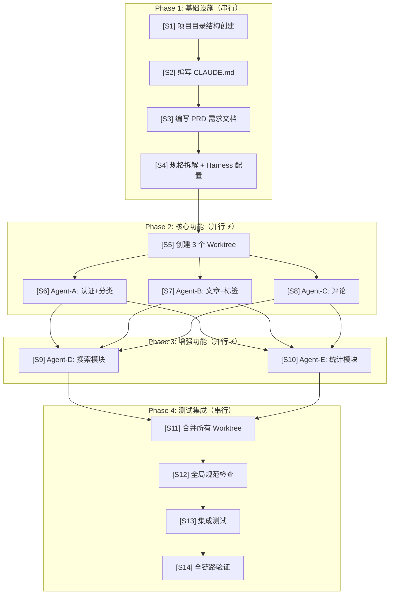

# 1. 流程总览

## 1.1 这个流程在干什么？

用 AI Agent 开发一个完整的 Spring Boot 博客系统。不是让 AI 随意写代码，而是**先搭建控制环境（Harness），再让 Agent 在约束下编码**。

整个流程分 4 个 Phase、14 个 Step：

## 1.2 各 Phase 做什么？

| Phase | 做什么 | 预估时间 | Harness 投入 | 一句话 |
|-------|--------|---------|-------------|--------|
| Phase 1 | 搭建 Harness 基础设施 | 1~2 小时 | 100% | 建好约束环境，后续只复用 |
| Phase 2 | 多 Agent 并行开发核心功能 | 2~4 小时 | 20% | Agent 在约束下各自编码 |
| Phase 3 | 增量开发增强功能 | 1~2 小时 | 10% | 复用 Phase 1 的 Harness |
| Phase 4 | 合并、测试、验证 | 1~2 小时 | 30% | Feedback 集中生效 |
| **合计** | | **8~10 小时** | | 传统方式估计 3~5 天 |

> Phase 1 投入最大，但后续 Phase 直接复用——这正是 Harness 的价值：**一次搭建，持续收益**。

---

