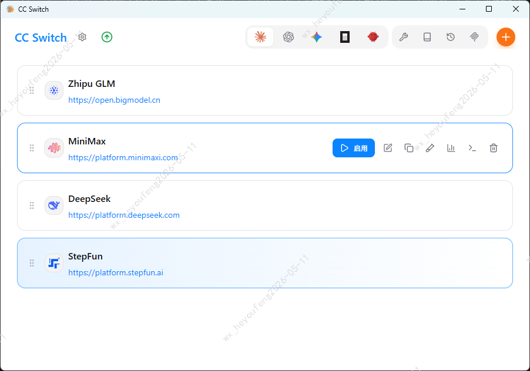

# Windows 下安装 Claude Code 及模型配置

> 涵盖 Windows 环境下的 Claude Code 安装、模型选择与配置。

---

## 一、Windows 安装 Claude Code

### 1.1 前置条件

| 依赖 | 最低版本 | 检查命令 |
|------|---------|---------|
| Node.js | 18.x+ | `node -v` |
| npm | 9.x+ | `npm -v` |
| Git（可选） | 2.x+ | `git --version` |

> Windows 下推荐使用 nvm-windows 管理 Node.js 版本。

### 1.2 安装方式

**方式一：npm 全局安装（推荐）**

```bash
npm install -g @anthropic-ai/claude-code
```

安装完成后验证：

```bash
claude --version
```

**方式二：Windows 安装包**

访问 [claude.ai/code](https://claude.ai/code) 下载 Windows 安装程序，双击运行即可。

**方式三：通过 Scoop（Windows 包管理器）**

```bash
scoop bucket add extras
scoop install claude-code
```


---

## 二、模型切换

使用 `cc-switch` 插件快速切换 Claude Code 配置：


