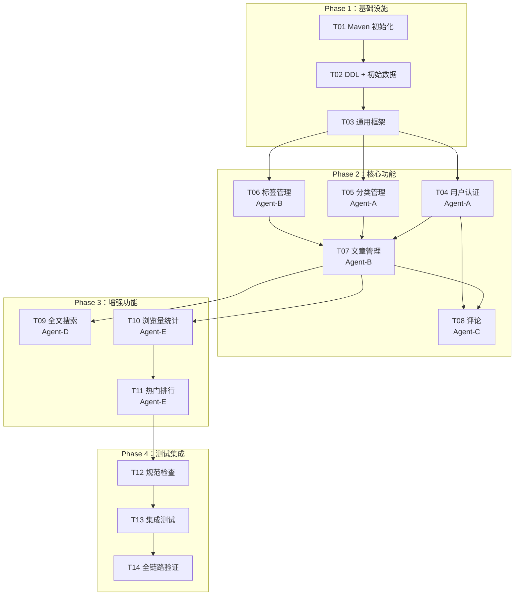

# 6. Step 4：规格拆解 + Harness 基础设施配置

> **本步是整个流程中最核心的 Harness 搭建步骤**，涉及 6 个子步骤（4a~4f）。
> 做完这一步，后续的编码工作就是"拿着规格执行"——Agent 不需要猜测任何东西。

## 6.0 Step 4 全景：6 个子步骤在做什么？

> **用工厂的比喻理解：** 你开了一家汽车工厂，Step 4 就是在**造生产线之前，先把图纸、操作手册、质检规则、报警装置全部装好**。之后工人（Agent）来了直接干活。

| 子步骤 | 一句话说明 | 工厂比喻 | 产出文件 |
|--------|-----------|---------|---------|
| **4a** 拆任务 | 把大需求拆成小任务卡片 | 项目经理排甘特图 | `tasks/TASKS.md` |
| **4b** 写 API + DB 契约 | 所有接口和表结构的"宪法" | 建筑蓝图，所有人必须照着来 | `specs/api-spec.md` + `specs/db-schema.md` |
| **4c** 写实现规格 | 每个任务写清楚"要写哪些文件、什么方法签名" | 给工人的零件清单 | `specs/impl-t{xx}.md`（8份） |
| **4d** 写提示词 | 给 Agent 的角色、规范、执行指令 | 员工手册 + SOP | `prompts/` 目录下三类文件 |
| **4e** 配 Hooks | Agent 每次保存文件自动触发检查 | 流水线上的自动质检机 | `.claude/settings.json` + `.claude/hooks/*.sh` |
| **4f** 写 Skills | 封装常用操作为可复用命令 | 工具箱里的专用工具 | `.claude/skills/*/SKILL.md` |

---

## 6.1 4a. 自定义 split-task Skill 拆解任务 → Architecture Feedforward

> **做什么？** 自定义一个 `split-task` Skill，把 PRD（产品需求文档）拆成一张**任务看板**。
>
> **为什么需要？** 一个"博客系统"太大了，AI 一次做不完。必须拆成小任务，标注谁做、先后顺序、哪些可以同时做。

**Step 1：创建 Skill 文件 `.claude/skills/split-task/SKILL.md`**

```yaml
---
name: split-task
description: 将 PRD 拆解成可并行的子任务
user-invocable: true
---
读取 specs/PRD.md。按模块依赖关系拆分任务到 tasks/TASKS.md。
规则：
1. 按 Phase 组织：基础依赖 → 核心功能 → 增强功能 → 测试
2. 标注每个任务：编号、名称、负责Agent、优先级、依赖关系、可并行性
3. 依赖关系必须精确到"T04 → T07"粒度
4. 可并行的任务放在同一 Phase 并列标注 ⚡
5. 输出完整的 TASKS.md
```

**执行：**

```bash
claude "/split-task"
```

**生成结果 `tasks/TASKS.md`：**

> 自动生成于 S4，每次 Agent 完成任务后更新勾选状态

```markdown
# 任务看板

## Phase 1：基础设施（串行，约 0.5h）
- [ ] T01: Maven 多模块初始化（父 POM + blog-common）
  - 交付物：pom.xml、Application.java、基础配置
- [ ] T02: 数据库 DDL + 初始数据
  - 交付物：schema.sql、data.sql
- [ ] T03: 统一响应/异常框架 + 基础工具类
  - 交付物：Result.java、GlobalExceptionHandler.java、JwtUtils.java
  - 位置：blog-common 模块

## Phase 2：核心功能（并行 ⚡，约 2~4h）
- [ ] T04: 用户认证模块 → Agent-A
  - 依赖：T03 / 规格：specs/impl-t04-auth.md / 包：com.blog.api.auth
- [ ] T05: 分类管理模块 → Agent-A
  - 依赖：T03 / 规格：specs/impl-t05-category.md / 包：com.blog.api.category
- [ ] T06: 标签管理模块 → Agent-B
  - 依赖：T03 / 规格：specs/impl-t06-tag.md / 包：com.blog.api.tag
- [ ] T07: 文章管理模块 → Agent-B
  - 依赖：T04, T05, T06 / 规格：specs/impl-t07-article.md / 包：com.blog.api.article
- [ ] T08: 评论模块 → Agent-C
  - 依赖：T07, T04 / 规格：specs/impl-t08-comment.md / 包：com.blog.api.comment

## Phase 3：增强功能（并行 ⚡，约 1~2h）
- [ ] T09: 全文搜索 → Agent-D
  - 依赖：T07 / 规格：specs/impl-t09-search.md
- [ ] T10: 浏览量统计 → Agent-E
  - 依赖：T07 / 规格：specs/impl-t10-statistics.md
- [ ] T11: 热门文章/标签统计 → Agent-E
  - 依赖：T10 / 规格：specs/impl-t11-hot-rank.md

## Phase 4：测试 + 集成（串行，约 1~2h）
- [ ] T12: 全局规范检查
- [ ] T13: 集成测试（全链路）
- [ ] T14: API 全链路验证
```

**依赖关系图：**



> **关键依赖链：** T04（认证）是全局基础 — T07（文章）和 T08（评论）都依赖它，必须尽早完成

**拆解的关键决策（人类要做）：**

| 决策 | 选项 | 本项目选择 | 原因 |
|------|------|-----------|------|
| T04+T05 给同一个 Agent？ | 分开 / 合并 | 合并给 Agent-A | 认证和分类都简单，一个 Agent 能搞定 |
| T06+T07 放一起？ | 分开 / 合并 | 合并给 Agent-B | 标签是文章的属性，一起做上下文更完整 |
| Phase 3 用新 Agent？ | 复用 / 新的 | 新 Agent-D/E | 任务性质不同（搜索/统计） |

> **拆解三大原则：**
> 1. **依赖多的模块尽早做** — T04（认证）是基础，T07 和 T08 都依赖它
> 2. **能并行的不要串行** — T04、T05、T06 之间没有依赖，可以同时开工
> 3. **一个 Agent 最多负责 2 个任务** — AI 的上下文窗口有限，任务太多会"遗忘"

---

## 6.2 4b. 编写 API + DB 契约 → Behaviour Feedforward

> **做什么？** 定义**所有模块必须遵守的契约**。多个 Agent 并行开发时，这是防止"合并地狱"的关键。
>
> **怎么理解？** 这是整个项目的"宪法"。后续 4c 的实现规格是每个 Agent 的"工作图纸"，而 4b 是所有 Agent 共同遵守的"总则"。

### specs/api-spec.md（接口契约）

````markdown
# 博客系统 API 规格 v1.0

## 通用规范
- Base URL：`http://localhost:8080/api`
- 统一响应：`{ "code": 200, "message": "ok", "data": {} }`
- 分页响应：`{ "code": 200, "data": { "records": [...], "total": 100, "page": 1, "size": 10 } }`
- 认证 Header：`Authorization: Bearer {access_token}`

## 1. 认证接口

| 方法 | 路径 | 认证 | Request | Response | 错误码 |
|------|------|------|---------|----------|--------|
| POST | `/api/auth/login` | 否 | `{"username":"admin","password":"123456"}` | `{"accessToken":"...","refreshToken":"...","expiresIn":7200}` | 40100 用户名或密码错误 |
| POST | `/api/auth/refresh` | 否 | `{"refreshToken":"eyJhbG..."}` | `{"accessToken":"...","refreshToken":"...","expiresIn":7200}` | 40101 Token 过期, 40102 Token 无效 |
| POST | `/api/auth/logout` | 是 | — | null | — |

## 2. 分类接口

| 方法 | 路径 | 认证 | 说明 |
|------|------|------|------|
| GET | `/api/categories` | 否 | 树形列表 |
| POST | `/api/categories` | 是 | 创建分类 |
| PUT | `/api/categories/{id}` | 是 | 更新分类 |
| DELETE | `/api/categories/{id}` | 是 | 删除（有关联文章时返回 409） |

## 3. 标签接口

| 方法 | 路径 | 认证 | 说明 |
|------|------|------|------|
| GET | `/api/tags` | 否 | 分页列表 `?page=1&size=20&keyword=Java` |
| POST | `/api/tags` | 是 | 创建标签 |
| PUT | `/api/tags/{id}` | 是 | 更新标签 |
| DELETE | `/api/tags/{id}` | 是 | 删除（有文章关联时返回 409） |

## 4. 文章接口

| 方法 | 路径 | 认证 | 说明 |
|------|------|------|------|
| GET | `/api/articles` | 否 | 列表 `?page=1&size=10&categoryId=2&tagId=5&keyword=Spring&status=PUBLISHED` |
| GET | `/api/articles/{slug}` | 否 | 详情（含上一篇/下一篇） |
| POST | `/api/articles` | 是 | 创建 `{"title":"...","slug":"...","content":"...","categoryId":2,"tagIds":[5,6],"status":"DRAFT"}` |
| PUT | `/api/articles/{id}` | 是 | 更新 |
| DELETE | `/api/articles/{id}` | 是 | 软删除 |

## 5. 评论接口

| 方法 | 路径 | 认证 | 说明 |
|------|------|------|------|
| GET | `/api/articles/{articleId}/comments` | 否 | 树形评论列表 |
| POST | `/api/articles/{articleId}/comments` | 否 | 发表评论（游客，默认 PENDING 待审核） |
| PUT | `/api/admin/comments/{id}/audit` | 是 | 审核评论 |
| DELETE | `/api/admin/comments/{id}` | 是 | 删除评论 |

## 6. 搜索接口

| 方法 | 路径 | 认证 | 说明 |
|------|------|------|------|
| GET | `/api/search` | 否 | 全文搜索 `?keyword=Spring&categoryId=2&page=1&size=10`，返回高亮 |
| GET | `/api/search/history` | 是 | 搜索历史 |
| DELETE | `/api/search/history` | 是 | 清除历史 |

## 7. 统计接口

| 方法 | 路径 | 认证 | 说明 |
|------|------|------|------|
| GET | `/api/statistics/dashboard` | 是 | 仪表盘：文章总数、评论总数、今日浏览、待审评论 |
| GET | `/api/statistics/articles/hot` | 否 | 热门文章 TOP 10 `?period=WEEK|ALL` |
| GET | `/api/statistics/tags` | 否 | 标签使用统计 |

## 错误码汇总

| 错误码 | HTTP 状态 | 说明 |
|--------|----------|------|
| 200 | 200 | 成功 |
| 40000 | 400 | 参数校验失败 |
| 40100 | 401 | 用户名或密码错误 |
| 40101 | 401 | Token 过期 |
| 40102 | 401 | Token 无效 |
| 40103 | 401 | Token 已被加入黑名单 |
| 40300 | 403 | 无权限 |
| 40400 | 404 | 资源不存在 |
| 40900 | 409 | 资源冲突 |
| 50000 | 500 | 系统内部错误 |
````

### specs/db-schema.md（数据库契约）

````markdown
# 博客系统数据库规格 v1.0

## 通用约定
- 引擎：InnoDB / 字符集：utf8mb4
- 主键：id BIGINT AUTO_INCREMENT
- 必备字段：created_at DATETIME + updated_at DATETIME + is_deleted TINYINT(1) DEFAULT 0
- 索引命名：idx_{表名}_{字段名} / 唯一索引：uk_{表名}_{字段名}

## DDL（6 张表）

### user 表
```sql
CREATE TABLE `user` (
  `id` BIGINT AUTO_INCREMENT, `username` VARCHAR(50) NOT NULL,
  `password` VARCHAR(200) NOT NULL, `nickname` VARCHAR(50),
  `email` VARCHAR(100), `avatar` VARCHAR(500),
  `role` VARCHAR(20) NOT NULL DEFAULT 'BLOGGER',
  `created_at` DATETIME NOT NULL DEFAULT CURRENT_TIMESTAMP,
  `updated_at` DATETIME NOT NULL DEFAULT CURRENT_TIMESTAMP ON UPDATE CURRENT_TIMESTAMP,
  `is_deleted` TINYINT(1) NOT NULL DEFAULT 0,
  PRIMARY KEY (`id`), UNIQUE KEY `uk_user_username` (`username`)
);
```

### category 表
```sql
CREATE TABLE `category` (
  `id` BIGINT AUTO_INCREMENT, `name` VARCHAR(50) NOT NULL,
  `slug` VARCHAR(50) NOT NULL, `parent_id` BIGINT DEFAULT NULL,
  `sort_order` INT NOT NULL DEFAULT 0, `article_count` INT DEFAULT 0,
  `created_at` DATETIME, `updated_at` DATETIME, `is_deleted` TINYINT(1) DEFAULT 0,
  PRIMARY KEY (`id`), UNIQUE KEY `uk_category_slug` (`slug`),
  KEY `idx_category_parent_id` (`parent_id`)
);
```

### tag 表
```sql
CREATE TABLE `tag` (
  `id` BIGINT AUTO_INCREMENT, `name` VARCHAR(50) NOT NULL,
  `slug` VARCHAR(50) NOT NULL, `use_count` INT DEFAULT 0,
  `created_at` DATETIME, `updated_at` DATETIME, `is_deleted` TINYINT(1) DEFAULT 0,
  PRIMARY KEY (`id`), UNIQUE KEY `uk_tag_name` (`name`), UNIQUE KEY `uk_tag_slug` (`slug`)
);
```

### article 表
```sql
CREATE TABLE `article` (
  `id` BIGINT AUTO_INCREMENT, `title` VARCHAR(200) NOT NULL,
  `slug` VARCHAR(200) NOT NULL, `content` LONGTEXT NOT NULL,
  `html_content` LONGTEXT, `summary` VARCHAR(500),
  `cover_image` VARCHAR(500), `category_id` BIGINT NOT NULL,
  `author_id` BIGINT NOT NULL, `status` VARCHAR(20) DEFAULT 'DRAFT',
  `is_top` TINYINT(1) DEFAULT 0, `view_count` INT DEFAULT 0,
  `comment_count` INT DEFAULT 0, `published_at` DATETIME,
  `created_at` DATETIME, `updated_at` DATETIME, `is_deleted` TINYINT(1) DEFAULT 0,
  PRIMARY KEY (`id`), UNIQUE KEY `uk_article_slug` (`slug`),
  KEY `idx_article_category_id` (`category_id`),
  KEY `idx_article_status_published_at` (`status`, `published_at`),
  FULLTEXT KEY `ft_article_title_content` (`title`, `content`)
);
```

### article_tag 关联表
```sql
CREATE TABLE `article_tag` (
  `id` BIGINT AUTO_INCREMENT, `article_id` BIGINT NOT NULL, `tag_id` BIGINT NOT NULL,
  `created_at` DATETIME, PRIMARY KEY (`id`),
  UNIQUE KEY `uk_article_tag` (`article_id`, `tag_id`)
);
```

### comment 表
```sql
CREATE TABLE `comment` (
  `id` BIGINT AUTO_INCREMENT, `article_id` BIGINT NOT NULL,
  `user_id` BIGINT, `parent_id` BIGINT, `reply_to` VARCHAR(50),
  `nickname` VARCHAR(50) NOT NULL, `email` VARCHAR(100) NOT NULL,
  `website` VARCHAR(200), `content` TEXT NOT NULL,
  `status` VARCHAR(20) DEFAULT 'PENDING', `ip` VARCHAR(45),
  `user_agent` VARCHAR(500), `created_at` DATETIME, `updated_at` DATETIME,
  `is_deleted` TINYINT(1) DEFAULT 0, PRIMARY KEY (`id`),
  KEY `idx_comment_article_id` (`article_id`)
);
```

## Redis Key 设计

| Key 格式 | 类型 | TTL | 说明 |
|---------|------|-----|------|
| `blog:auth:token:{userId}` | String | 2h | access_token |
| `blog:auth:refresh:{userId}` | String | 7d | refresh_token |
| `blog:auth:blacklist:{tokenHash}` | String | 7d | 黑名单 |
| `blog:article:view:{articleId}` | String | 无 | 文章浏览量 |
| `blog:article:view:daily:{date}` | Hash | 30d | 每日访问统计 |
| `blog:search:history:{userId}` | List | 7d | 搜索历史 |
````

---

## 6.3 4c. 自定义 create-spec Skill 生成详细实现规格 → Behaviour Feedforward

> **做什么？** 自定义一个 `create-spec` Skill，基于上一步的 API + DB 契约，对每个任务生成一份详细规格文件。
>
> **为什么在 4b 之后？** 实现规格需要引用 `api-spec.md` 和 `db-schema.md`，所以契约必须先定好。

**Step 1：创建 Skill 文件 `.claude/skills/create-spec/SKILL.md`**

```yaml
---
name: create-spec
description: 根据 PRD + API/DB 契约生成指定模块的详细实现规格
user-invocable: true
argument-hint: "<task-number> <module-name>"
---
读取：
- specs/PRD.md（需求来源）
- specs/api-spec.md（接口契约）
- specs/db-schema.md（数据库契约）
- CLAUDE.md（命名和编码规范）

为指定任务（如 T04）生成 specs/impl-t{xx}.md，包含：
1. 涉及文件清单（每个 Java 类的完整路径）
2. 核心方法签名（Service 接口和 Controller 端点）
3. 业务逻辑要点（校验规则、边界条件、异常情况）
4. 依赖接口列表（需要其他模块提供什么）
5. 测试清单（正常流 + 异常流 + 边界值）

所有命名必须符合 CLAUDE.md 规范。
```

**Step 2：执行**

```bash
claude "/create-spec T04 用户认证模块"
claude "/create-spec T05 分类管理模块"
claude "/create-spec T06 标签管理模块"
claude "/create-spec T07 文章管理模块"
claude "/create-spec T08 评论模块"
claude "/create-spec T09 搜索模块"
claude "/create-spec T10 浏览量统计模块"
claude "/create-spec T11 热门排行模块"
```

---

## 6.4 4d. 编写提示词体系 → Inferential Feedforward

> **做什么？** 写三**层**提示词文件，让 Agent 知道"我是谁"、"规范是什么"、"这次具体做什么"。
>
> **为什么分三层？** 角色层写一次所有 Agent 共享，规范层写一次所有 Agent 共享，任务层每个任务一份但引用前两层。改命名规范只需要改一个文件。

| 层级 | 目录 | 回答的问题 | 改动频率 |
|------|------|-----------|---------|
| **第1层：角色层** | `prompts/agents/backend.md` | "我是谁？工作流程是什么？" | 很低 |
| **第2层：规范层** | `prompts/shared/naming.md` 等 | "命名怎么取？异常怎么处理？" | 偶尔 |
| **第3层：任务层** | `prompts/impl/t04-auth.md` 等 | "这个任务要读哪些文件、按什么顺序做？" | 每个任务重新生成 |

### prompts/agents/backend.md（Agent 角色定义）

```markdown
# 角色：Spring Boot 后端开发专家

你是 Spring Boot 后端开发专家，严格遵循规范编码。

## 核心职责
1. 根据 specs/ 下的规格文档实现 Java 代码
2. 严格遵循 CLAUDE.md 中的命名规范、编码规范、包结构
3. 每完成一个接口后更新 tasks/TASKS.md 中的进度

## 工作流程（每个任务都按这个顺序）
1. **读取规格** —— 先读 specs/impl-t{xx}.md
2. **确认依赖** —— 检查依赖的模块是否已实现
3. **按顺序编码** —— Entity → Mapper → Service → Controller → Test
4. **自检** —— 编译 + 测试 + 命名自查
5. **更新进度** —— 勾选 tasks/TASKS.md

## 约束
- 只修改自己负责的包
- 数据库操作必须用 MyBatis XML，不允许 Mapper 注解写 SQL
- 每个 Service 方法必须加 @Transactional
- Controller 只做参数校验 + 调用 Service
- 必须写单元测试

## 不要做的事
- 不要修改非自己模块的文件
- 不要跳过测试
- 不要不使用 CLAUDE.md 规范就动手
```

### prompts/shared/naming.md（命名检查清单）

```markdown
# 命名检查清单

## Java 命名
- [ ] Controller：`{Entity}Controller`
- [ ] Service 接口：`{Entity}Service`
- [ ] Service 实现：`{Entity}ServiceImpl`
- [ ] Request DTO：`{Entity}{Action}Request`
- [ ] Response DTO：`{Entity}{Action}Response`

## 数据库命名
- [ ] 表名：小写下划线单数（`article` 不是 `articles`）
- [ ] 列名：小写下划线（`created_at` 不是 `createdAt`）

## API 命名
- [ ] 路径：`/api/{resources}`
- [ ] GET 列表、GET {slug} 详情、POST 创建、PUT 更新、DELETE 删除

## Redis Key
- [ ] 格式：`blog:{module}:{business}:{id}`
- [ ] 正确：`blog:article:view:123` / 错误：`article:123`

## 方法命名
| 操作 | 前缀 | 示例 |
|------|------|------|
| 查询单条 | get | getUserById |
| 查询列表 | list | listArticles |
| 分页查询 | page | pageArticles |
| 创建 | create | createArticle |
| 更新 | update | updateArticle |
| 删除 | delete | deleteArticle |
```

### prompts/shared/error-handling.md（异常处理规范）

```markdown
# 异常处理规范

- 业务异常继承 BusinessException（RuntimeException），包含 errorCode 和 message
- 错误码：4xxxx 客户端错误，5xxxx 服务端错误
- 用 @RestControllerAdvice 统一处理
- 禁止在 Controller 中用 try-catch 吞异常
- 禁止 return null 表示"没找到"
- 禁止 e.printStackTrace()
```

### prompts/impl/t04-auth.md（任务执行指令示例）

```markdown
# T04: 用户认证模块 — 执行指令

## 角色设定
加载 prompts/agents/backend.md

## 目标
实现 JWT 认证：登录签发 Token、Token 刷新、接口鉴权。

## 必需读取的文件
1. specs/impl-t04-auth.md — 详细实现规格
2. specs/api-spec.md — 接口定义
3. specs/db-schema.md — user 表结构
4. CLAUDE.md — 命名和编码规范

## 必需遵守的规范
加载 prompts/shared/naming.md
加载 prompts/shared/error-handling.md

## 实现顺序（严格执行）
1. Entity(User)
2. Mapper(UserMapper + XML)
3. JwtUtils
4. SecurityConfig
5. JwtAuthFilter
6. AuthService / AuthServiceImpl
7. AuthController
8. DTO
9. 单元测试

## 完成标准
- [ ] mvn compile 通过
- [ ] mvn test 通过
- [ ] 命名符合 CLAUDE.md
- [ ] Redis key 符合 `blog:auth:*` 格式
- [ ] 更新 tasks/TASKS.md 勾选 T04
```

---

## 6.5 4e. 配置 Hooks → Computational Feedback

> **做什么？** 在 `.claude/settings.json` 中配置钩子脚本，Agent 每次保存文件时**自动触发检查**。
>
> **和 4f Skills 的区别：**
> - **Hooks** = 自动触发（Agent 每次保存文件自动跑，Agent 无法绕过）
> - **Skills** = 手动触发（你觉得需要时敲 `/check-style`）

| 钩子脚本 | 触发时机 | 做什么 | 不通过会怎样 |
|---------|---------|--------|-------------|
| `check-naming.sh` | **写入前**（PreToolUse） | 检查文件名、包路径、类命名是否符合规范 | ❌ 直接拒绝写入 |
| `check-schema-sync.sh` | **写入前**（PreToolUse） | 改 Entity 时提醒同步 DB 规格和 Mapper | ⚠️ 警告提示 |
| `on-code-change.sh` | **写入后**（PostToolUse） | 检测跨模块影响，改公共模块时记录到 BLOCKERS.md | ⚠️ 记录 + 提醒 |

### .claude/settings.json

```json
{
  "hooks": {
    "PreToolUse": [
      {
        "matcher": "Edit|Write",
        "hooks": [{
          "type": "command",
          "command": "bash .claude/hooks/check-naming.sh \"$CLAUDE_FILE_PATH\""
        }]
      },
      {
        "matcher": "Edit|Write",
        "hooks": [{
          "type": "command",
          "command": "bash .claude/hooks/check-schema-sync.sh \"$CLAUDE_FILE_PATH\""
        }]
      }
    ],
    "PostToolUse": [
      {
        "matcher": "Edit|Write",
        "hooks": [{
          "type": "command",
          "command": "bash .claude/hooks/on-code-change.sh \"$CLAUDE_FILE_PATH\""
        }]
      }
    ]
  }
}
```

### .claude/hooks/check-naming.sh（写入前命名检查）

> 检查 7 项：Controller 类名、Service 接口名、ServiceImpl 名、DTO 名、包路径、模块归属、Redis Key 格式。

```bash
#!/bin/bash
# Harness: Maintainability — Computational Feedback Sensor
FILE="$1"
ERRORS=0

# 1. Controller 命名检查
if echo "$FILE" | grep -q "Controller\.java$"; then
    FILENAME=$(basename "$FILE")
    if ! echo "$FILENAME" | grep -qE "^[A-Z][a-zA-Z]+Controller\.java$"; then
        echo "❌ [命名检查] Controller 命名违规: $FILENAME"
        echo "   示例: ArticleController ✅ | article_controller.java ❌"
        ERRORS=$((ERRORS + 1))
    fi
fi

# 2. Service 接口检查
if echo "$FILE" | grep -q "service.*Service\.java$" && ! echo "$FILE" | grep -q "ServiceImpl"; then
    FILENAME=$(basename "$FILE")
    if ! echo "$FILENAME" | grep -qE "^[A-Z][a-zA-Z]+Service\.java$"; then
        echo "❌ [命名检查] Service 接口命名违规: $FILENAME"
        ERRORS=$((ERRORS + 1))
    fi
fi

# 3. Service 实现类检查
if echo "$FILE" | grep -q "ServiceImpl\.java$"; then
    FILENAME=$(basename "$FILE")
    if ! echo "$FILENAME" | grep -qE "^[A-Z][a-zA-Z]+ServiceImpl\.java$"; then
        echo "❌ [命名检查] ServiceImpl 命名违规: $FILENAME"
        ERRORS=$((ERRORS + 1))
    fi
fi

# 4. DTO 命名检查
if echo "$FILE" | grep -qE "(Request|Response)\.java$"; then
    FILENAME=$(basename "$FILE")
    if ! echo "$FILENAME" | grep -qE "^[A-Z][a-zA-Z]+(Request|Response)\.java$"; then
        echo "❌ [命名检查] DTO 命名违规: $FILENAME"
        echo "   示例: ArticleCreateRequest ✅ | ArticleReq ❌"
        ERRORS=$((ERRORS + 1))
    fi
fi

# 5. 包路径检查
if echo "$FILE" | grep -q "src/main/java/"; then
    if ! echo "$FILE" | grep -q "com/blog/"; then
        echo "❌ [架构检查] 包路径违规: 所有 Java 文件必须在 com.blog 下"
        ERRORS=$((ERRORS + 1))
    fi
fi

# 6. 模块归属检查
if echo "$FILE" | grep -q "src/main/java/"; then
    if ! echo "$FILE" | grep -qE "com/blog/(common|api|admin)/"; then
        echo "❌ [架构检查] 模块归属不明"
        echo "   允许的包: com.blog.common.* / com.blog.api.* / com.blog.admin.*"
        ERRORS=$((ERRORS + 1))
    fi
fi

# 7. Redis key 格式检查
if echo "$FILE" | grep -q "\.java$"; then
    BAD_KEYS=$(grep -oP '"[^"]*"' "$FILE" 2>/dev/null | grep -iE '(redis|cache|key)' | grep -v 'blog:' || true)
    if [ -n "$BAD_KEYS" ]; then
        echo "⚠️  [Redis 检查] 发现可能不符合规范的 Redis key"
        echo "   规则: blog:{module}:{business}:{id}"
    fi
fi

if [ $ERRORS -gt 0 ]; then
    echo "🚫 命名检查未通过 ($ERRORS 个问题)。请修改后重试。"
    exit 1
fi

echo "✅ 命名检查通过: $FILE"
```

### .claude/hooks/check-schema-sync.sh（数据库同步检查）

```bash
#!/bin/bash
# Harness: Behaviour — Computational Feedback Sensor
FILE="$1"

# Entity 变更 → 提示检查 db-schema.md
if echo "$FILE" | grep -q "/entity/"; then
    ENTITY=$(basename "$FILE" .java)
    echo "ℹ️  [Schema 同步] Entity 变更: $ENTITY"
    echo "   请确认: 1) specs/db-schema.md 2) Mapper XML 3) DDL 脚本"
fi

# db-schema.md 变更 → 提示同步 Entity
if echo "$FILE" | grep -q "db-schema\.md"; then
    echo "⚠️  [Schema 同步] 数据库规格变更！需同步 Entity / Mapper XML / DTO / DDL"
    echo "SCHEMA_CHANGE: $FILE $(date)" >> tasks/BLOCKERS.md
fi

# application.yml 变更 → 提示检查配置类
if echo "$FILE" | grep -q "application.*\.yml"; then
    echo "ℹ️  [配置变更] 请检查 @ConfigurationProperties 绑定类"
fi
```

### .claude/hooks/on-code-change.sh（跨模块影响检测）

```bash
#!/bin/bash
# Harness: Architecture Fitness — Computational Feedback Sensor
FILE="$1"

# blog-common 变更 → 记录到 BLOCKERS
if echo "$FILE" | grep -q "blog-common"; then
    echo "⚠️  [架构] 公共模块(blog-common)变更！所有模块需重新编译"
    echo "BLOCKER: blog-common changed at $FILE $(date)" >> tasks/BLOCKERS.md
fi

# Entity 变更 → 提示检查关联层
if echo "$FILE" | grep -q "/entity/"; then
    echo "ℹ️  [影响分析] Entity 变更，需检查 DTO / Mapper XML / Service"
fi

# Mapper 接口变更 → 提示检查 XML
if echo "$FILE" | grep -q "/mapper/" && echo "$FILE" | grep -q "\.java$"; then
    echo "ℹ️  [影响分析] Mapper 接口变更，需检查对应 XML"
fi

# API 规格变更 → 记录
if echo "$FILE" | grep -q "api-spec\.md"; then
    echo "⚠️  [契约变更] API 规格变更！依赖模块需同步"
    echo "API_CHANGE: $FILE $(date)" >> tasks/BLOCKERS.md
fi

echo "✅ 跨模块影响检查完成: $FILE"
```

---

## 6.6 4f. 编写 Skills → 可复用的 Guide + Sensor

> **做什么？** 把常用的检查/操作封装成 `/命令`，随时可以手动触发。

| Skill 命令 | 做什么 | 什么时候用 |
|-----------|--------|-----------|
| `/check-style` | 全局代码规范检查，输出问题表格 | 写完代码后想全面检查 |
| `/run-tests` | 编译 + 跑测试 + 输出报告 | 想看测试结果 |
| `/sync-status` | 检查所有 worktree 的进度、编译状态、阻塞项 | 多 Agent 并行时看进度 |
| `/security-check` | SQL 注入、XSS、密码硬编码等安全检查 | 上线前 |

### .claude/skills/check-style/SKILL.md

```yaml
---
name: check-style
description: 检查代码是否符合 CLAUDE.md 命名规范
user-invocable: true
---
# 全局代码规范检查

## 步骤
1. 读取 CLAUDE.md 中的所有命名规范和编码规范
2. 扫描 src/ 下所有 Java 文件
3. 逐项检查：
   - Controller / Service / ServiceImpl / DTO 命名
   - 包路径 com.blog.{module}.{layer}
   - Mapper 中是否有注解写 SQL
   - Controller 是否包含业务逻辑
   - Service 方法是否加 @Transactional
   - Redis key 格式

## 输出格式
| 文件 | 行号 | 问题类型 | 问题描述 | 修复建议 |
|------|------|---------|---------|---------|
```

### .claude/skills/run-tests/SKILL.md

```yaml
---
name: run-tests
description: 运行测试并生成报告
user-invocable: true
---
# 执行测试并汇总结果

## 步骤
1. `mvn clean compile -DskipTests`
2. `mvn test`
3. 汇总结果

## 输出
- 编译状态 / 测试总数 / 通过 / 失败 / 耗时
- 失败分析（如有）：测试类 + 根因 + 修复建议
- 覆盖率：Service 层 > 80%？ 总体 > 60%？
```

### .claude/skills/sync-status/SKILL.md

```yaml
---
name: sync-status
description: 同步所有 worktree 的开发进度
user-invocable: true
---
# 多 Agent 进度同步

## 步骤
1. `git worktree list`
2. 对每个 worktree：git log + TASKS.md 状态 + BLOCKERS.md + mvn compile

## 输出
| Worktree | Agent | 负责任务 | 进度 | 编译 | 阻塞项 |
|----------|-------|---------|------|------|--------|
```

### .claude/skills/security-check/SKILL.md

```yaml
---
name: security-check
description: 代码安全检查
user-invocable: true
---
# 安全检查

## 检查项
1. SQL 注入：XML 中是否使用 `${}` 而非 `#{}`
2. XSS：用户输入是否做了 HTML 转义
3. 密码：是否使用 BCrypt
4. JWT：密钥是否硬编码
5. 敏感信息：密码/密钥/Token 是否在代码中
6. 日志：有无输出敏感信息
7. 权限：Controller 方法是否缺少 @PreAuthorize

## 输出格式
| 文件 | 行号 | 风险等级 | 问题 | 修复建议 |
```

---

## 6.7 Step 4 产出物总结

做完 Step 4 后，项目目录多出以下文件。这些就是 AI Agent 的"工作环境"：

```
.claude/
├── settings.json              ← Hook 配置（4e）
├── hooks/
│   ├── check-naming.sh        ← 命名检查（4e）
│   ├── check-schema-sync.sh   ← 数据库同步检查（4e）
│   └── on-code-change.sh      ← 跨模块影响检测（4e）
└── skills/
    ├── split-task/SKILL.md     ← 拆任务（4a）
    ├── create-spec/SKILL.md    ← 生成规格（4b）
    ├── check-style/SKILL.md    ← 规范检查（4f）
    ├── run-tests/SKILL.md      ← 跑测试（4f）
    ├── sync-status/SKILL.md    ← 进度同步（4f）
    └── security-check/SKILL.md ← 安全检查（4f）

specs/
├── PRD.md                      ← Step 3 产出
├── api-spec.md                 ← API 契约（4c）
├── db-schema.md                ← 数据库契约（4c）
└── impl-t04-*.md ~ t11-*.md   ← 8 份实现规格（4b）

tasks/
├── TASKS.md                    ← 任务看板（4a）
└── BLOCKERS.md                 ← 阻塞项（运行时 Hook 自动写入）

prompts/
├── agents/backend.md           ← Agent 角色定义（4d）
├── shared/naming.md            ← 命名规范（4d）
├── shared/error-handling.md    ← 异常处理规范（4d）
└── impl/t04-*.md ~ t11-*.md   ← 各任务执行指令（4d）
```

> **一句话总结 Step 4：** 这些文件就是 AI Agent 的"工作环境"。建好之后，Agent 进来就知道要做什么、怎么做、做完怎么检查，完全不需要猜测。

---

