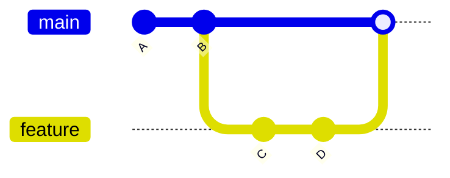
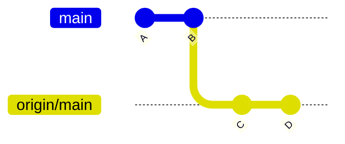
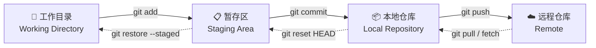

# Git 高频面试题（Top 20）

---

## 1. git merge 和 git rebase 的区别？

| 维度 | `git merge` | `git rebase` |
|------|------------|-------------|
| **历史记录** | 保留分支结构，产生 merge commit | 线性历史，不产生额外 commit |
| **冲突解决** | 一次性解决 | 每个 commit 逐个解决 |
| **适用场景** | 公共分支合并 | 整理个人分支 |
| **是否改写历史** | 否 | 是 |

> 对已推送的公共分支不要用 rebase，会导致其他人基于旧历史的提交冲突。

---

## 2. git reset 和 git revert 的区别？

| 维度 | `git reset` | `git revert` |
|------|------------|-------------|
| **原理** | 移动 HEAD 指针到指定提交 | 创建一个新的"反向"提交 |
| **是否改写历史** | 是 | 否 |
| **适用场景** | 撤销未推送的本地提交 | 撤销已推送的远程提交 |
| **安全性** | 可能丢失代码（--hard） | 安全，历史可追溯 |

> **简单说**：reset 是"撤销"，revert 是"反做"。reset 改历史，revert 追加历史。

### git reset 三种模式

```
            工作目录        暂存区         本地仓库
           (Working)      (Staging)      (Repo/HEAD)

--soft        ✅ 保留        ✅ 保留         ❌ 回退
--mixed       ✅ 保留        ❌ 清空         ❌ 回退
--hard        ❌ 清空        ❌ 清空         ❌ 回退
```

| 模式 | HEAD | 暂存区 | 工作目录 | 典型用途 |
|------|------|--------|---------|---------|
| `--soft` | 移动 | 保留 | 保留 | 合并多个 commit，或修改上次提交信息 |
| `--mixed`（默认） | 移动 | 重置 | 保留 | 撤销 commit 和 add，改动回到工作目录 |
| `--hard` | 移动 | 重置 | **清空** | 完全放弃所有改动 |

```bash
# --soft：回退 commit，改动保留在暂存区（可重新提交）
git reset --soft HEAD~3       # 回退 3 步，合并成一个提交
git commit -m "合并为一个提交"

# --mixed（默认）：回退 commit + 暂存区，改动保留在工作目录
git reset HEAD~1

# --hard：彻底丢弃所有改动 ⚠️ 不可恢复
git reset --hard HEAD~1

# revert：生成新提交，安全撤销
git revert HEAD
```

---

## 3. git merge 和 git merge --no-ff 的区别？

### 场景假设

main 分支有 A→B 两个提交。从 B 切出 feature 分支，开发了 C、D 两个提交。此时 **main 没有新提交**（feature 领先 main 2 步）。

```
main:    A---B
              \
feature:       C---D
```

### fast-forward（默认行为）

因为 main 没往前走，Git 只需把 main 指针**直接移到 D**，不产生新提交：



结果：`A-B-C-D` 一条直线，**看不出 C、D 曾经在 feature 分支上**。

### --no-ff（强制生成 merge commit）

无论能不能快进，都**生成一个 merge commit M**：


结果：能看到分支从哪分叉、从哪合并，**保留功能开发轨迹**。

### 一句话总结

| 方式 | 行为 | 历史外观 |
|------|------|---------|
| 默认 merge | 能快进就快进 | 一条直线，分支信息丢失 |
| `--no-ff` | 强制生成 merge commit | 保留分叉/合并点，可追溯 |

> 团队协作推荐 `--no-ff`，方便回溯"这个功能是从哪个分支合并进来的"。

---

## 4. git stash 的作用是什么？常用命令有哪些？

**作用**：将工作区和暂存区的改动临时保存到 Git 栈中，清理工作目录。

```bash
git stash                  # 暂存当前改动
git stash pop              # 恢复 + 删除最近一次 stash
git stash apply            # 恢复但不删除 stash
git stash list             # 查看所有 stash
git stash drop stash@{0}   # 删除指定 stash
```

> 典型场景：开发到一半需要切分支修 bug，先 stash → 切分支 → 修完回来 → stash pop。

---

## 5. git fetch 和 git pull 的区别？

### 一句话解释

`git pull` = `git fetch` + `git merge`，两步合成一步。`fetch` 只下载不改代码，`pull` 下载后立刻合并。

### 场景演示

你和同事都在 main 分支开发，远程仓库已经到 D 了，你本地还停在 B：

```
远程:  A---B---C---D  (origin/main)
本地:  A---B          (main)
```

**执行 git fetch 后：**



`origin/main` 更新到了 D，但你本地的 `main` 分支没动。你可以先 `git log origin/main` 看看别人改了啥，再决定怎么合并。

**执行 git pull 后：**


本地 `main` 直接被合并到 D（产生 merge commit）。一步到位，但没机会先审查。

### 对比总结

| 命令 | 做了什么 | 本地分支 | 适用场景 |
|------|---------|---------|---------|
| `git fetch` | 下载远程更新到 `origin/xxx`，不合并 | 不动 | 想先看看远程有啥变化 |
| `git pull` | fetch + merge，自动合并到本地分支 | 被更新 | 确定要合并远程代码 |
| `git pull --rebase` | fetch + rebase，线性合并 | 被更新 | 想保持历史整洁 |

> **推荐习惯**：先 `git fetch` 看看远程进展，再决定 `git merge` 还是 `git rebase`。

---

## 6. Git 工作区、暂存区、本地仓库、远程仓库分别是什么？



| 区域 | 内容 | 关键命令 |
|------|------|---------|
| **工作目录** | 当前正在编辑的文件 | — |
| **暂存区** | `git add` 后的文件，等待 commit | `git add` / `git restore --staged` |
| **本地仓库** | `git commit` 后的版本历史 | `git commit` / `git reset` |
| **远程仓库** | `git push` 后推到 GitHub/GitLab 等远端 | `git push` / `git fetch` |

---

## 7. Git 中 HEAD 是什么？

**HEAD** 是指向当前工作位置的指针，通常指向一个分支（如 `main`），分支再指向最新 commit。

```
正常状态：                        Detached HEAD：
HEAD → main → C                   HEAD → C (直接指向 commit)
              ↑                             ↑
           当前分支                      没有分支引用，切换后可能丢失
```

```bash
git checkout main        # HEAD 指向 main 分支（正常）
git checkout <commit>    # HEAD 指向具体 commit（detached HEAD）
git checkout main        # 回到正常状态
```

> detached HEAD 下做的提交不会被任何分支引用，切换分支后可能丢失。如需保留，应先创建分支：`git checkout -b temp-branch`。

---

## 8. 如何修改最近一次 commit 的 message？

```bash
git commit --amend -m "新的 message"
```

> 注意：如果已经 push 过，amend 后需要 `git push --force`，且仅限于个人分支。已推送的公共分支不要 amend。

---

## 9. 什么是冲突？如何解决？

**冲突**：两个分支修改了同一个文件的同一行，Git 无法自动决定用哪个版本。

### 冲突长什么样

```java
<<<<<<< HEAD              // ← 当前分支的版本
int price = 100;
=======                   // ← 分隔线
int price = 200;          // ← 合并进来的分支的版本
>>>>>>> feature
```

### 解决流程

```bash
# 1. 冲突发生后，查看哪些文件有冲突
git status

# 2. 手动编辑文件，删除冲突标记，保留正确代码
# 把 <<<<<<<、=======、>>>>>>> 三行标记删掉

# 3. 标记为已解决
git add <file>

# 4. 继续
git merge --continue       # 如果是 merge 触发的冲突
git rebase --continue      # 如果是 rebase 触发的冲突

# 放弃本次操作
git merge --abort          # 回到 merge 前
git rebase --abort         # 回到 rebase 前
```

### merge 冲突 vs rebase 冲突

| 场景 | 冲突特征 | 解决方式 |
|------|---------|---------|
| merge | 一次性解决所有冲突 | `git merge --continue` |
| rebase | 每个 commit 逐个可能冲突 | 解决一个 → `git rebase --continue` → 下一个 |

> rebase 冲突更频繁但更精细，merge 冲突一次性但可能遗漏细节。

---

## 10. git cherry-pick 是什么？有什么作用？

将某个（或多个）提交**复制**到当前分支，适用于只需要某个分支上的几个 commit 而不想合并整个分支。

```bash
git cherry-pick <commit-hash>            # 单个 commit
git cherry-pick <hash1> <hash2>          # 多个 commit
git cherry-pick <hash1>..<hash3>         # 连续范围（不含 hash1）
```

---

## 11. 如何回退某个文件到指定版本？

```bash
git checkout <commit-hash> -- <file>     # 从历史版本恢复文件
git restore --source=<hash> <file>       # 新版 Git 推荐方式
```

---

## 12. git tag 的用法？轻量标签和附注标签的区别？

| 维度 | 轻量标签（lightweight） | 附注标签（annotated） |
|------|----------------------|---------------------|
| **本质** | 只是一个指向 commit 的指针 | 独立的 Git 对象，存储完整元数据 |
| **存储内容** | 仅 commit hash | 作者、日期、message、可签名 |
| **适用** | 临时标记、个人使用 | 正式发布版本 |
| **推荐** | — | ✅ 发布用这个 |

```bash
git tag v1.0.0                          # 轻量标签
git tag -a v1.0.0 -m "发布版本 1.0.0"    # 附注标签
git push origin v1.0.0                  # 推送指定标签
git push origin --tags                  # 推送所有标签
git push origin --delete v1.0.0         # 删除远程标签
git tag -d v1.0.0                       # 删除本地标签
```

---

## 13. .gitignore 文件的作用？如果不生效怎么办？

定义哪些文件不需要被 Git 追踪。

```bash
# .gitignore 示例
*.class
target/
*.log
node_modules/
.idea/
```

**不生效的原因和解决方法**：

```bash
# 原因：文件曾经被 git add / commit 过，已经被追踪
# 解决：先从 Git 缓存中移除
git rm --cached <file>
git add .gitignore
git commit -m "update gitignore"
```

---

## 14. Git Flow、GitHub Flow、GitLab Flow 的核心区别？

### 三工作流对比

| 维度 | Git Flow | GitHub Flow | GitLab Flow |
|------|----------|-------------|-------------|
| **长期分支** | `main` + `develop` | 仅 `main` | `main` + 环境分支 |
| **发布方式** | `release` 分支测试后合并 | 打 tag 即发布 | 代码逐级升级到生产 |
| **Hotfix** | 合并到 `develop` + `main` | 只合并到 `main` | 合并到环境分支，逐级向上 |
| **适用** | 有版本号的多版本产品 | SaaS / 持续部署 | 多环境企业应用 |

### 选型指南

```
多版本产品（有版本号）      → Git Flow
多环境企业应用（dev/staging/prod）→ GitLab Flow
持续部署 / SaaS           → GitHub Flow
```

### 各流程简介

**Git Flow**：`feature → develop → release → main`，最重，适合需要维护多个发布版本的场景。

**GitHub Flow**：`feature → main → tag`，最轻，feature 分支直接合并 main 打 tag 上线。

**GitLab Flow**：`feature → main → staging → production`，环境分支串联，代码逐级推进，兼顾环境和版本控制。

---

## 15. git reflog 是什么？什么场景下用？

`git reflog` 记录**本地 HEAD 的所有移动历史**，包括被 reset 掉的提交。即使 `git reset --hard` 回退了，也可以通过 reflog 找回。

```bash
git reflog                              # 查看操作历史
# 输出示例：
# a1b2c3d HEAD@{0}: commit: fix bug
# e4f5g6h HEAD@{1}: reset: moving to HEAD~1   ← 被 reset 掉的提交

git checkout HEAD@{1}                   # 恢复到 reset 前的状态
git branch recovered-branch HEAD@{1}    # 创建分支保存恢复的提交
```

> reflog 默认保留 90 天，是"后悔药"的底层实现。

---

## 16. 如何把一个分支上的某个文件单独合并到另一个分支？

```bash
# 从 feature 分支取某个文件合并到当前分支
git checkout feature -- path/to/file
git add path/to/file
git commit -m "从 feature 分支导入 xxx 文件"
```

> 只取文件内容，不合并分支历史。

---

## 17. git bisect 是什么？

**二分法定位 bug 引入的 commit**。适用于"某功能之前是好的，现在坏了，但不知道哪次提交引入的"。

```bash
git bisect start
git bisect bad HEAD           # 当前版本有问题
git bisect good v1.0.0        # v1.0.0 是好的

# Git 自动 checkout 中间的 commit
# 测试后标记 good 或 bad
git bisect good   # 或 git bisect bad

# 重复直到定位到引入 bug 的 commit
git bisect reset              # 结束 bisect，回到原分支
```

---

## 18. git clone --depth=1 是什么意思？

**浅克隆**（shallow clone），只克隆最新一次提交，不下载完整历史。

```bash
git clone --depth=1 https://github.com/xxx/repo.git
```

| 对比 | 普通 clone | --depth=1 |
|------|-----------|-----------|
| **下载大小** | 整个仓库历史 | 仅最新版本 |
| **速度** | 大仓库很慢 | 极快 |
| **适用** | 日常开发 | CI/CD 构建、浏览源码 |

---

## 19. 如何合并多个 commit 为一个？

使用 **交互式 rebase**：

```bash
git rebase -i HEAD~3   # 合并最近 3 个 commit
```

编辑器打开后，将后面的 commit 标记为 `squash` 或 `fixup`：

```
pick a1b2c3d 第一个提交     ← 保留
pick e4f5g6h 第二个提交     → 改为 s (squash)
pick i7j8k9l 第三个提交     → 改为 f (fixup)
```

| 标记 | 全称 | 效果 |
|------|------|------|
| `pick` | — | 保留这个 commit（不动） |
| `squash` / `s` | — | 合并到上一个 commit，**保留** commit message |
| `fixup` / `f` | — | 合并到上一个 commit，**丢弃** commit message |

> 保存后 Git 自动将三个 commit 合并为一个。注意：不要对已 push 的公共 commit 做 rebase。

---

## 20. 如何撤销已经 push 到远程的 commit？

```bash
# 方案 1：revert（推荐，不改写历史）
git revert <commit-hash>
git push

# 方案 2：reset + force push（仅限个人分支！）
git reset --hard <commit-hash>
git push --force
```

> **原则**：公共分支用 **revert**，个人分支可用 **reset + force push**。永远不要 force push 公共分支。
