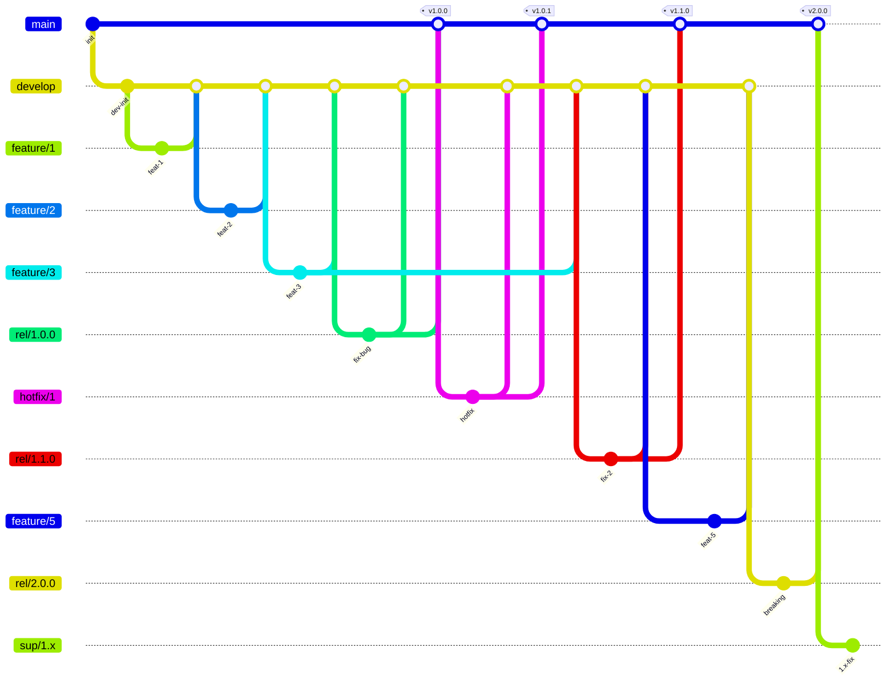
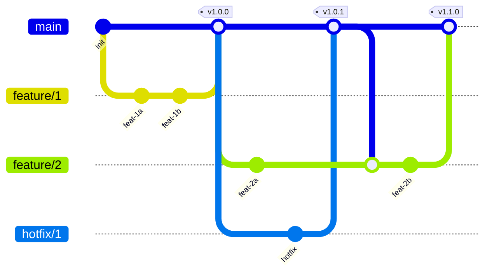
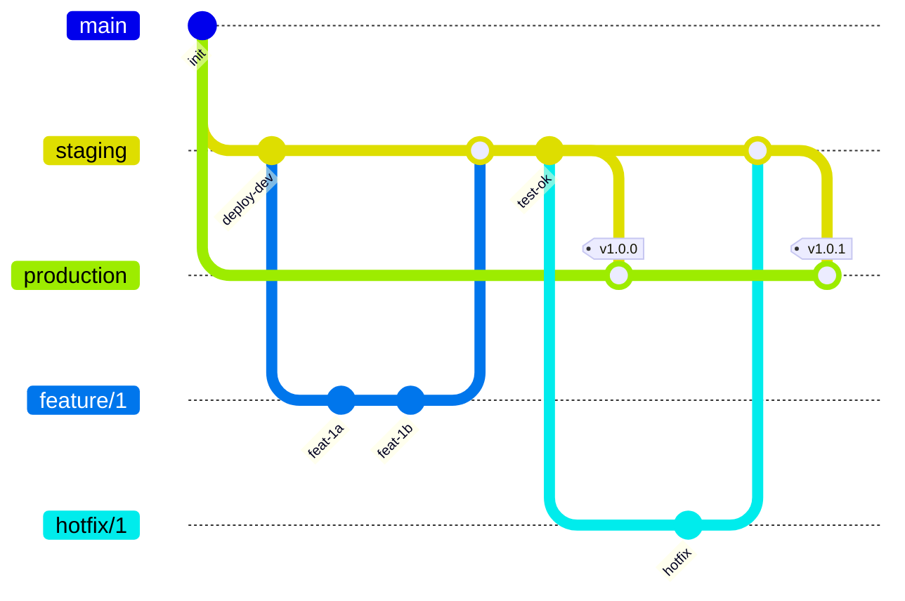

# Git 工作流

> 交互式学习推荐：[Learn Git Branching](https://learngitbranching.js.org/?locale=zh_CN)

---

## 1. 三种工作流对比

| 工作流 | 长期分支 | 版本概念 | 适用场景 |
|--------|---------|---------|---------|
| **Git Flow** | `main` + `develop` | 有版本号（1.0, 2.0） | 多版本软件 |
| **GitHub Flow** | 仅 `main` | 持续部署 | SaaS/Web 应用 |
| **GitLab Flow** | `main` + 环境分支 | 无明确版本号 | 多环境企业应用 |

| 维度 | GitLab Flow | Git Flow | GitHub Flow |
|------|------------|----------|-------------|
| 环境映射 | 分支对应具体环境 | 无直接映射 | 无直接映射 |
| 热修复同步 | 逐级同步到上游 | 同步到 `develop` | 直接合并 `main` |
| 测试方式 | CI/CD + PR 测试 | `release` 分支测试 | 通过 `main` 模拟环境 |

---

## 2. Git Flow

### 2.1 分支模型



### 2.2 分支说明

| 分支 | 说明 | 命名示例 |
|------|------|---------|
| `master/main` | 发布分支，只存稳定版本 | `main` |
| `develop` | 开发分支，集成所有 feature | `develop` |
| `feature` | 功能分支 | `feature/FOO-1` |
| `hotfix` | 紧急修复分支 | `hotfix/FOO-3` |
| `release` | 发布准备工作 | `release/1.0.3` |

### 2.3 版本 1.0.0 流程

```bash
# 1. 创建 develop
git checkout -b develop

# 2. feature 开发，完成后合并到 develop
git checkout develop
git checkout -b feature/1
git commit -m "feat: ..."
git checkout develop
git merge feature/1

# 3. 功能开发完成 → 创建 release
git checkout develop
git checkout -b rel/1.0.0

# 4. release 发现 bug，直接在上面修复
git checkout rel/1.0.0
git commit -m "fix: ..."

# 5. release 合并到 develop 和 main，打 tag
git checkout develop
git merge rel/1.0.0
git checkout main
git merge rel/1.0.0
git tag 1.0.0
```

### 2.4 Hotfix 流程

```bash
git checkout main
git checkout -b hotfix/1
git commit -m "fix: urgent bug"
git checkout develop
git merge hotfix/1
git checkout main
git merge hotfix/1
git tag 1.0.1
```

### 2.5 Breaking Change（大版本升级 2.0.0）

老接口不兼容时，必须升级大版本号：

```bash
# 清理旧分支
git branch -d feature/1 feature/2 feature/3
git branch -d rel/1.0.0 rel/1.1.0
git branch -d hotfix/1

# 开发 2.0.0
git checkout develop
git checkout -b feature/5
git commit -m "feat: breaking change"
git checkout develop
git merge feature/5
git checkout -b rel/2.0.0
git checkout main
git merge rel/2.0.0
git tag 2.0.0
```

### 2.6 老版本维护（Support 分支）

主版本已升级到 2.0.0，但 1.x 仍需修 bug：

```bash
git checkout 1.1.0              # 定位到老版本 tag
git checkout -b sup/1.x         # 创建老版本维护分支
git checkout -b feature/8       # 在上面修 bug
git commit -m "fix: ..."
git checkout sup/1.x
git merge feature/8
```

> **总结**：develop 包含 main 和 feature 的代码。release 作为功能发布分支为 main 提供支持，release 有 bug 在 release 上修改后合并到 develop 和 main。线上 bug 由 hotfix 解决，修复后合并到 develop 和 main（不需要合并到 release）。Breaking change 需升级大版本号。1.x 功能由 sup/1.x 分支提供支持。

---

## 3. GitHub Flow

### 3.1 分支模型



### 3.2 核心规则

- 所有开发在 feature 分支进行
- 直接合并到 `main`，打 tag 即发布
- hotfix 处理后只合并 `main`，活跃分支需要 merge `main` 同步，不能直接 merge hotfix

### 3.3 操作流程

```bash
# 功能开发
git checkout -b feature/1
git commit -m "feat: ..."
git checkout main
git merge feature/1
git tag 1.0.0

# hotfix
git checkout main
git checkout -b hotfix/1
git commit -m "fix: ..."
git checkout main
git merge hotfix/1
git tag 1.0.1

# 其他 feature 同步 main 最新代码
git checkout feature/2
git merge main
# 继续开发...
git commit -m "feat: ..."
git checkout main
git merge feature/2
git tag 1.1.0
```

> **总结**：GitHub Flow 适合发布和维护一个版本的流程。hotfix 修复后只合并到 main，活跃分支通过 merge main 同步最新代码，不能直接 merge hotfix。

---

## 4. GitLab Flow

### 4.1 分支模型



### 4.2 特点

引入环境分支，代码逐级升级：

```
main → staging → production
     (开发)      (测试)        (生产)
```

> **总结**：GitLab Flow 为多环境企业应用设计的平衡工作流，代码按环境逐级推进，适合需要通过 PR/CR 的企业团队。

---

## 5. 工作实践

### 5.1 不同场景的流程选择

| 场景 | 推荐 |
|------|------|
| 多版本产品（有版本号） | Git Flow |
| 多租户 SaaS（区分环境） | GitLab Flow |
| 小系统 / 持续部署 | GitHub Flow |

### 5.2 日常操作习惯

```bash
# 每次提交前先拉取
git pull origin main --rebase

# 如果本地有未提交改动
git stash
git pull --rebase
git stash pop

# 有冲突就人工解决（避免多余的 merge commit）
# 解决后：
git add .
git rebase --continue
```

### 5.3 代码冲突处理

- **本地冲突**：`git stash pop` 或 `git rebase` 时触发，手工解决 → `git add` → `git rebase --continue`
- **已 merge 但未 push**：用 `git reset HEAD~ --hard` 撤销 merge → 改用 rebase
- **远程冲突**：拉取最新代码 → 本地 rebase 解决 → 再 push
