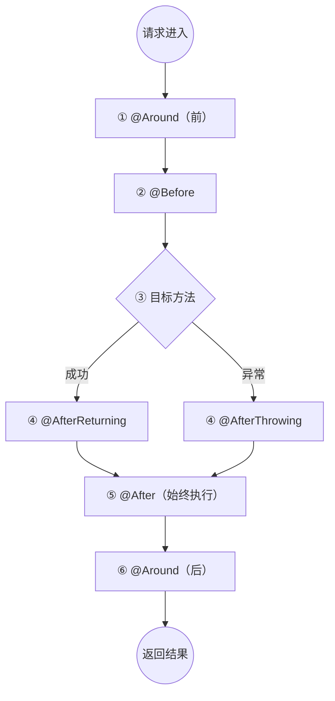

# Spring 核心知识

## 一、Spring 与 Spring Boot 概述

| 概念 | 说明 |
|------|------|
| **Spring** | 开源框架，提供 IOC/AOP 等基础能力 |
| **框架** | 可复用的设计和架构，提供基础结构、标准、约定来帮助快速构建应用 |
| **Spring Boot** | 对 Spring 的扩展增强，"约定优于配置"，通过自动配置、内嵌服务器、Starter 简化开发 |
| **约定优于配置** | 系统设定默认值，开发者仅在偏离约定时才需显式配置 |

> **Web 服务器** vs **HTTP 客户端**：服务器 = 餐厅（接收请求提供服务，如 Tomcat），客户端 = 外卖员（发送请求调用其他服务，如 Feign）。

---

## 二、Spring AOP

### 2.1 核心概念

| 概念 | 说明 |
|------|------|
| **Advice（通知）** | 切面在特定连接点执行的动作 |
| **Join Point（连接点）** | 程序中所有可能被拦截的点（方法调用、异常抛出等） |
| **Pointcut（切点）** | 通过表达式筛选出的实际要拦截的连接点 |
| **Aspect（切面）** | 包含 Pointcut 和 Advice 的模块化单元 |

### 2.2 五种通知类型




> 关键点：`@After` 在 `@AfterReturning` / `@AfterThrowing` 之后执行，类似于 finally 语义。`@Around` 可以修改返回值甚至不调用目标方法，其他通知不能。

### 2.3 完整示例

```java
@Aspect
@Component
public class LogAspect {

    Logger logger = LoggerFactory.getLogger(LogAspect.class);

    @Pointcut("execution(public * com.example.aspect.service.impl..*.*(..))")
    public void servicePointCut() {
    }

    @Before("servicePointCut()")
    public void logBeforeService(JoinPoint joinPoint) {
        Signature signature = joinPoint.getSignature();
        logger.info("请求方法名称类: {}", signature.getDeclaringTypeName());
        logger.info("请求方法名: {}", signature.getName());
        logger.info("请求参数：{}", joinPoint.getArgs());
    }

    @After(value = "servicePointCut()")
    public void afterService(JoinPoint joinPoint) {
    }

    @AfterReturning(returning = "object", pointcut = "servicePointCut()")
    public Object afterReturnService(Object object) {
        logger.info("返回参数：{}", object);
        return object;
    }
}
```

---

## 三、依赖注入 (DI)

DI 的核心思想：内部使用不关注外部实现，外部实现不影响内部使用，分工解耦。

### 3.1 注入方式对比

| 方式 | 示例 | 特点 |
|------|------|------|
| **字段注入** | `@Autowired private MyRepository repo;` | 使用最多，反射实现 |
| **Setter 注入** | `@Autowired public void setRepo(MyRepository r)` | 可选依赖，可动态更换 |
| **构造方法注入** | `public MyService(MyRepository r)` | 推荐方式，保证不可变，便于测试 |

```java
// 构造方法注入（推荐）
@Component
public class MyService {
    private final MyRepository repository;

    public MyService(MyRepository repository) {
        this.repository = repository;
    }
}
```

### 3.2 装配规则

| 注解 | 默认方式 | 支持位置 | 特殊说明 |
|------|---------|---------|---------|
| `@Autowired` | byType，多个则 byName | 字段、构造方法、setter、普通方法 | 配合 `@Qualifier` 可按 id 装配 |
| `@Resource` | byName → byType | 字段、setter | 通过 `name` 属性指定 bean 名称 |

---

## 四、Bean 生命周期

```
实例化 → 属性填充 → Aware 回调 → BeanPostProcessor 前置处理
→ 初始化方法 → BeanPostProcessor 后置处理 → 就绪 → 销毁
```

| 阶段 | 说明 |
|------|------|
| 1. 实例化 | 调用构造方法创建对象 |
| 2. 属性填充 | DI 注入依赖（setter、字段注入） |
| 3. Aware 回调 | `ApplicationContextAware` 等，感知容器环境 |
| 4. `BeanPostProcessor` 前置 | 初始化前加工（生成代理、修改属性） |
| 5. 初始化方法 | `@PostConstruct` → `InitializingBean` → `init-method` |
| 6. `BeanPostProcessor` 后置 | 初始化后加工（AOP 代理在此阶段创建） |
| 7. 就绪 | Bean 可被正常使用 |
| 8. 销毁 | `@PreDestroy` → `DisposableBean` → `destroy-method` |

> AOP 代理在 BeanPostProcessor 后置处理阶段创建。

---

## 五、Bean 的创建方式

### 5.1 五种方式

| 方式 | 适用场景 | 示例 |
|------|---------|------|
| **注解声明** | 业务组件 | `@Service`、`@Repository`、`@Controller` |
| **XML 声明** | 遗留项目 | `<bean id="..." class="..."/>` |
| **Java Config** | 第三方组件、复杂初始化 | `@Configuration` + `@Bean` |
| **FactoryBean** | 封装复杂创建过程 | `SqlSessionFactoryBean` |
| **手动注册** | 框架级别扩展 | `BeanDefinitionRegistryPostProcessor` |

### 5.2 `@Component` vs `@Configuration` + `@Bean`

| 维度 | `@Component` | `@Configuration` + `@Bean` |
|------|-------------|--------------------------|
| 级别 | 类级别 | 方法级别 |
| 适用场景 | 业务组件声明 | 第三方/外部组件，显式配置复杂初始化 |

### 5.3 FactoryBean 示例

```java
// MyBatis 中 SqlSessionFactoryBean 实现 FactoryBean<SqlSessionFactory>
public SqlSessionFactory getObject() throws Exception {
    if (this.sqlSessionFactory == null) {
        this.afterPropertiesSet();
    }
    return this.sqlSessionFactory;
}
```

### 5.4 手动注册（框架级扩展）

```java
@Component
public class MyBeanRegistrar implements BeanDefinitionRegistryPostProcessor {
    @Override
    public void postProcessBeanDefinitionRegistry(BeanDefinitionRegistry registry) {
        RootBeanDefinition beanDefinition = new RootBeanDefinition(MyDynamicBean.class);
        beanDefinition.setScope(BeanDefinition.SCOPE_SINGLETON);
        registry.registerBeanDefinition("myDynamicBean", beanDefinition);
    }
}
```

---

## 六、Spring Boot 自动配置

### 6.1 启动类注解

```
@SpringBootApplication = @Configuration + @EnableAutoConfiguration + @ComponentScan
```

| 注解 | 来源 | 作用 |
|------|------|------|
| `@Configuration` | Spring | 声明配置类，配合 `@Bean` 注册 Bean |
| `@EnableAutoConfiguration` | Spring Boot | 基于 classpath 自动装配 Bean |
| `@ComponentScan` | Spring | 启用组件扫描，自动发现和注册 Bean |
| `@ConfigurationProperties` | Spring Boot | 批量绑定配置文件属性到 Java Bean |

> `@ConfigurationProperties` 只绑定属性，需配合 `@Component` 或 `@EnableConfigurationProperties` 才能注入容器。

### 6.2 Starter 工作原理

1. **依赖管理**：Starter 是 Maven/Gradle 模块，`pom.xml` 声明一组相关依赖，传递性下载
2. **自动配置**：扫描 classpath 下 `META-INF/spring/org.springframework.boot.autoconfigure.AutoConfiguration.imports`（2.7+）中的配置类
3. **条件注解**：控制配置生效时机

### 6.3 条件注解

| 注解 | 生效条件 |
|------|---------|
| `@ConditionalOnClass` | classpath 中存在指定类 |
| `@ConditionalOnMissingBean` | 容器中不存在指定 Bean |
| `@ConditionalOnProperty` | 配置文件存在指定属性 |
| `@ConditionalOnWebApplication` | 应用为 Web 应用 |

---

## 七、循环依赖与三级缓存

### 7.1 问题场景

```java
@Service
public class ServiceA {
    @Autowired
    ServiceB serviceB;
}

@Service
public class ServiceB {
    @Autowired
    ServiceA serviceA;
}
```

### 7.2 Spring 解决流程

```
getBean → 缓存查找 → 创建对象 → 填充属性(DI) → 初始化 → 就绪
```

### 7.3 三级缓存

| 缓存级别 | 存放内容 | 说明 |
|---------|---------|------|
| **一级缓存** | 完整 Bean（可直接使用） | `singletonObjects` |
| **二级缓存** | 提前曝光的对象（属性未填充） | `earlySingletonObjects` |
| **三级缓存** | 对象工厂（可能产生 A 或 proxyA） | `singletonFactories` |

> 流程：A 创建 → 提前曝光到三级缓存 → 填充属性时发现需要 B → B 创建时需要 A → 从三级缓存拿到 A 的早期引用 → B 完成 → A 完成。

---

## 八、SpEL 表达式

### 8.1 `#{}` vs `${}`

| 表达式 | 类型 | 说明 |
|--------|------|------|
| `${}` | 属性占位符 | 读取配置文件属性值 |
| `#{}` | SpEL 表达式 | 支持运算、方法调用、引用 Bean |

### 8.2 使用场景

```java
// 注解中使用 SpEL
@Value("#{systemProperties['user.timezone']}")
private String timezone;

@Scheduled(fixedDelayString = "#{${task.interval} * 1000}")
public void dynamicTask() { }

// Kafka 动态获取配置
@KafkaListener(topics = "#{@crmKafkaTopicConfig.index}", ...)
public void batchIndexListener(...) { }
```

```yaml
# 配置文件
app.batch-size: #{10 * 5}
app.data-dir: #{environment['DATA_HOME'] ?: '/tmp/data'}
app.api.url: #{'http://' + '${app.host}' + ':' + '${app.port}' + '/api'}
```

```xml
<!-- XML 中使用 SpEL -->
<property name="maximumPoolSize"
    value="#{T(java.lang.Integer).parseInt(environment['db.pool.max'])}"/>
```

> 注意：AOP 的 `@Pointcut` 表达式（`execution`、`@annotation`）不是 SpEL，是 AspectJ 独有的表达式语法。

---

## 九、Log4j2 日志

### 9.1 核心概念

| 概念 | 作用 |
|------|------|
| **Logger** | 记录什么日志（定义日志类别和级别） |
| **Appender** | 日志输出到哪儿（控制台、文件、远程等） |

### 9.2 Appender 类型

| Appender | 用途 |
|----------|------|
| **Console** | 输出到控制台（SYSTEM_OUT / SYSTEM_ERR） |
| **RollingRandomAccessFile** | 滚动日志文件（按时间/大小归档） |
| **GELF** | 发送到 Graylog 等日志收集系统 |

**Console 配置示例**：
```xml
<Console name="STDOUT" target="SYSTEM_OUT">
    <PatternLayout pattern="${logfile.pattern}"/>
</Console>

<Console name="STDERR" target="SYSTEM_ERR">
    <PatternLayout pattern="${logfile.pattern}"/>
    <Filters>
        <ThresholdFilter level="ERROR" onMatch="ACCEPT" onMismatch="DENY"/>
    </Filters>
</Console>
```

```bash
# SYSTEM_OUT → app.log, SYSTEM_ERR → error.log
nohup java -jar app.jar 1>app.log 2>error.log &
```

**滚动日志配置**：
```xml
<RollingRandomAccessFile
    name="SERVICE_LOG_FILE"
    fileName="${logfile.path}/service.log"
    filePattern="${logfile.arch.path}/service-%d{yyyy-MM-dd}-%i.log.gz">
    <Policies>
        <TimeBasedTriggeringPolicy/>
    </Policies>
    <DefaultRolloverStrategy/>
</RollingRandomAccessFile>
```

归档目录结构：
```
/data/logs/myapp/
├── service.log                  # 当前活跃日志
└── 2024-01/
    ├── service-2024-01-20-1.log.gz
    ├── service-2024-01-21-1.log.gz
    └── service-2024-01-22-1.log.gz
```

### 9.3 GELF（Graylog Extended Log Format）

```xml
<Gelf name="GELF-SERVICE"
      facility="SOA-SERVICE"
      host="${gelf.host}" port="${gelf.port}"
      version="1.1"
      extractStackTrace="true" filterStackTrace="true"
      mdcProfiling="true" includeFullMdc="true"
      maximumMessageSize="8192"
      originHost="%host{fqdn}">
    <Field name="logTime" pattern="${timestamp.pattern}"/>
    <Field name="severity" pattern="%p"/>
    <Field name="className" pattern="%C"/>
    <DynamicMdcFields regex="mdc.*"/>
</Gelf>
```

### 9.4 Logger 配置

```xml
<!-- ROOT：所有 logger 的父类 -->
<Root level="info">
    <AppenderRef ref="STDOUT"/>
    <AppenderRef ref="SERVICE_LOG_FILE"/>
</Root>

<!-- 特定包路径的 logger -->
<Logger name="com.alibaba.nacos" level="WARN" additivity="false">
    <AppenderRef ref="STDERR"/>
    <AppenderRef ref="SERVICE_LOG_FILE"/>
</Logger>
```

> 为什么需要单独配置第三方 Logger？ROOT 通常定义为 INFO 级别，但第三方组件（如 MyBatis）默认可能输出 DEBUG 或 WARN 级别，不单独配置就无法被 ROOT 捕获。`additivity="false"` 防止日志重复输出到父 logger。

### 9.5 日志级别

```
DEBUG < INFO < WARN < ERROR < FATAL
```

配置 `level="info"` 表示 >= INFO 的日志都会输出。

---

## 十、自定义拦截器

```java
@Component
public class AuthInterceptor implements HandlerInterceptor {

    @Override
    public boolean preHandle(HttpServletRequest request,
                             HttpServletResponse response,
                             Object handler) throws Exception {
        // Controller 方法执行前
        String token = request.getHeader("Authorization");
        if (!isValid(token)) {
            response.setStatus(401);
            return false; // 中断请求
        }
        return true;
    }

    @Override
    public void postHandle(...) {
        // Controller 执行后，视图渲染前
    }

    @Override
    public void afterCompletion(...) {
        // 整个请求完成后（包括视图渲染）
    }
}
```

---

## 十一、全局异常处理

```java
@RestControllerAdvice
public class ControllerResponseAdvice implements ResponseBodyAdvice<Object> {

    @Override
    public Object beforeBodyWrite(Object object, ...) {
        if (object instanceof Response response) {
            response.setTranceId("123");
            response.setCostTime(1000L);
        }
        return object;
    }

    @ExceptionHandler({Exception.class})
    public Response handleException(HttpServletRequest request,
                                     HttpServletResponse response, Exception e) {
        return new Response();
    }
}
```

---

## 十二、启动任务与缓存预热

### 12.1 三种方式

| 方式 | 时机 | 推荐度 |
|------|------|--------|
| **`CommandLineRunner`** | ApplicationContext 刷新完成，请求接收前 | 推荐 |
| **`ApplicationRunner`** | 同 CommandLineRunner | 推荐 |
| **`@EventListener(ApplicationReadyEvent.class)`** | 应用完全启动后 | 可选 |
| **`@PostConstruct`** | 依赖注入完成后 | 不推荐（资源可能未就绪） |

### 12.2 缓存预热示例

```java
@Component
public class CachePreheatRunner implements CommandLineRunner {
    @Autowired
    private ProductCacheService productCacheService;

    @Override
    public void run(String... args) {
        productCacheService.preheatHotProducts();
    }
}

@Service
public class ProductCacheService {
    private static final String HOT_PRODUCTS_KEY = "hot:products";

    public void preheatHotProducts() {
        List<Product> hotProducts = productMapper.selectHotProducts(100);
        redisTemplate.opsForValue().set(HOT_PRODUCTS_KEY, hotProducts, 1, TimeUnit.HOURS);
    }
}
```

启动时序：应用启动 → Bean 加载完成 → Spring 上下文就绪 → `ApplicationRunner.run()` → Web 服务器启动 → 接受外部请求

---

## 十三、获取 Bean

```java
@Component
public class SpringUtil implements ApplicationContextAware {

    private static ApplicationContext applicationContext;

    @Override
    public void setApplicationContext(ApplicationContext applicationContext) {
        SpringUtil.applicationContext = applicationContext;
    }

    public static ApplicationContext getApplicationContext() {
        return applicationContext;
    }

    @SuppressWarnings("unchecked")
    public static <T> T getBean(String name) {
        return (T) applicationContext.getBean(name);
    }
}
```

---

## 十四、常用注解速查

| 分类 | 注解 | 作用 |
|------|------|------|
| **Bean 定义** | `@Component` | 通用组件 |
| | `@Service` | 业务层组件 |
| | `@Repository` | 数据访问层（含异常转换） |
| | `@Controller` | Web 控制器 |
| | `@RestController` | REST 控制器 = `@Controller` + `@ResponseBody` |
| **依赖注入** | `@Autowired` | 按类型自动装配 |
| | `@Resource` | 按名称装配（JSR-250） |
| | `@Qualifier` | 指定 Bean 名称 |
| | `@Primary` | 首选 Bean |
| | `@Lazy` | 延迟初始化 |
| **配置** | `@Configuration` | 配置类 |
| | `@Bean` | 方法返回值注册为 Bean |
| | `@ConfigurationProperties` | 配置文件属性绑定 |
| **条件** | `@ConditionalOnClass` | 类存在时生效 |
| | `@ConditionalOnMissingBean` | Bean 不存在时生效 |
| | `@ConditionalOnProperty` | 属性存在时生效 |
| **生命周期** | `@PostConstruct` | 初始化回调 |
| | `@PreDestroy` | 销毁回调 |
