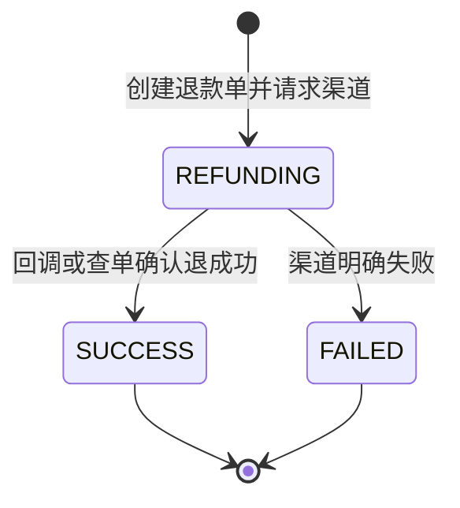
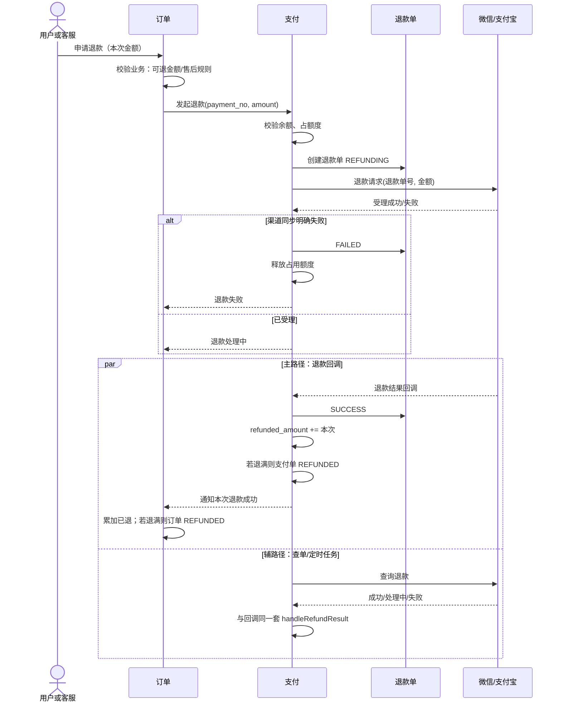
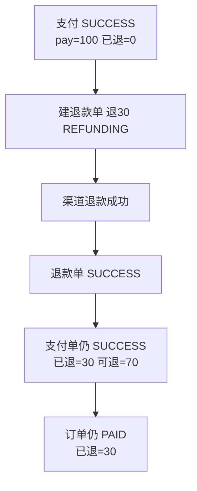
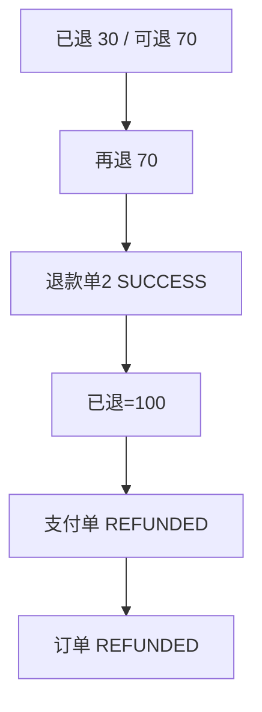
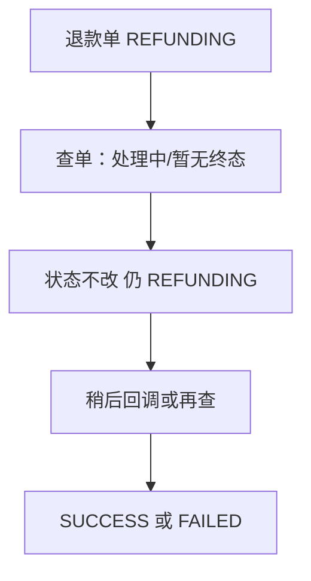
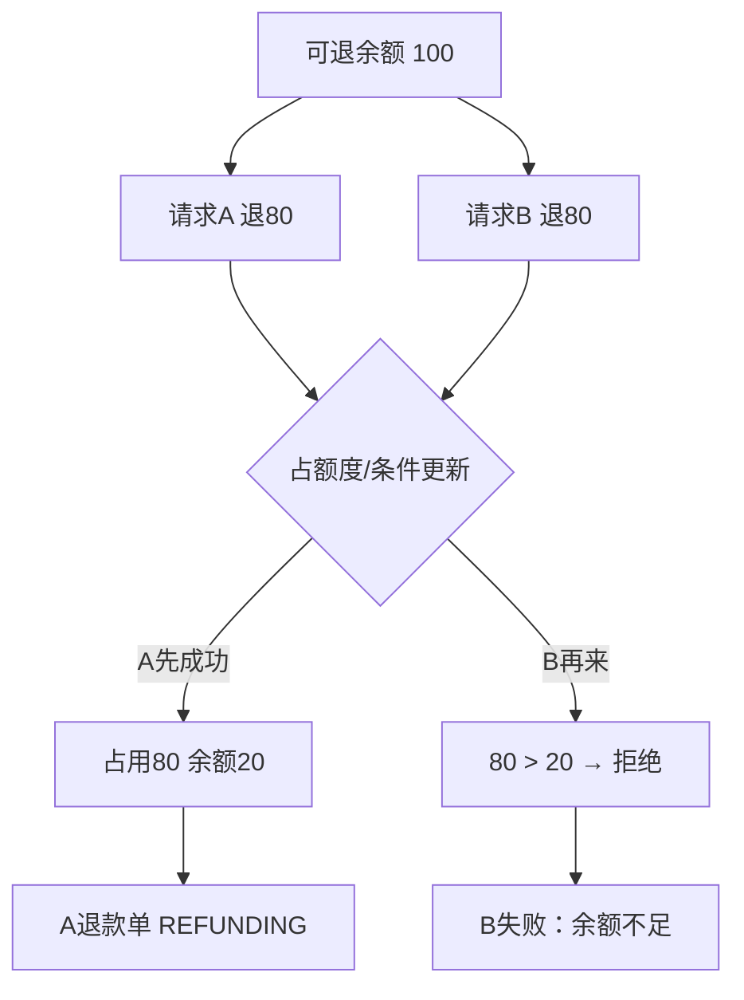
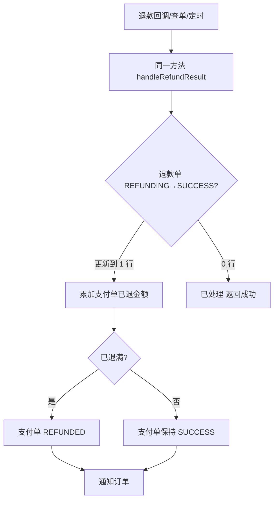
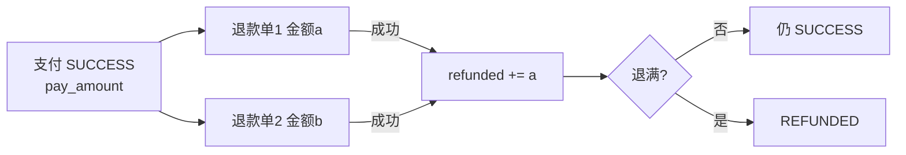

# 支付 · 部分退款（精简版）

> 承接《用户 · 订单 · 支付（精简版）》。  
> 主文档把退款收成 `SUCCESS → REFUNDING → REFUNDED`，适合讲全额退完；  
> **本文专门讲：一笔支付可以退多次、每次只退一部分。**

---

## 1. 先说结论

| 问题 | 答案 |
|------|------|
| 微信支持部分退款吗？ | **支持**。一笔支付可多次部分退，常见上限约 50 次；累计退款 ≤ 原支付金额 |
| 支付宝支持部分退款吗？ | **支持**。一笔交易可分多次退；每次换不同退款请求号；累计 ≤ 原金额 |
| 钱怎么退？ | **原路退回**（退回用户当时的支付账户/渠道） |
| 没退完时支付单算什么？ | 仍是 **已支付（可继续退）**，不是失败，也不是已关闭 |
| 什么时候才算 REFUNDED？ | **累计已退金额 = 原支付金额**（全额退完） |

一句话：

- **支付成功**管的是「钱进来了」
- **退款单**管的是「这一次退了多少、退没退成」
- **累计已退**管的是「这笔支付还剩多少可退」
- **只有退满**，支付单/订单才进入「已全额退款」

---

## 2. 为什么主文档那套状态不够用

主文档：

```text
SUCCESS → REFUNDING → REFUNDED
```

问题在于：

| 场景 | 只有三态时会怎样 |
|------|------------------|
| 100 元订单，先退 30 | 变成 REFUNDED？不对，还剩 70 |
| 先退 30 再退 70 | 第二次退款时支付单已经 REFUNDED，模型说不通 |
| 退 30 成功、退 20 还在渠道处理中 | 一个 REFUNDING 描述不了「已退 30 + 在退 20」 |
| 多次退款回调乱序到达 | 没有「退款单」维度，很难做幂等 |

所以部分退款要 **拆成两层**：

```text
支付单（一笔收款）     退款单（每一次退款动作）
────────────────     ────────────────────
管：原金额、已退累计     管：本次金额、本次结果
管：还能不能再退         管：跟渠道的一次请求
```

---

## 3. 模型：支付单 + 退款单 + 金额字段

### 3.1 支付单（在主文档基础上加字段）

| 字段 | 含义 |
|------|------|
| `pay_amount` | 原支付成功金额（不可改） |
| `refunded_amount` | 已成功退款累计金额 |
| `refunding_amount` | 正在退、尚未确认成功的占用金额（可选，防超退） |
| `status` | 见下表 |

**支付单状态（支持部分退款版）：**

| 状态 | 含义 |
|------|------|
| `PAYING` | 支付中 |
| `SUCCESS` | 支付成功，**且未全额退完**（可 0 退、可部分退） |
| `CLOSED` | 未支付关闭 |
| `REFUNDING` | **可选**：当前存在进行中的退款（有的系统不用此态，只看退款单） |
| `REFUNDED` | **已全额退完**（`refunded_amount == pay_amount`） |

推荐更干净的做法：

```text
支付单主状态只保留：
  PAYING / SUCCESS / CLOSED / REFUNDED

「有没有在退」看退款单表，不靠支付单卡在 REFUNDING
```

对应关系：

```text
refunded_amount = 0                    → SUCCESS（未退过）
0 < refunded_amount < pay_amount       → SUCCESS（部分已退，仍 SUCCESS）
refunded_amount = pay_amount           → REFUNDED（全额退完）
```

> 要点：**部分退款成功后，支付单往往仍是 SUCCESS，不是 REFUNDED。**  
> 这和支付宝「部分退款后交易仍可能是成功态」的直觉一致。

### 3.2 退款单（每一次退款一条）

| 字段 | 含义 |
|------|------|
| `refund_no` | 商户退款单号（全局唯一；微信/支付宝都靠它做幂等） |
| `payment_no` | 原支付单号 |
| `order_no` | 业务订单号 |
| `refund_amount` | **本次**退款金额 |
| `status` | 见下表 |
| `channel_refund_no` | 渠道退款单号（回调后回写） |

**退款单状态：**

| 状态 | 含义 |
|------|------|
| `INIT` / `REFUNDING` | 已受理，等待渠道结果 |
| `SUCCESS` | 本次退款成功 |
| `FAILED` | 本次失败（可换新单重试，或同单按规则重试） |
| `CLOSED` | 关闭/撤销（按产品需要，可不用） |



### 3.3 订单侧（和钱相关）

| 状态/字段 | 含义 |
|-----------|------|
| `PAID` | 已支付；可能 `refunded_amount > 0` 但仍未退满 |
| `REFUNDED` | 订单维度也退满（或业务认为整单结束） |
| `refunded_amount` | 订单累计已退（可与支付单对齐，或按售后单汇总） |

电商常见更细：

```text
订单 PAID
  └─ 售后单 A 退 30 → 售后成功
  └─ 售后单 B 退 70 → 售后成功
订单在「商品/金额都退完」后 → REFUNDED 或交易关闭
```

面试精简版可以不展开售后单，但要有 **累计已退金额**。

### 3.4 金额恒等式（写进代码校验）

```text
pay_amount >= 0
refunded_amount >= 0
refunding_amount >= 0

refunded_amount + refunding_amount <= pay_amount

本次 refund_amount > 0
本次 refund_amount <= pay_amount - refunded_amount - refunding_amount
```

硬规则：

1. **不能超退**（累计不能大于原支付）  
2. **退款金额单位**与渠道一致（微信成分，支付宝按约定精度）  
3. **只有退款单 SUCCESS**，才把金额加进 `refunded_amount`  
4. **进行中的退款要占额度**，防止并发两次都按「余额 100」各退 80

---

## 4. 总流程（部分退款）



一句话：

- **订单**决定「允不允许退、退多少业务含义」  
- **支付**决定「渠道能不能退、退款单与累计金额」  
- **渠道**决定「钱有没有真正退回去」  
- **以渠道确认成功为准** 增加 `refunded_amount`

---

## 5. 五个业务：状态和金额怎么转

### 5.1 一次部分退款成功（未退满）



| 步骤 | 支付单 | 已退累计 | 退款单 | 订单 |
|------|--------|----------|--------|------|
| 已支付 | SUCCESS | 0 | - | PAID |
| 发起退 30 | SUCCESS | 0（占用 30） | REFUNDING / 30 | PAID |
| 退成功 | **SUCCESS** | **30** | SUCCESS | **PAID**（已退 30） |

注意：**未退满不要把支付单改成 REFUNDED。**

---

### 5.2 多次部分退款，最后退满



| 步骤 | 已退累计 | 支付单 | 订单 |
|------|----------|--------|------|
| 第一次退 30 成功 | 30 | SUCCESS | PAID |
| 第二次退 70 成功 | 100 | **REFUNDED** | **REFUNDED** |

---

### 5.3 一次就全额退款

等价于「部分退款模型下的一次退满」：

| 步骤 | 支付单 | 已退 | 退款单 | 订单 |
|------|--------|------|--------|------|
| 已支付 100 | SUCCESS | 0 | - | PAID |
| 退 100 成功 | REFUNDED | 100 | SUCCESS / 100 | REFUNDED |

主文档的 `SUCCESS → REFUNDING → REFUNDED` 是本场景的缩略版。

---

### 5.4 退款处理中：查不到结果



硬规则：

- **查不到 ≠ 失败**，也 ≠ 成功  
- 占用额度保持，防止用户以为失败又发起一笔导致超退  
- 定时任务 + 查单，与支付成功一样要有补偿

---

### 5.5 并发：两笔退款抢同一笔可退余额

例：可退 100，请求 A 退 80、请求 B 退 80。



做法见第 7 节：用 **条件更新占额度** 或 **锁支付单**，保证不会两笔都成功受理。

---

## 6. 幂等：退款比支付更要「按单号」

### 6.1 退款单号唯一

```text
同一 refund_no 重复请求：
  → 返回同一退款单当前状态
  → 绝不新开一笔渠道退款
```

微信/支付宝都要求：多次退款换 **不同退款单号/退款请求号**；重试同一笔必须用 **原单号**。

### 6.2 退款成功只入账一次

```text
handleRefundSuccess(refund_no):
  1. 条件更新退款单：
     WHERE refund_no=? AND status='REFUNDING'
     SET status='SUCCESS', ...
  2. 影响行数 = 1 →
       支付单 refunded_amount += 本次金额
       若 refunded_amount == pay_amount → 支付单 REFUNDED
       通知订单（事件带 refund_no，订单侧也幂等）
  3. 影响行数 = 0 → 已处理过，直接返回 OK
```

支付单累加建议也做成安全更新：

```sql
UPDATE payment
SET refunded_amount = refunded_amount + :amt,
    refunding_amount = refunding_amount - :amt,
    status = CASE
      WHEN refunded_amount + :amt >= pay_amount THEN 'REFUNDED'
      ELSE status
    END,
    ...
WHERE payment_no = :payNo
  AND status IN ('SUCCESS', 'REFUNDING')  -- 按你状态机裁剪
  AND refunded_amount + refunding_amount <= pay_amount
  AND refunded_amount + :amt <= pay_amount;
```

（具体 SQL 按库语法微调；核心是 **加金额 + 防超退 + 退满改状态** 同一事务。）

### 6.3 回调 / 查单 / 定时任务共用一个结果处理函数

与主文档支付成功同构：

```text
handleRefundResult(refund_no, result):
  SUCCESS → handleRefundSuccess
  FAILED  → handleRefundFailed（释放占用）
  PROCESSING → 不改终态
```

### 6.4 通知订单也要幂等

```text
订单侧：
  同一 refund_no 只加一次已退金额
  或 WHERE 记录未处理过该 refund_no
```

防止：积分扣回两次、库存加两次、优惠券重复回退。

### 6.5 渠道回调已处理过仍返回成功

内部不重复入账，对外仍应答成功，避免渠道疯狂重试。



---

## 7. 并发安全

### 7.1 常见对打场景

| 场景 | 风险 |
|------|------|
| 用户连点退款 | 两笔退款单、可能超退 |
| 售后自动退 + 客服手工退 | 同上 |
| 退款回调 + 定时查单 | 重复增加 `refunded_amount` |
| 一笔退款成功累加 与 另一笔占额度 | 余额算错 |
| 全额退完瞬间又来一笔退款 | 对已 REFUNDED 单继续退 |

### 7.2 做法

**（1）创建退款：锁支付单或条件占额度**

```text
UPDATE payment
SET refunding_amount = refunding_amount + :amt
WHERE payment_no = ?
  AND status = 'SUCCESS'
  AND pay_amount - refunded_amount - refunding_amount >= :amt;
```

- 影响 1 行 → 允许建退款单并调渠道  
- 影响 0 行 → 余额不足或状态不对，拒绝  

**（2）退款成功累加：只通过退款单状态机一次**

不要「先查已退再加」。用退款单 `REFUNDING → SUCCESS` 抢占，抢到再加支付单金额。

**（3）退满后禁止新退款**

```text
支付单 status = REFUNDED
或 pay_amount - refunded_amount - refunding_amount <= 0
→ 拒绝新建退款单
```

**（4）失败释放占用**

```text
REFUNDING → FAILED：
  refunding_amount -= 本次金额
```

**（5）允许的流转（支付单，部分退款版）**

| 当前 | 可以变成 | 不可以 |
|------|----------|--------|
| SUCCESS | SUCCESS（部分退成功，仅改金额）、REFUNDED（退满） | 直接变 PAYING |
| REFUNDED | 无（终态） | 再 SUCCESS 收款、再开普通退款 |
| SUCCESS | 不因「发起退款」就必变 REFUNDING（若你坚持有 REFUNDING，也可以，但金额字段更重要） | 把部分退当成 CLOSED |

**（6）退款单非法流转拒绝**

| 当前 | 可以 | 不可以 |
|------|------|--------|
| REFUNDING | SUCCESS, FAILED | 直接当没生成过 |
| SUCCESS | 无 | 回 REFUNDING、改金额 |
| FAILED | 无（重试请用**新** refund_no，或按渠道规则同号重试但不改已成功单） | 改成 SUCCESS 仅靠本地想象（必须以渠道为准） |

---

## 8. 和主文档状态如何对齐

| 主文档（精简） | 本文（部分退款） |
|----------------|------------------|
| 支付 `REFUNDING` | 可保留为「存在进行中退款」；更推荐看退款单 |
| 支付 `REFUNDED` | **仅全额退完** |
| 一次退款流程 | 多次退款 = 多个退款单 |
| 订单 `REFUNDED` | 订单业务退满（常与支付退满一致；多支付单订单要汇总） |

兼容讲法（面试 30 秒版）：

```text
全额退款：SUCCESS →（退款中）→ REFUNDED
部分退款：SUCCESS 不变，记下已退金额；
         退满那一刻再变 REFUNDED
每一次退款：单独退款单，状态机 + 幂等单号
```

---

## 9. 渠道侧注意点（面试够用）

| 点 | 说明 |
|----|------|
| 都支持部分退 | 微信、支付宝均可 |
| 多次退 | 每次新退款单号；重试用旧单号 |
| 累计上限 | 不超过原支付成功金额 |
| 次数上限 | 微信常见最多约 50 次部分退（以当期文档为准） |
| 时效 | 通常支付成功后一段时间内可退（常见约 1 年量级，以签约/文档为准） |
| 有优惠券/充值免单 | 实退金额、出资方可能按渠道规则分摊，业务单要记录渠道返回 |
| 退款到账 | 原路退回；到账时间看银行/渠道，业务以渠道「退款成功」为准 |
| 部分退后交易态 | 渠道侧交易可能仍显示成功，直到全额退完或关闭 |

---

## 10. 总览（一页记住）



| 问题 | 答案 |
|------|------|
| 有没有部分退款 | 微信、支付宝都有 |
| 怎么建模 | 支付单累计金额 + 每次一笔退款单 |
| 未退满支付单状态 | 保持 SUCCESS，只加 `refunded_amount` |
| 何时 REFUNDED | 累计已退 = 原支付金额 |
| 幂等 | `refund_no` 唯一 + 退款单条件更新 + 累加只一次 + 订单一 tip 一次 |
| 并发 | 占额度条件更新防超退；成功优先按单号抢占；退满拒绝新退 |
| 查不到 | 保持 REFUNDING，不当失败 |

---

## 11. 和主文档的衔接句（可直接背）

> 支付成功只确认一次收款；退款按次建模。  
> 每次退款一张退款单，用退款单号保证幂等。  
> 支付单用已退累计判断是否退满：未满仍是成功可退，退满才 REFUNDED。  
> 超退用「可退余额 + 占用中金额」条件更新挡住。  
> 回调、查单、定时任务共用一个退款结果处理器。

---

## 文档信息

| 版本 | 说明 |
|------|------|
| 1.0 | 部分退款专项：模型、金额、五场景、幂等、并发；对接主文档状态机 |

| 相关文档 | 路径 |
|----------|------|
| 主文档 | `user-order-payment-status.md` |
| 本文 | `payment-partial-refund.md` |
