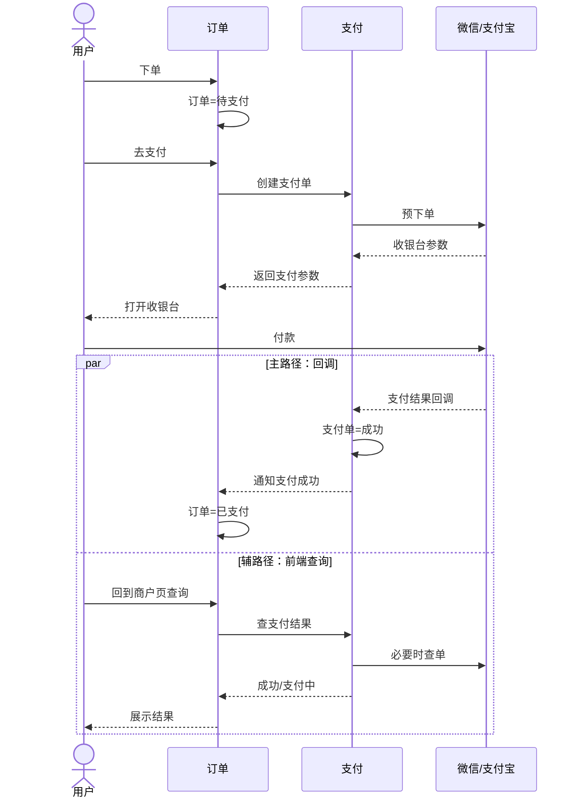
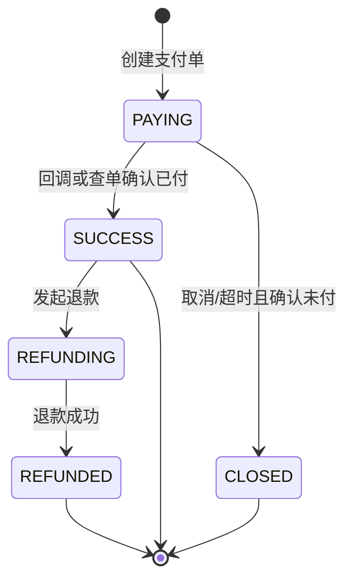
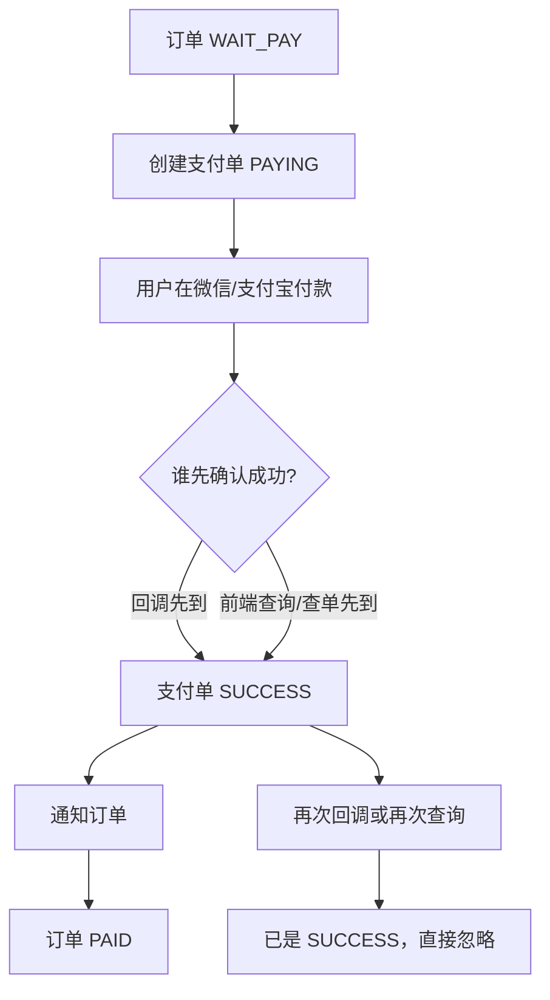
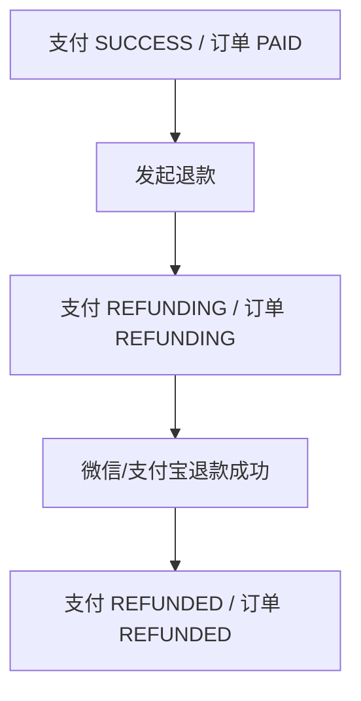
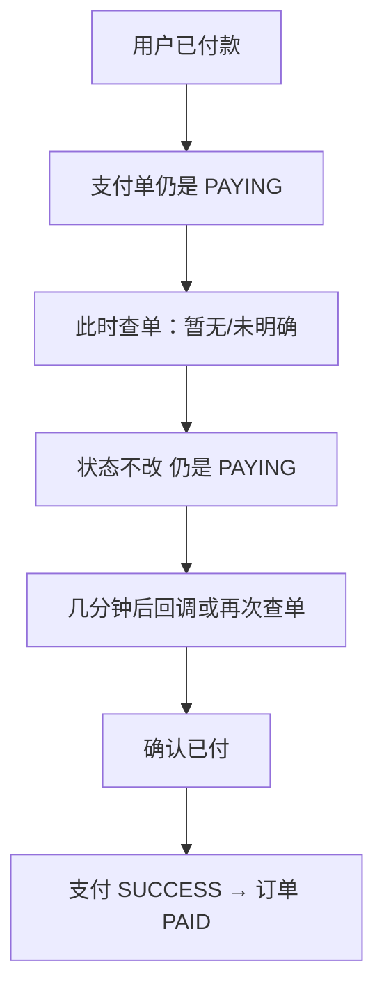
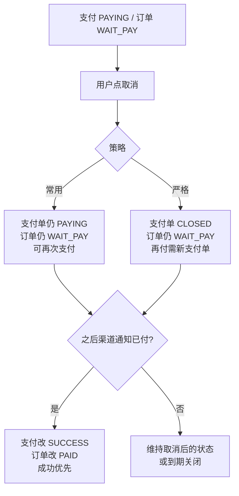
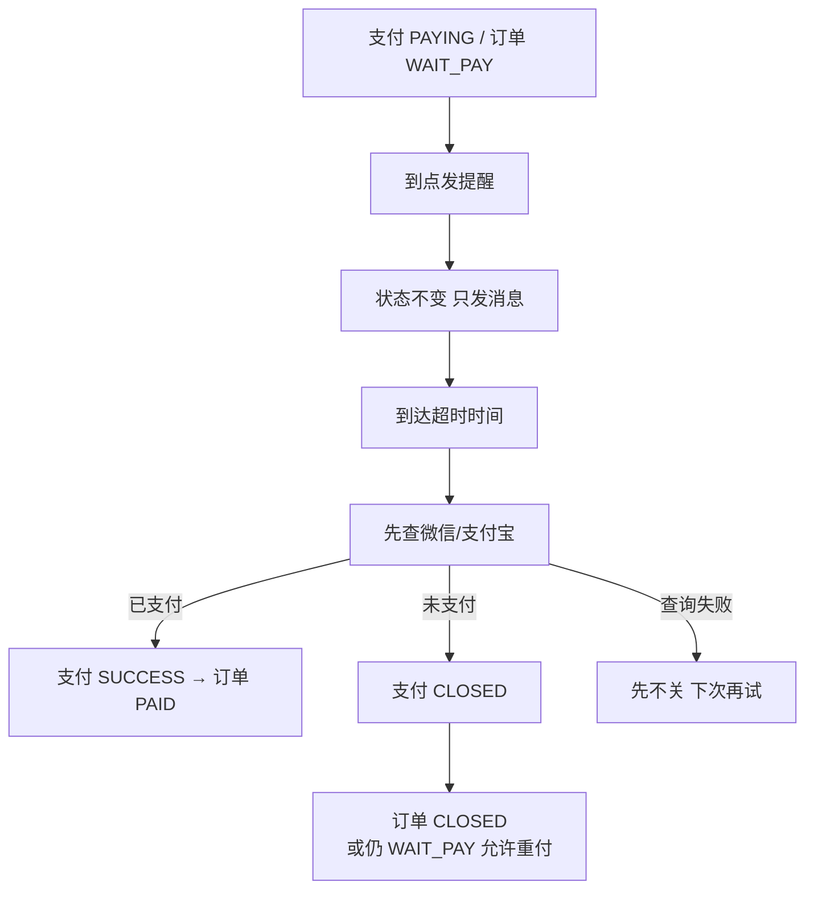
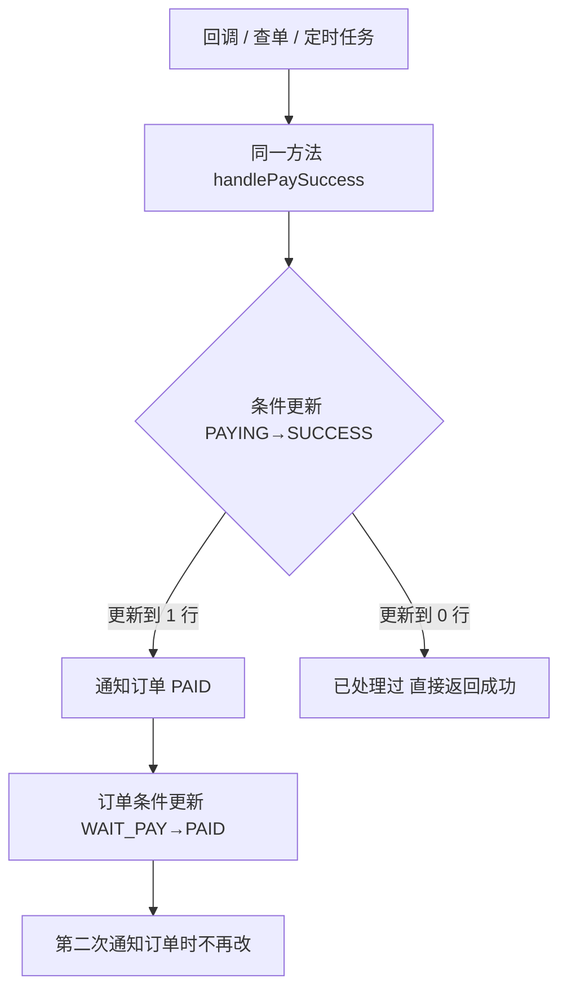
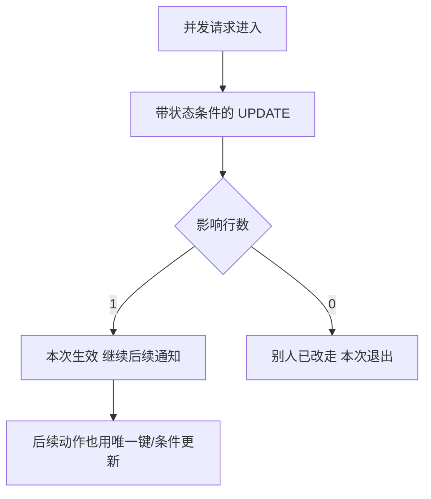
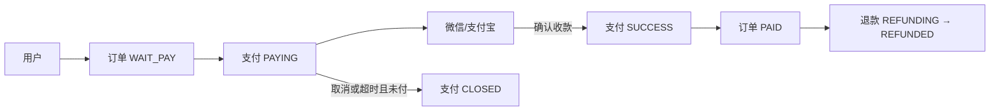

# 用户 · 订单 · 支付（精简版）

---

## 1. 用户 - 订单 - 支付 流程图



一句话：

- 订单管「买什么、付没付、能不能发货」
- 支付管「跟微信/支付宝要钱、认结果」
- **只有支付确认成功后，订单才能变已支付**

---

## 2. 支付状态有哪些

支付单只保留这些状态：

| 状态 | 含义 |
|------|------|
| `PAYING` | 支付中（已建单，还没确认收到钱） |
| `SUCCESS` | 支付成功 |
| `CLOSED` | 已关闭（取消 / 超时 / 作废） |
| `REFUNDING` | 退款中 |
| `REFUNDED` | 已全额退款 |

订单（和钱相关）只保留：

| 状态 | 含义 |
|------|------|
| `WAIT_PAY` | 待支付 |
| `PAID` | 已支付 |
| `CLOSED` | 已关闭 |
| `REFUNDING` | 退款中 |
| `REFUNDED` | 已退款 |

对应关系：

```text
支付 SUCCESS  →  订单 PAID
支付 CLOSED   →  订单一般仍 WAIT_PAY（除非整单不要了才 CLOSED）
支付 REFUNDED →  订单 REFUNDED
```

状态只能往前走（成功不能变回支付中；已关闭不能当普通失败乱改，见并发规则）。



---

## 3. 五个业务：状态怎么转（附图）

### 3.1 正常支付成功（回调为主，前端查询为辅）



| 步骤 | 支付单 | 订单 |
|------|--------|------|
| 下单 | - | WAIT_PAY |
| 去支付 | PAYING | WAIT_PAY |
| 确认收款 | SUCCESS | PAID |

---

### 3.2 成功后退款（退款单独走）



| 步骤 | 支付单 | 订单 |
|------|--------|------|
| 已支付 | SUCCESS | PAID |
| 申请退款 | REFUNDING | REFUNDING |
| 退款完成 | REFUNDED | REFUNDED |

说明：退款不是支付失败，不要回到 `PAYING`，也不要用失败状态表示退款。

---

### 3.3 已付但当时查不到，过几分钟才查到



| 步骤 | 支付单 | 订单 |
|------|--------|------|
| 已付未确认 | **保持 PAYING** | **保持 WAIT_PAY** |
| 后来确认 | SUCCESS | PAID |

硬规则：**查不到 ≠ 失败，也 ≠ 关闭。** 一直 `PAYING`，确认后再变 `SUCCESS`。

---

### 3.4 用户取消支付



| 步骤 | 支付单 | 订单 |
|------|--------|------|
| 取消后（常用） | PAYING | WAIT_PAY |
| 取消后（严格） | CLOSED | WAIT_PAY |
| 取消后却已扣款 | SUCCESS | PAID |

硬规则：**成功优先于取消。** 取消一般不关业务订单。

---

### 3.5 没打开支付 / 不付 + 提醒与超时



| 步骤 | 支付单 | 订单 |
|------|--------|------|
| 提醒时 | 不变 PAYING | 不变 WAIT_PAY |
| 超时且未付 | CLOSED | CLOSED 或 WAIT_PAY |
| 超时但已付 | SUCCESS | PAID |

硬规则：**提醒不改状态；关单前先查渠道。**

---

### 3.6 五张业务对照

| 业务 | 支付单怎么转 | 订单怎么转 |
|------|--------------|------------|
| 正常成功 | PAYING → SUCCESS | WAIT_PAY → PAID |
| 成功后退款 | SUCCESS → REFUNDING → REFUNDED | PAID → REFUNDING → REFUNDED |
| 晚到账 | 一直 PAYING → 后来 SUCCESS | 一直 WAIT_PAY → 后来 PAID |
| 用户取消 | 保持 PAYING 或 → CLOSED；若已扣款 → SUCCESS | 多保持 WAIT_PAY；已扣款 → PAID |
| 提醒/超时 | 提醒不变；超时未付 → CLOSED；已付 → SUCCESS | 提醒不变；按产品关单或重付 |

---

## 4. 怎么做到幂等

幂等 = **同一件事做很多次，结果和做一次一样**（不重复建单、不重复入账、不来回改状态）。

### 4.1 三类容易重复的请求

| 类型 | 典型情况 |
|------|----------|
| 重复请求支付 | 用户连点、前端重试、网络重发「创建支付」 |
| 重复回调 | 微信/支付宝同一笔成功通知发多次 |
| 回调 + 定时查单同时改状态 | 一边回调成功，一边补偿任务也查到成功 |

### 4.2 做法（够用就这几条）

**（1）创建支付：用业务唯一键防重复建单**

```text
唯一键示例：order_no + 支付次数
或：商户支付单号 payment_no 全局唯一
```

- 同一个「进行中」的订单，已有 `PAYING` 支付单 → **直接返回旧单**，不新建。
- 数据库对唯一键加 **唯一索引**，插入冲突就查旧单返回。

**（2）支付成功：只允许成功一次**

```text
更新条件：
WHERE payment_no = ? AND status = 'PAYING'
SET status = 'SUCCESS', ...
```

- 影响行数 = 1 → 第一次成功，再通知订单。
- 影响行数 = 0 → 已经是成功/关闭，**不再通知、不重复入账**。

**（3）回调、前端查询、定时任务：走同一条「置成功」函数**

```text
handlePaySuccess(payment_no):
  1. 加锁或用上面那条条件更新
  2. 更新成功 → 发「支付成功」给订单（事件也要幂等）
  3. 更新失败（已终态）→ 直接返回 OK
```

三条通路都调用它，就不会一个改成功、一个又改成别的。

**（4）通知订单也要幂等**

```text
订单更新：
WHERE order_no = ? AND status = 'WAIT_PAY'
SET status = 'PAID'
```

或订单表记录 `pay_success_event_id` / `payment_no`，同一支付单只处理一次。

**（5）回调响应**

- 业务已处理过：仍返回成功给微信/支付宝，避免对方不停重试。
- 但内部不能再入账第二次。



---

## 5. 怎么做到并发安全

并发 = **同一时刻多条链路一起改同一笔支付单/订单**。

### 5.1 常见并发场景

| 场景 | 谁在打架 |
|------|----------|
| 用户连点支付 | 两个「创建支付」 |
| 回调 + 定时任务 | 两个「置成功」 |
| 取消/超时关单 + 支付成功 | 一个要 CLOSED，一个要 SUCCESS |
| 前端轮询 + 回调 | 多次读、多次写成功 |

### 5.2 做法

**（1）数据库条件更新 = 最核心**

不要先查状态再改（会抢跑）。直接：

```sql
-- 置成功
UPDATE payment SET status='SUCCESS', paid_at=NOW()
WHERE payment_no=? AND status='PAYING';

-- 关单
UPDATE payment SET status='CLOSED', closed_at=NOW()
WHERE payment_no=? AND status='PAYING';
```

谁先执行成功谁赢；另一个影响 0 行，自动退出。

**（2）成功优先于关闭**

若业务要求「先关单、后成功回调仍要认款」：

```sql
-- 允许从 PAYING 或 CLOSED 进入 SUCCESS（仅此放宽）
UPDATE payment SET status='SUCCESS', ...
WHERE payment_no=? AND status IN ('PAYING', 'CLOSED')
  AND status <> 'SUCCESS';
```

同时打日志/告警：「关闭后又成功」。  
更稳妥的产品策略：**超时关单前先查渠道，未付再关**，减少这种对打。

**（3）创建支付加锁或唯一约束**

- 按 `order_no` 加分布式锁 / 数据库行锁，锁内判断是否已有 `PAYING` 单。  
- 或依赖唯一索引，插入失败则返回已有单。  

两者选一种即可，线上两者都有。

**（4）订单入账同样条件更新**

```sql
UPDATE orders SET status='PAID', ...
WHERE order_no=? AND status='WAIT_PAY';
```

防止支付成功通知发两次导致异常副作用（积分发两次等业务，也要用同一支付单号做唯一键）。

**（5）允许的状态流转表（实现时写死校验）**

| 当前状态 | 可以变成 | 不可以变成 |
|----------|----------|------------|
| PAYING | SUCCESS, CLOSED | REFUNDED |
| SUCCESS | REFUNDING | PAYING, CLOSED |
| CLOSED | SUCCESS（仅「关单后发现已付」时可选） | PAYING |
| REFUNDING | REFUNDED | PAYING |
| REFUNDED | 无 | 任意回退 |

非法流转直接拒绝并打日志。



---

## 6. 总览（一页记住）



| 问题 | 答案 |
|------|------|
| 流程 | 用户 → 订单 → 支付 → 微信/支付宝 → 回调/查单回写 |
| 支付状态 | PAYING / SUCCESS / CLOSED / REFUNDING / REFUNDED |
| 五个业务怎么转 | 见第 3 节图 |
| 幂等 | 唯一键建单 + 条件更新置成功 + 三条通路共用一个成功处理 + 订单侧也条件更新 |
| 并发 | 用 `WHERE status=PAYING` 更新抢占；成功优先；创建支付加锁/唯一索引；非法流转拒绝 |

---

## 文档信息

| 版本 | 说明 |
|------|------|
| 2.0 | 按 5 问精简：总流程、状态、五业务扭转、幂等、并发 |
