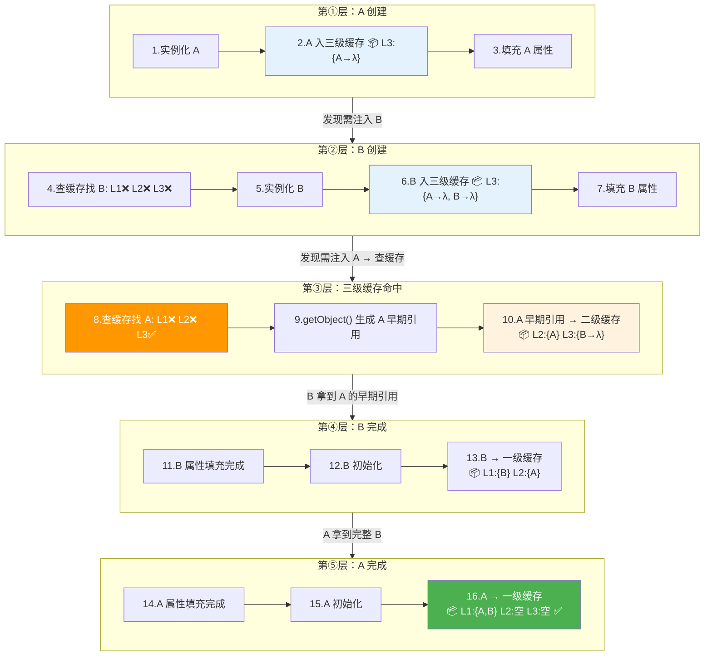

# 牛客网 Spring Boot 实战面试 100 题（上）

> 来源：牛客网面经 + 大厂高频真题 + 场景设计题
> 说明：本题库偏向**实战与场景**，每题均为真实面试出现过的题目
> 本篇涵盖：第 1-29 题（基础原理、自动配置、IoC 容器）

---

## 一、Spring Boot 基础与核心原理（13 题）

### 1. Spring Boot 相比传统 Spring 框架做了什么改进？为什么现在大家都在用？

> **一句话总结：** Spring 是"提供能力"的基础框架（IoC/AOP），Spring Boot 是"帮你把 Spring 用起来"的脚手架。
>
> **第一，内嵌 Tomcat**，开箱即用，无需部署外部容器。
>
> **第二，Starter 机制**，一键集成，把某个功能的 Maven 依赖统一管理好。
>
> **第三，约定优于配置**，Spring Boot 对很多组件都有默认配置，当用户偏离这些默认值时，再添加自己的配置即可。

### 2. `@SpringBootApplication` 注解内部由哪几个注解构成？各自负责什么？

> **① `@SpringBootConfiguration`** — 本质就是 `@Configuration`，标记当前类是 Spring 的配置类，会被注册到 IoC 容器中。
>
> **② `@EnableAutoConfiguration`** —`META-INF/spring/org.springframework.boot.autoconfigure.AutoConfiguration.imports` 文件中读取所有候选的自动配置类 ，然后按需加载默认配置 。
>
> **③ `@ComponentScan`** —  扫描指定包下`@Component`、`@Service`、`@Repository`、`@Controller` 等注解的类，将它们注册为 Bean。
>
> > **追问预警：** "那我想扫描别的包怎么办？" → 用 `@SpringBootApplication(scanBasePackages = "com.xxx")` 或在启动类上额外加 `@ComponentScan("com.xxx")` 指定扫描路径。

### 4. Spring Boot 的启动流程是怎样的？`SpringApplication.run()` 内部做了哪些关键步骤？

> 一句话概括：**推断应用类型 → 加载扩展 → 准备环境 → 创建容器 → `refresh()`（自动配置生效 + Bean 实例化）→ 回调 Runner。**

| 步骤 | 干了啥 | 一句话理解 |
|---|---|---|
| **① 推断应用类型** | 看 classpath 有没有 Tomcat / Reactive 相关类，判断是 Servlet Web、Reactive Web 还是普通应用 | 决定后面建哪种容器 |
| **② 加载扩展** | 通过 `spring.factories` 反射加载三类钩子：`ApplicationContextInitializer`、`ApplicationListener`、`SpringApplicationRunListener` | 开工前把"插手点"备好（个人开发基本用不到，**测试**和 **Nacos/Apollo** 等第三方框架才用） |
| **③ 准备环境** | 建一个 `Environment` 配置池，把命令行参数、JVM 参数(`-D`)、系统环境变量、`application.yml` 全收集进去 | 把"配置池"灌满，后续 Bean 取配置才有得取 |
| **④ 创建容器** | 按应用类型 `new` 出对应的 `ApplicationContext` | 造一个空容器 |
| **⑤ `refresh()`（最核心）** | 加载 BeanDefinition → 自动配置生效（读 `AutoConfiguration.imports`）→ 实例化 Bean → 依赖注入 → 生命周期回调，并启动内嵌 Tomcat | Spring 的灵魂，真正"造 Bean"的地方 |
| **⑥ 回调 Runner** | 容器就绪后执行 `ApplicationRunner` / `CommandLineRunner` | 给开发者"启动完了干点活"的入口（如预热缓存） |

> **记忆重点：** ①②③④ 都是**搭台**，**⑤ `refresh()` 才是唱戏** —— Bean 创建、注入、自动配置全在这一步。外面包的那圈是 Spring Boot 加的壳，`refresh()` 是 Spring 本身的灵魂。

### 6. `CommandLineRunner` 和 `ApplicationRunner` 的区别是什么？你在项目中用过吗？

> **相同点：** 执行时机一样。
>
> **区别：参数类型不同。** 假设命令行为 `java -jar app.jar --name=张三 hello 123`：
>
> | | CommandLineRunner | ApplicationRunner |
> |---|---|---|
> | **收到的参数** | `String... args`（原始字符串数组） | `ApplicationArguments`（已解析好的对象） |
> | **实际拿到什么** | `["--name=张三", "hello", "123"]` | 选项参数和非选项参数已分好 |
> | **取 `--name` 的值** | 自己截字符串：`args[0].split("=")[1]` | 直接调：`args.getOptionValues("name")` → `["张三"]` |
> | **取非 `--` 参数** | 自己判断哪些没 `--` 前缀 | 直接调：`args.getNonOptionArgs()` → `["hello", "123"]` |
>
> ```java
> // CommandLineRunner —— 不关心参数，启动后跑一段逻辑
> @Component
> public class CacheWarmRunner implements CommandLineRunner {
>     @Override
>     public void run(String... args) throws Exception {
>         cacheManager.preload(); // 预热缓存
>     }
> }
>
> // ApplicationRunner —— 需要用命令行参数
> @Component
> public class StartupCheckRunner implements ApplicationRunner {
>     @Override
>     public void run(ApplicationArguments args) throws Exception {
>         if (args.containsOption("env")) {
>             String env = args.getOptionValues("env").get(0);
>             if ("prod".equals(env)) healthChecker.checkAll();
>         }
>     }
> }
>

> ```

### 7. Spring Boot 有几种注入 Bean 的方式？各有什么优缺点？

> 三种方式：**构造器注入、Setter 注入、字段注入（`@Autowired` 打在字段上）**。
>
> ```java
> // ① 构造器注入（推荐）——单构造器时 @Autowired 可省略
> @Component
> public class OrderService {
>     private final UserService userService;
>     private final PayService payService;
>
>     public OrderService(UserService userService, PayService payService) {
>         this.userService = userService;
>         this.payService = payService;
>     }
> }
>
> // ② Setter 注入
> @Component
> public class OrderService {
>     private UserService userService;
>
>     @Autowired
>     public void setUserService(UserService userService) {
>         this.userService = userService;
>     }
> }
>
> // ③ 字段注入（不推荐）
> @Component
> public class OrderService {
>     @Autowired
>     private UserService userService;
> }
> ```
>
> | | 构造器注入 | Setter 注入 | 字段注入 |
> |---|---|---|---|
> | **能否 `final`** | ✅ 可以，保证不可变 | ❌ 不行 | ❌ 不行 |
> | **空指针安全** | ✅ 创建完就有值 | ⚠️ 可能没调 setter | ⚠️ 可能没注入 |
> | **循环依赖** | ❌ 直接报错（好事，早暴露问题） | ✅ 能解决 | ✅ 能解决 |
> | **可测试性** | ✅ new 时直接传 mock | ✅ 调 setter 传 mock | ❌ 要用反射才能测 |
> | **Spring 推荐** | ✅ 官方推荐 | 可选依赖时用 | 不推荐 |
>
> **结论：构造器注入是首选**——不可变（`final`）、不空、好单元测试、循环依赖早发现。字段注入最简单但问题最多：不能 `final`、不好测试、隐藏依赖关系。

### 8. Spring Boot 中 `@ConfigurationProperties` 和 `@Value` 的区别是什么？什么时候用哪个？

> ```java
> // @Value —— 一个一个取
> @Component
> public class RedisConfig {
>     @Value("${spring.redis.host}")
>     private String host;
>
>     @Value("${spring.redis.port}")
>     private int port;
>
>     @Value("${spring.redis.password:}")  // 默认空字符串
>     private String password;
> }
>
> // @ConfigurationProperties —— 按 prefix 批量绑定
> @Component
> @ConfigurationProperties(prefix = "spring.redis")
> public class RedisProperties {
>     private String host;      // 自动绑定 spring.redis.host
>     private int port;         // 自动绑定 spring.redis.port
>     private String password;  // 自动绑定 spring.redis.password
>     // getter/setter
> }
> ```
>
> | | `@Value` | `@ConfigurationProperties` |
> |---|---|---|
> | **绑定方式** | 一个字段一个注解 | 按 prefix 批量绑定 |
> | **松散绑定** | ❌ 必须精确匹配 key | ✅ `redis-host` 能绑定到 `redisHost` |
> | **SpEL 表达式** | ✅ 支持 `#{@beanName.method()}` | ❌ 不支持 |
> | **配置校验** | ❌ 不支持 | ✅ 配合 `@Validated` + JSR 303 校验 |
> | **动态刷新** | ❌ 启动后改了不生效 | ✅ 配合 `@RefreshScope` 可动态刷新 |
> | **复杂对象** | ❌ List、Map 写法很丑 | ✅ 直接绑定嵌套对象 |
> | **适合场景** | 取 1-2 个零散值 | 一组相关配置统一管理 |
>
> **怎么选：零散取值用 `@Value`，批量绑定用 `@ConfigurationProperties`。** Spring Boot 官方 Starter 用的全是 `@ConfigurationProperties`（如 `RedisProperties`、`DataSourceProperties`），因为支持松散绑定和校验，更规范。

### 9. Spring Boot 支持哪些配置文件格式？`.properties` 和 `.yml` 加载优先级是怎样的？

> Spring Boot 支持 `.properties` 和 `.yml`（`.yaml` 和 `.yml` 等同）两种格式。
>
> **优先级：`.properties` > `.yml`。** 两个文件同时存在且 key 相同时，`.properties` 的值生效。
>

### 10. Spring Boot 多环境配置怎么实现？你在项目中怎么切换 dev / test / prod 环境？

> **传统方式（纯 Spring Boot）：** 用 `application-{profile}.yml` 按环境拆配置文件。
>
> ```text
> application.yml           ← 公共配置
> application-dev.yml       ← 开发环境
> application-test.yml      ← 测试环境
> application-prod.yml      ← 生产环境
> ```
>
> ```yaml
> # application.yml 里指定激活哪个环境
> spring:
>   profiles:
>     active: dev
> ```
>
> 启动时也可以覆盖：`java -jar app.jar --spring.profiles.active=prod`
>
> ---
>
> **项目实际方式（Nacos）：** 配置放 Nacos 服务端，本地只配 Nacos 地址和 profile，不同环境用 namespace 隔离。
>

## 二、自动配置与 Starter 机制（8 题）

### 14. Spring Boot 的自动装配原理是什么？从 `@EnableAutoConfiguration` 到最终加载配置类的完整链路是怎样的？

> 一句话：**注解触发 → 读配置文件 → 加载候选类 → 条件过滤 → 注册 Bean。**
>
> **① 入口：`@EnableAutoConfiguration`**
>
> ```java
> @SpringBootApplication
>     ├── @SpringBootConfiguration
>     ├── @EnableAutoConfiguration    // ← 自动装配入口
>     └── @ComponentScan
>
> // @EnableAutoConfiguration 内部
> @AutoConfigurationPackage
> @Import(AutoConfigurationImportSelector.class)  // ← 关键
> public @interface EnableAutoConfiguration { }
> ```
>
> **② 读配置文件：`AutoConfigurationImportSelector`**
>
> 从所有 jar 包中读取候选自动配置类（可能有 100+ 个）：
>
> ```properties
> # Spring Boot 2.x：META-INF/spring.factories（key-value 格式）
> org.springframework.boot.autoconfigure.EnableAutoConfiguration=\
>   org.springframework.boot.autoconfigure.web.servlet.WebMvcAutoConfiguration,\
>   org.springframework.boot.autoconfigure.data.redis.RedisAutoConfiguration,\
>   ...
>
> # Spring Boot 3.x：META-INF/spring/...AutoConfiguration.imports（每行一个类名）
> org.springframework.boot.autoconfigure.web.servlet.WebMvcAutoConfiguration
> org.springframework.boot.autoconfigure.data.redis.RedisAutoConfiguration
> ```
>
> **③ 条件过滤（核心）：** 不是读出来就全部加载，要过三层过滤：
>
> ```java
> // 过滤一：@ConditionalOnClass —— classpath 里有没有这个类
> @ConditionalOnClass(DataSource.class)   // 没引入数据库依赖 → 不加载
> public class DataSourceAutoConfiguration { }
>
> // 过滤二：@ConditionalOnMissingBean —— 容器里有没有这个 Bean
> @ConditionalOnMissingBean
> @Bean
> public DataSource dataSource() { }      // 用户自己定义了 → 不加载
>
> // 过滤三：@ConditionalOnProperty —— 配置开关
> @ConditionalOnProperty(prefix = "spring.redis", name = "enabled", havingValue = "true")
> public class RedisAutoConfiguration { }  // 没配或配了 false → 不加载
> ```
>
> **④ 注册 BeanDefinition：** 过滤后剩下的配置类注册到容器，在 `refresh()` 时实例化。
>
> **完整链路：**
>
> ```text
> @SpringBootApplication
>   └→ @EnableAutoConfiguration
>        └→ @Import(AutoConfigurationImportSelector)
>             └→ selectImports()
>                  └→ 读 spring.factories / AutoConfiguration.imports（100+ 个候选类）
>                       └→ @ConditionalOnClass 过滤（classpath 有没有）
>                       └→ @ConditionalOnMissingBean 过滤（用户有没有自定义）
>                       └→ @ConditionalOnProperty 过滤（配置开关）
>                            └→ 剩下的注册为 BeanDefinition → refresh() 时实例化
> ```
>
> **面试答法（四步说清楚）：** `@EnableAutoConfiguration` 触发 → `AutoConfigurationImportSelector` 读配置文件拿到候选类 → 条件注解过滤 → 剩下的注册为 Bean。

### 16. `@ConditionalOnClass`、`@ConditionalOnMissingBean`、`@ConditionalOnProperty` 这些条件注解在自动装配中怎么协作的？

> 三个注解各管一层过滤：
>
> | 注解 | 判断什么 | 什么时候生效 |
> |---|---|---|
> | **`@ConditionalOnClass`** | classpath 里有没有这个类 | 引入了对应依赖才生效 |
> | **`@ConditionalOnMissingBean`** | 容器里有没有这个 Bean | 用户没自定义才生效，避免覆盖用户的 |
> | **`@ConditionalOnProperty`** | 配置文件里某个值是什么 | 配置开关控制是否生效 |
>
> ```java
> @AutoConfiguration
> @ConditionalOnClass(RedisOperations.class)   // ① 引了 redis 依赖才往下走
> @EnableConfigurationProperties(RedisProperties.class)
> public class RedisAutoConfiguration {
>
>     @Bean
>     @ConditionalOnMissingBean(name = "redisTemplate")  // ② 用户没自定义才创建
>     public RedisTemplate<String, Object> redisTemplate(
>             RedisConnectionFactory factory) {
>         RedisTemplate<String, Object> template = new RedisTemplate<>();
>         template.setConnectionFactory(factory);
>         return template;
>     }
> }
> ```
>
> **三层过滤流程：**
>
> ```
> 100+ 个候选自动配置类
>     │
>     ▼ @ConditionalOnClass（第一道门）
>     │  没引入 spring-data-redis → RedisAutoConfiguration 淘汰
>     │  没引入 mybatis → MybatisAutoConfiguration 淘汰
>     │
>     ▼ @ConditionalOnMissingBean（第二道门）
>     │  用户自己定义了 DataSource → 自动配置的 DataSource 不创建
>     │  用户自己定义了 RedisTemplate → 自动配置的 RedisTemplate 不创建
>     │
>     ▼ @ConditionalOnProperty（第三道门）
>        配置了 enabled=false → 不加载
>        最终真正生效的配置类
> ```
>
### 17. 如何排除某个不想用的自动配置？比如不想用默认的 DataSource？

> 三种方式：
>
> ```java
> // ① @SpringBootApplication 注解上排除（最常用）
> @SpringBootApplication(exclude = {
>     DataSourceAutoConfiguration.class,
>     DataSourceTransactionManagerAutoConfiguration.class
> })
> public class MyApp { }
>
> // ② @EnableAutoConfiguration 上排除（拆开写时用）
> @EnableAutoConfiguration(exclude = {DataSourceAutoConfiguration.class})
> ```
>
> ```yaml
> # ③ 配置文件排除（不用改代码，不同环境排除不同的）
> spring:
>   autoconfigure:
>     exclude:
>       - org.springframework.boot.autoconfigure.jdbc.DataSourceAutoConfiguration
>       - org.springframework.boot.autoconfigure.jdbc.DataSourceTransactionManagerAutoConfiguration
> ```
>
>
> **实际项目中最常用第一种**。

### 18. 如果你自己封装一个公司内部的 Starter，步骤是怎样的？需要注意什么？

> **① 建两个模块（官方推荐结构）：**
>
> ```text
> xxx-spring-boot-starter           ← 空壳模块，只做依赖聚合
>   └── pom.xml（引入 autoconfigure + 第三方依赖）
>
> xxx-spring-boot-autoconfigure     ← 核心逻辑
>   ├── XxxProperties.java          ← 配置属性类
>   ├── XxxAutoConfiguration.java   ← 自动配置类
>   ├── XxxService.java             ← 核心功能
>   └── META-INF/spring/...AutoConfiguration.imports
> ```
>
> **② 核心代码：**
>
> ```java
> // 配置属性类
> @ConfigurationProperties(prefix = "xxx.sms")
> public class SmsProperties {
>     private String url;
>     private String appKey;
>     private String appSecret;
>     // getter/setter
> }
>
> // 自动配置类
> @AutoConfiguration
> @ConditionalOnClass(SmsService.class)
> @EnableConfigurationProperties(SmsProperties.class)
> public class SmsAutoConfiguration {
>
>     @Bean
>     @ConditionalOnMissingBean
>     public SmsService smsService(SmsProperties props) {
>         return new SmsService(props.getUrl(), props.getAppKey(), props.getAppSecret());
>     }
> }
> ```
>
> ```properties
> # 3.x：META-INF/spring/org.springframework.boot.autoconfigure.AutoConfiguration.imports
> com.company.sms.autoconfigure.SmsAutoConfiguration
> ```
>
> ```xml
> <!-- starter 模块只做依赖聚合 -->
> <dependencies>
>     <dependency>
>         <groupId>com.company</groupId>
>         <artifactId>xxx-spring-boot-autoconfigure</artifactId>
>     </dependency>
> </dependencies>
> ```
>
> **③ 使用方引入后配一下就能用：**
>
> ```xml
> <dependency>
>     <groupId>com.company</groupId>
>     <artifactId>xxx-spring-boot-starter</artifactId>
> </dependency>
> ```

### 19. Starter 中的自动配置类和用户自己定义的 Bean，谁的优先级更高？如果用户想覆盖 Starter 的默认 Bean 怎么做？

> **用户的 Bean 优先级更高。** Spring Boot 设计原则：用户定义的优先，自动配置的后备。
>
> 原因是自动配置类的 `@Bean` 方法都加了 `@ConditionalOnMissingBean`，容器里已有同类型 Bean 就不创建。
>
> ```java
> @AutoConfiguration
> public class RedisAutoConfiguration {
>     @Bean
>     @ConditionalOnMissingBean(name = "redisTemplate")  // 容器里没有才创建
>     public RedisTemplate<String, Object> redisTemplate() {
>         return new RedisTemplate<>();
>     }
> }
> ```
>
> **用户覆盖 Starter 默认 Bean 的三种方式：**
>
> ```java
> // 方式一：自己定义同类型 Bean（最常用）
> @Configuration
> public class MyRedisConfig {
>     @Bean
>     public RedisTemplate<String, Object> redisTemplate(RedisConnectionFactory factory) {
>         RedisTemplate<String, Object> template = new RedisTemplate<>();
>         template.setConnectionFactory(factory);
>         template.setKeySerializer(new StringRedisSerializer());
>         return template;
>     }
> }
> ```
>
> ```yaml
> # 方式二：通过配置文件覆盖属性
> spring:
>   data:
>     redis:
>       host: 192.168.1.100
> ```
>
> ```java
> // 方式三：排除整个自动配置类
> @SpringBootApplication(exclude = {RedisAutoConfiguration.class})
> ```

## 三、IoC 容器与 Bean 生命周期

### 22. IoC（控制反转）你是怎么理解的？它解决了什么问题？

> **IoC（Inversion of Control）**——对象的创建和依赖管理不由你自己 new，而是交给 Spring 容器来管。"控制"指的是对象创建和依赖关系的管理权，以前自己 new（正转），现在交给容器（反转）。
>
> **它解决了对象之间的硬耦合问题**——你只声明需要什么，Spring 负责创建和注入。换个实现改配置就行，不用改业务代码。

### 23. Spring 容器启动时，Bean 的完整生命周期是怎样的？每一步都在做什么？

> **核心四阶段：实例化 → 属性注入 → 初始化 → 销毁。**
>
> ```text
> ① 实例化（new）
>    ↓
> ② 属性注入（@Autowired、setter）
>    ↓
> ③ BeanNameAware / BeanFactoryAware / ApplicationContextAware 回调
>    ↓
> ④ BeanPostProcessor.postProcessBeforeInitialization()  ← 前置处理
>    ↓
> ⑤ @PostConstruct 方法（InitializingBean.afterPropertiesSet）  ← 初始化
>    ↓
> ⑥ init-method（自定义初始化方法）
>    ↓
> ⑦ BeanPostProcessor.postProcessAfterInitialization()  ← 后置处理（AOP 代理在这里生成）
>    ↓
> ⑧ Bean 就绪，可以使用
>    ↓
> ⑨ @PreDestroy 方法（DisposableBean.destroy）  ← 销毁
>    ↓
> ⑩ destroy-method（自定义销毁方法）
> ```
>

### 24. `BeanFactory` 和 `ApplicationContext` 的区别是什么？你平时用的是哪个？

> **`BeanFactory`** 是 Spring 最底层的容器接口，只提供最基本的 Bean 管理。**`ApplicationContext`** 是它的子接口，在基础上加了一堆高级功能。平时开发一般都用 `ApplicationContext`。
>

### 25. `@Component` 和 `@Bean` 的区别是什么？什么场景用 `@Bean`？

| 维度 | `@Component` | `@Bean` |
|------|-------------|---------|
| **作用位置** | 类上 | 方法上（必须在 `@Configuration` 类内） |
| **注册方式** | 类路径扫描（Spring 自动发现） | 手动声明，显式调用工厂方法 |
| **归属权** | 标注的类必须**你自己能改源码** | 适用于**第三方类**（改不了源码） |
| **灵活性** | 单一用途，全量扫描注册 | 可加条件判断、循环创建多个实例 |

> 一句话：**能改源码用 `@Component`，改不了或需要灵活控制用 `@Bean`**。

### 26. Bean 的作用域有哪些？`singleton`、`prototype`、`request`、`session` 分别在什么场景使用？

| 作用域 | 生命周期 |
|--------|---------|
| **singleton**（默认） | 容器内只有一个实例 |
| **prototype** | 每次 `getBean()` 都新建 |
| **request** | 每个 HTTP 请求一个（仅 Web） |
| **session** | 每个 HTTP Session 一个（仅 Web） |
| **application** | 整个 ServletContext 一个 |
| **websocket** | 每个 WebSocket 会话一个 |

### 27. 如果一个 `prototype` 作用域的 Bean 被注入到 `singleton` 的 Bean 中，会发生什么？怎么解决？

> singleton 在容器里只有一个实例，所以只会被创建一次；prototype 的特性（每次向容器获取都是新创建）就丢失了。
>
> **解决办法：**

```java
// 方案一：ObjectProvider（推荐）
@Service
public class OrderService {
    @Autowired
    private ObjectProvider<OrderContext> orderContextProvider;

    public void handle() {
        OrderContext ctx = orderContextProvider.getObject();  // 每次都是新的
    }
}

// 方案二：手动获取
@Service
public class OrderService {
    @Autowired
    private ApplicationContext ctx;

    public void handle() {
        OrderContext ctx2 = ctx.getBean(OrderContext.class);  // 每次都是新的
    }
}
```

### 28. Spring 怎么解决循环依赖的？三级缓存各自存的是什么？为什么必须是三级，两级行不行？

| 缓存级别 | 存放内容 | 说明 |
|---------|---------|------|
| **一级缓存** | 完整 Bean（可直接使用） | `singletonObjects` |
| **二级缓存** | 提前曝光的对象（属性未填充） | `earlySingletonObjects` |
| **三级缓存** | 对象工厂（可能产生 A 或 proxyA） | `singletonFactories` |



---

### 29. 构造器注入的循环依赖能解决吗？

> **不能。** 三级缓存需要先把 Bean 实例化后才能放入，而构造器注入时对象还没实例化完成（卡在构造方法等参数），没有半成品可缓存，所以无法破环。 
