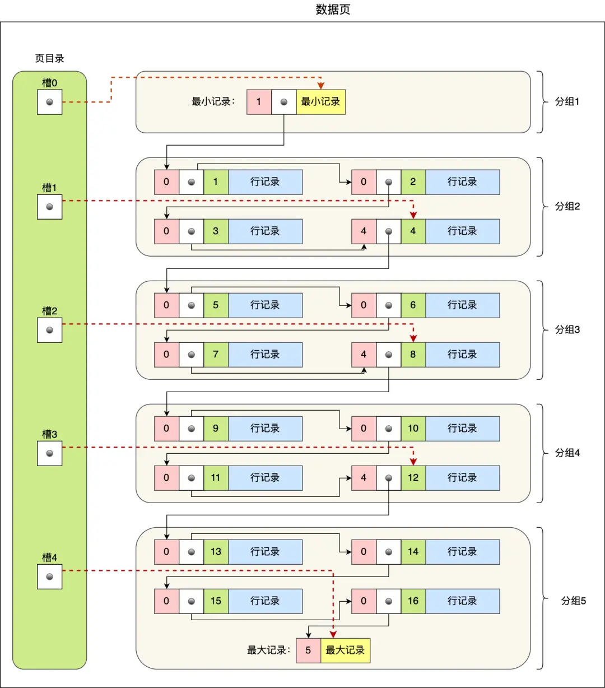
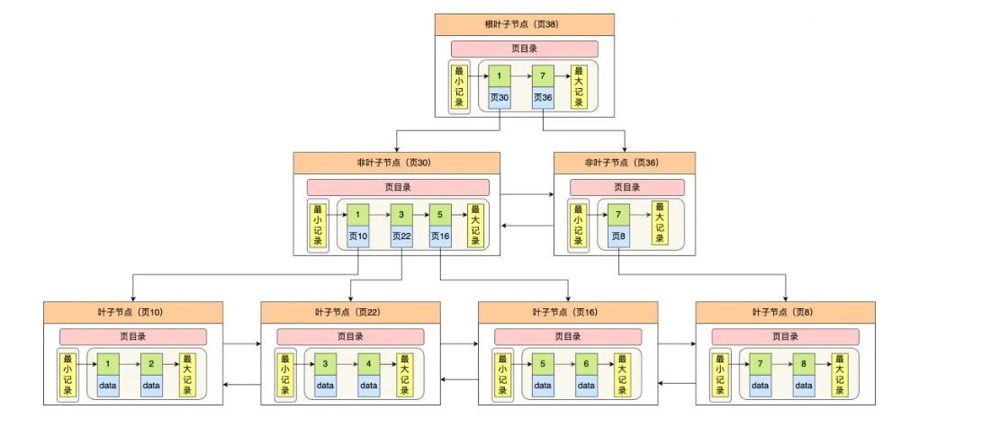

# MySQL 核心原理

---

## InnoDB 数据存储

InnoDB 的数据以**数据页**为单位读写，默认大小 **16KB**。需要读一条记录时，是将整个页读入内存，而非单条记录。

### 数据页结构

数据页之间采用**链表结构**，逻辑连续而非物理连续：

- **File Header**（文件头）：2 个指针，分别指向上一个和下一个数据页
- **User Records**（用户记录）：按主键顺序组成**单向链表**，插入/删除方便，但检索效率不高
- **Page Directory**（页目录）：起到索引作用，通过二分法快速定位记录


页目录查找过程（以 5 个槽 0~4，查找主键 11 为例）：

1. 二分 `(0+4)/2=2`，2 号槽最大记录为 8，`11 > 8` → 继续向后搜索
2. 二分 `(2+4)/2=3`，3 号槽最大记录为 12，`11 < 12` → 目标在 3 号槽
3. 通过槽 2 的记录（主键 8）找到槽 3 的最小记录 9，沿链表向下搜索 2 次定位到主键 11



---

## B+ 树索引

### 查询过程

- 只有**叶子节点**存放实际数据，非叶子节点仅存放目录项作为索引

查找主键为 6 的记录：



1. 从根节点开始，二分定位到 `[1, 7)` 范围对应的页 30
2. 在页 30（非叶子节点）中继续二分，主键 `6 > 5` → 进入叶子节点页 16
3. 在页 16 中通过槽定位记录分组，遍历组内记录找到主键 6

### B+ 树容量计算（2000W 的由来）

公式：`Total = x^(z-1) × y`

**非叶子节点每页可容纳的目录项数 x**：

- 每页 16KB，固定开销约 1KB，可用约 15KB
- 每条目录项：主键 BIGINT（8B）+ 页号（4B）= 12B
- `x = 15 × 1024 / 12 ≈ 1280`

**叶子节点每页可容纳的行数 y**（假设每行 1KB）：

- `y = 15 × 1024 / 1000 ≈ 15`

**总容量**：

| B+ 树层数 | 计算 | 总行数 |
|-----------|------|--------|
| 2 层 | 1280^1 × 15 | 19,200 |
| 3 层 | 1280^2 × 15 | **≈ 2,457 万** |

> 三层 B+ 树只需 3 次磁盘 I/O 即可定位到任意一条记录。当数据量超过 2000W 左右，B+ 树可能从 3 层增长到 4 层，每次查询多一次 I/O，性能显著下降。

### 大字段处理：垂直拆分

如果表中包含大字段（TEXT/BLOB），单页能存储的行数急剧减少，B+ 树层数增加。

**解决方案**：将大字段拆到扩展表，主表只保留核心小字段。

| 对比项 | 主表 | 扩展表 |
|--------|------|--------|
| 存储内容 | 核心小字段（ID、姓名等） | 大字段（TEXT/BLOB） |
| 页存储行数 | 高密度（每页 100+ 行） | 低密度（每页可能几行） |
| B+ 树层数 | 由主表决定关键层数 | 不影响主查询性能 |

> 查询扩展表本身也慢，但不影响主表的高频查询路径。

---

## 索引类型

### 聚簇索引 vs 二级索引

| 对比项 | 聚簇索引 | 二级索引 |
|--------|----------|----------|
| 叶子节点存放 | **完整数据行** | **主键值** |
| 查询方式 | 直接获取数据 | 需**回表**到聚簇索引获取完整数据 |
| 每张表数量 | 只能有 1 个 | 可以有多个 |

**聚簇索引的选取规则**（优先级从高到低）：

1. 有主键 → 默认使用主键
2. 无主键 → 选择第一个 NOT NULL 的唯一列
3. 都没有 → InnoDB 自动生成隐式自增 ID

### InnoDB vs MyISAM 索引结构

| 对比项 | InnoDB | MyISAM |
|--------|--------|--------|
| 叶子节点存放 | 聚簇索引存完整数据行；二级索引存主键值 | 都存**数据物理地址** |
| 主键索引 | 数据即索引 | 索引指向数据地址 |
| 非主键索引 | 存主键值，需回表 | 与主键索引结构相同，直接指向地址 |

**MyISAM 索引结构**（所有索引都存数据物理地址）：

```
主键索引(id)              二级索引(name)              数据文件
┌─────┬────────┐     ┌───────┬────────┐     ┌────────────────────┐
│ id  │ 数据地址 │     │ name  │ 数据地址 │     │ id=1,name=张三,age=25│
│  1  │ 0x7A3F  │────→│ '张三' │ 0x7A3F  │────→│ （同一份数据）        │
└─────┴────────┘     └───────┴────────┘     └────────────────────┘
```

**InnoDB 索引结构**（主键索引存完整数据，二级索引存主键值）：

```
主键索引(聚簇索引)                二级索引(name)
┌─────┬────────────────────┐     ┌───────┬──────┐
│ id  │ 完整数据行(id,name,age) │     │ name  │ 主键值 │
│  1  │ 1, 张三, 25         │     │'张三' │  1   │
└─────┴────────────────────┘     └───────┴──────┘
          ↑                           │
          │        回表：用主键值1      │
          └───────────────────────────┘
```

---

## 事务

### ACID 四大特性

InnoDB 引擎支持事务，MyISAM 不支持。

| 特性 | 说明 | 实现机制 |
|------|------|----------|
| **原子性**（Atomicity） | 事务中的操作要么全部完成，要么全部不完成 | **undo log**（回滚日志） |
| **一致性**（Consistency） | 操作前后数据满足完整性约束 | 原子性 + 隔离性 + 持久性共同保证 |
| **隔离性**（Isolation） | 并发事务之间互不干扰 | **MVCC** 或**锁机制** |
| **持久性**（Durability） | 事务提交后修改永久生效，即使系统故障也不丢失 | **redo log**（重做日志） |

### 并发事务问题

| 问题 | 描述 |
|------|------|
| **脏读** | 事务 A 读到了事务 B **未提交**的修改数据。若 B 回滚，A 读到的就是无效数据 |
| **不可重复读** | 事务内多次读同一行数据，前后结果**不一致**（被其他已提交事务修改） |
| **幻读** | 事务内多次按条件查询，前后**记录数量不一致**（被其他已提交事务插入/删除） |

### 四种隔离级别

| 隔离级别 | 说明 | 脏读 | 不可重复读 | 幻读 |
|----------|------|------|------------|------|
| **读未提交**（READ UNCOMMITTED） | 能读到未提交事务的变更 | 有 | 有 | 有 |
| **读提交**（READ COMMITTED） | 只能读到已提交事务的变更 | 无 | 有 | 有 |
| **可重复读**（REPEATABLE READ） | 事务执行期间数据视图一致，InnoDB **默认级别** | 无 | 无 | 部分解决 |
| **串行化**（SERIALIZABLE） | 加读写锁，读写冲突时后访问事务等待 | 无 | 无 | 无 |

---

## MVCC（多版本并发控制）

全称 **Multi-Version Concurrency Control**，通过保存数据的多个版本实现读写不冲突。

### 版本链

每行数据有 2 个隐藏列：

- **trx_id**：最近修改该行的事务 ID
- **roll_pointer**：回滚指针，指向 undo log 中的上一个版本

每次修改数据时，旧版本存入 undo log，新版本的 roll_pointer 指向旧版本，形成版本链。事务回滚时沿链恢复旧数据。


### Read View

Read View 是事务在某个时刻对"哪些事务可见"的快照，包含四个关键字段：

| 字段 | 含义 |
|------|------|
| **m_ids** | 创建时所有**活跃（未提交）**事务的 ID 列表 |
| **min_trx_id** | 活跃事务中最小的 ID |
| **max_trx_id** | 创建时全局最大事务 ID + 1（下一个待分配的事务 ID） |
| **creator_trx_id** | 创建该 Read View 的事务 ID |

**可见性判断规则**（从版本链最新记录开始，沿 roll_pointer 往回找）：

| 条件 | 结果 |
|------|------|
| `trx_id < min_trx_id` | 该版本在 Read View 创建前已提交 → **可见** |
| `trx_id >= max_trx_id` | 该版本在 Read View 创建后才出现 → **不可见** |
| `min_trx_id <= trx_id < max_trx_id` 且 `trx_id ∈ m_ids` | 该事务尚未提交 → **不可见** |
| `min_trx_id <= trx_id < max_trx_id` 且 `trx_id ∉ m_ids` | 该事务已提交 → **可见** |

### 可重复读（RR）的工作原理

RR 级别下，Read View 在**事务中第一次执行 SELECT 时创建**，之后整个事务期间复用同一个 Read View。

示例（事务 A id=51，事务 B id=52）：

| 步骤 | 操作 | 事务 B 读到的余额 | 原因 |
|------|------|-------------------|------|
| 1 | B 读余额 | 100 万 | trx_id=50 < min_trx_id(51)，可见 |
| 2 | A 改余额为 200 万（未提交） | - | 新版本 trx_id=51 |
| 3 | B 再读余额 | **100 万** | trx_id=51 ∈ m_ids，不可见，沿版本链找到 trx_id=50 的版本 |
| 4 | A 提交 | - | - |
| 5 | B 再读余额 | **100 万** | 仍使用同一个 Read View，trx_id=51 仍在 m_ids 中 |

### 读提交（RC）的工作原理

RC 级别下，**每次 SELECT 都创建新的 Read View**。

同样的场景，步骤 5 中 B 会创建新的 Read View，此时 A 已提交（不在 m_ids 中），所以 B 能读到 200 万。

---

## 幻读问题

### MySQL 如何解决幻读

- **快照读**（普通 SELECT）：通过 MVCC 解决，事务期间数据视图不变
- **当前读**（SELECT ... FOR UPDATE 等）：通过 **Next-Key Lock**（记录锁 + 间隙锁）解决，锁定范围内的插入被阻塞

### 幻读仍可能出现的场景

当事务中先**快照读**（查不到记录），再**当前读**（UPDATE）时，可能触发幻读：

```sql
-- 事务 A：快照读，id=5 不存在
SELECT * FROM t_stu WHERE id = 5;  -- Empty set

-- 事务 B：插入 id=5 并提交
INSERT INTO t_stu VALUES(5, '小美', 18);
COMMIT;

-- 事务 A：UPDATE 是当前读，能修改到这条记录
UPDATE t_stu SET name = '小林coding' WHERE id = 5;  -- Rows matched: 1

-- 事务 A：再次快照读，能看到该记录了（幻读发生）
SELECT * FROM t_stu WHERE id = 5;  -- id=5, name=小林coding
```

> 原因：UPDATE 是当前读，修改后该行数据的 trx_id 变为事务 A 的 ID，再次快照读时该行对自己可见。

---

## COUNT() 原理与优化

### 各版本执行过程

**`count(字段)`**（非索引字段，效率最差）：

- InnoDB 遍历聚簇索引 → Server 层读取该字段值 → 判断是否为 NULL → 计数

**`count(主键)`**：

- 仅有聚簇索引：遍历聚簇索引 → 读取主键值 → 判断非 NULL → 计数
- 有二级索引：遍历**二级索引**（体积更小，I/O 更少）

**`count(1)`**：

- 遍历索引 → 不读取任何字段值 → 1 永远非 NULL → 计数
- 相比 `count(主键)` 省去读字段值的步骤

**`count(*)`**：

- MySQL 会将 `*` 转为 `0` 处理，等价于 `count(0)`，进一步等价于 `count(1)`
- 优先遍历二级索引

### 性能排序

```
count(*) ≈ count(1) > count(主键) > count(非索引字段)
```

> `count(*)` 和 `count(1)` 性能基本一致，且是标准写法，推荐使用 `count(*)`。

### 大表 COUNT 优化

| 方案 | 说明 | 适用场景 |
|------|------|----------|
| **explain 估算** | `EXPLAIN SELECT count(*) FROM t` 中的 rows 字段是估算值，速度快 | 允许近似值的场景 |
| **额外计数表** | 维护独立计数字段，增删时同步更新 | 需要精确值的场景 |
| **Redis 缓存** | 用 Redis 维护计数 | 高并发计数场景 |
