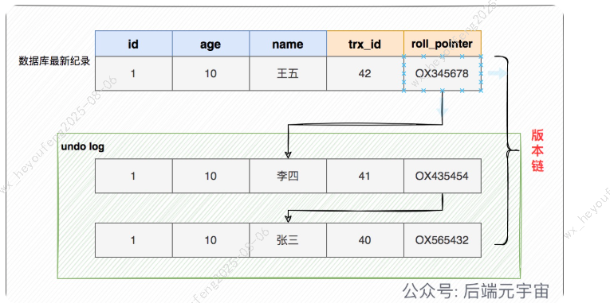
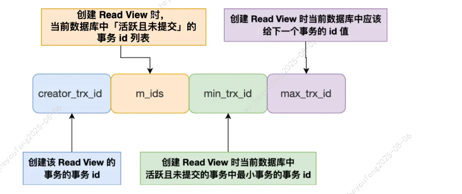

# MySQL 核心原理

---

## InnoDB 数据存储

InnoDB 的数据以**数据页**为单位读写，默认大小 **16KB**。需要读一条记录时，是将整个页读入内存，而非单条记录。

### 数据页结构

数据页之间采用**链表结构**，逻辑连续而非物理连续：

- **File Header**（文件头）：2 个指针，分别指向上一个和下一个数据页
- **User Records**（用户记录）：按主键顺序组成**单向链表**，插入/删除方便，但检索效率不高
- **Page Directory**（页目录）：起到索引作用，通过二分法快速定位记录


页目录查找过程（以 5 个槽 0~4，查找主键 11 为例）：

1. 二分 `(0+4)/2=2`，2 号槽最大记录为 8，`11 > 8` → 继续向后搜索
2. 二分 `(2+4)/2=3`，3 号槽最大记录为 12，`11 < 12` → 目标在 3 号槽
3. 通过槽 2 的记录（主键 8）找到槽 3 的最小记录 9，沿链表向下搜索 2 次定位到主键 11


---

## B+ 树索引

### 查询过程

- 只有**叶子节点**存放实际数据，非叶子节点仅存放目录项作为索引

查找主键为 6 的记录：


1. 从根节点开始，二分定位到 `[1, 7)` 范围对应的页 30
2. 在页 30（非叶子节点）中继续二分，主键 `6 > 5` → 进入叶子节点页 16
3. 在页 16 中通过槽定位记录分组，遍历组内记录找到主键 6

### B+ 树容量计算（2000W 的由来）

公式：`Total = x^(z-1) × y`

**非叶子节点每页可容纳的目录项数 x**：

- 每页 16KB，固定开销约 1KB，可用约 15KB
- 每条目录项：主键 BIGINT（8B）+ 页号（4B）= 12B
- `x = 15 × 1024 / 12 ≈ 1280`

**叶子节点每页可容纳的行数 y**（假设每行 1KB）：

- `y = 15 × 1024 / 1000 ≈ 15`

**总容量**：

| B+ 树层数 | 计算 | 总行数 |
|-----------|------|--------|
| 2 层 | 1280^1 × 15 | 19,200 |
| 3 层 | 1280^2 × 15 | **≈ 2,457 万** |

> 三层 B+ 树只需 3 次磁盘 I/O 即可定位到任意一条记录。当数据量超过 2000W 左右，B+ 树可能从 3 层增长到 4 层，每次查询多一次 I/O，性能显著下降。

### B+ 树层数与回表代价

> **3 层 B+ Tree 是经验参考值，不是硬性限制。** 绝大多数表设计合理时能控制在 3 层以内（data_length < 20GB 且单行 < 1KB），但大表到 4~5 层也是正常的。

**判断是否超过 3 层**：通过索引大小反推——索引列较窄时，200MB 以内大概率 3 层；2GB 以上大概率 4 层以上。

```sql
-- 查看各索引物理大小
SELECT index_name, stat_value * @@innodb_page_size / 1024 / 1024 AS index_mb
FROM mysql.innodb_index_stats
WHERE database_name = 'your_db' AND table_name = 'your_table' AND stat_name = 'size';
```

**二级索引层数 vs 聚簇索引层数的影响差异**：

| 场景 | 二级索引 3→4 层 | 聚簇索引 3→4 层 |
|------|----------------|----------------|
| 点查 | 多 1 次 IO | 多 1 次 IO |
| 回表 1000 条 | 多 1 次 IO | **多 1000 次 IO** |
| 回表 10W 条 | 多 1 次 IO | **多 10W 次 IO** |

- 二级索引多一层：只影响**定位起始位置**时多 1 次 IO（加法关系）
- 聚簇索引多一层：**每次回表**都多 1 次 IO（乘法关系），回表 N 条就多 N 次

> 结论：**真正的性能放大器是回表条数，不是树的高度。** 减少回表条数比控制层数更重要。

**随机 IO 是回表慢的根因**：回表时主键不连续，每次都要跳到不同的叶子页，产生大量随机 IO。HDD 上随机 IO 比顺序 IO 慢约 250 倍，SSD 上慢约 10~15 倍。

**减少回表代价的三个层次**（按优先级）：

| 手段 | 原理 | 适用场景 |
|------|------|---------|
| **联合索引优化过滤** | 把 WHERE 条件都放进索引，在二级索引上就完成过滤，减少最终回表条数 | 多条件查询 |
| **覆盖索引** | 把 SELECT 需要的列也放进索引，完全避免回表 | 查询列少且固定 |
| **延迟关联** | 先用覆盖索引查出主键，再用主键批量回表（InnoDB 会排序后批量读，减少随机 IO） | 深分页、大范围查询 |

```sql
-- 联合索引减少回表条数：5000 条 → 50 条
ALTER TABLE orders ADD INDEX idx_user_status (user_id, status);

-- 覆盖索引避免回表
SELECT id, order_no, status FROM orders WHERE user_id = 100;

-- 延迟关联：先覆盖索引拿 id，再批量回表
SELECT o.* FROM orders o
INNER JOIN (
    SELECT id FROM orders WHERE user_id = 100 AND status = 1
    ORDER BY create_time DESC LIMIT 10000
) t ON o.id = t.id;
```

### 大字段处理：垂直拆分

如果表中包含大字段（TEXT/BLOB），单页能存储的行数急剧减少，B+ 树层数增加。

**解决方案**：将大字段拆到扩展表，主表只保留核心小字段。

| 对比项 | 主表 | 扩展表 |
|--------|------|--------|
| 存储内容 | 核心小字段（ID、姓名等） | 大字段（TEXT/BLOB） |
| 页存储行数 | 高密度（每页 100+ 行） | 低密度（每页可能几行） |
| B+ 树层数 | 由主表决定关键层数 | 不影响主查询性能 |

> 查询扩展表本身也慢，但不影响主表的高频查询路径。

---

## 索引类型

### 聚簇索引 vs 二级索引

| 对比项 | 聚簇索引 | 二级索引 |
|--------|----------|----------|
| 叶子节点存放 | **完整数据行** | **主键值** |
| 查询方式 | 直接获取数据 | 需**回表**到聚簇索引获取完整数据 |
| 每张表数量 | 只能有 1 个 | 可以有多个 |

**聚簇索引的选取规则**（优先级从高到低）：

1. 有主键 → 默认使用主键
2. 无主键 → 选择第一个 NOT NULL 的唯一列
3. 都没有 → InnoDB 自动生成隐式自增 ID

### InnoDB 索引结构

```
主键索引(聚簇索引)                二级索引(name)
┌─────┬────────────────────┐     ┌───────┬──────┐
│ id  │ 完整数据行(id,name,age) │     │ name  │ 主键值 │
│  1  │ 1, 张三, 25         │     │'张三' │  1   │
└─────┴────────────────────┘     └───────┴──────┘
          ↑                           │
          │        回表：用主键值1      │
          └───────────────────────────┘
```

> InnoDB 的聚簇索引存完整数据行，二级索引存主键值需回表。早期 MyISAM 所有索引都存数据物理地址，二级索引少一次回表。但 MyISAM 没有事务、没有行锁、没有 MVCC，**MySQL 5.5 起默认引擎就是 InnoDB，8.0 已移除 MyISAM 系统表，新项目没有任何理由选 MyISAM。**

---

## 事务

### ACID 四大特性

InnoDB 引擎支持事务，MyISAM 不支持。

| 特性 | 说明 | 实现机制 |
|------|------|----------|
| **原子性**（Atomicity） | 事务中的操作要么全部完成，要么全部不完成 | **undo log**（回滚日志） |
| **一致性**（Consistency） | 操作前后数据满足完整性约束 | 原子性 + 隔离性 + 持久性共同保证 |
| **隔离性**（Isolation） | 并发事务之间互不干扰 | **MVCC** 或**锁机制** |
| **持久性**（Durability） | 事务提交后修改永久生效，即使系统故障也不丢失 | **redo log**（重做日志） |

### 并发事务问题

| 问题 | 描述 |
|------|------|
| **脏读** | 事务 A 读到了事务 B **未提交**的修改数据。若 B 回滚，A 读到的就是无效数据 |
| **不可重复读** | 事务内多次读同一行数据，前后结果**不一致**（被其他已提交事务修改） |
| **幻读** | 事务内多次按条件查询，前后**记录数量不一致**（被其他已提交事务插入/删除） |

### 四种隔离级别

| 隔离级别 | 说明 | 脏读 | 不可重复读 | 幻读 |
|----------|------|------|------------|------|
| **读未提交**（READ UNCOMMITTED） | 能读到未提交事务的变更 | 有 | 有 | 有 |
| **读提交**（READ COMMITTED） | 只能读到已提交事务的变更 | 无 | 有 | 有 |
| **可重复读**（REPEATABLE READ） | 事务执行期间数据视图一致，InnoDB **默认级别** | 无 | 无 | 部分解决 |
| **串行化**（SERIALIZABLE） | 加读写锁，读写冲突时后访问事务等待 | 无 | 无 | 无 |

---

## MVCC（多版本并发控制）

全称 **Multi-Version Concurrency Control**，通过保存数据的多个版本实现读写不冲突。

### 版本链

每行数据有 2 个隐藏列：

- **trx_id**：最近修改该行的事务 ID
- **roll_pointer**：回滚指针，指向 undo log 中的上一个版本

每次修改数据时，旧版本存入 undo log，新版本的 roll_pointer 指向旧版本，形成版本链。事务回滚时沿链恢复旧数据。



### Read View

Read View 不是数据的快照，是**事务活跃状态的快照**。它记录的是"创建那一刻，哪些事务还没提交"，不包含任何实际数据。

**作用**：事务拿着 Read View 去版本链上逐个比对 `trx_id`，找到第一个对自己可见的版本。

> 简单说：Read View 决定"你能看到谁"，版本链存"数据长什么样"，两者配合完成一次 MVCC 读。Read View 是事务级别的，不绑定表，创建一次后查所有表都用它判断可见性。

包含四个关键字段：

| 字段 | 含义 |
|------|------|
| **m_ids** | 创建时所有**活跃（未提交）**事务的 ID 列表 |
| **min_trx_id** | 活跃事务中最小的 ID |
| **max_trx_id** | 创建时全局最大事务 ID + 1（下一个待分配的事务 ID） |
| **creator_trx_id** | 创建该 Read View 的事务 ID |



**可见性判断规则**（从版本链最新记录开始，沿 roll_pointer 往回找）：

| 条件 | 结果 |
|------|------|
| `trx_id < min_trx_id` | 该版本在 Read View 创建前已提交 → **可见** |
| `trx_id >= max_trx_id` | 该版本在 Read View 创建后才出现 → **不可见** |
| `min_trx_id <= trx_id < max_trx_id` 且 `trx_id ∈ m_ids` | 该事务尚未提交 → **不可见** |
| `min_trx_id <= trx_id < max_trx_id` 且 `trx_id ∉ m_ids` | 该事务已提交 → **可见** |

### 可重复读（RR）的工作原理

RR 级别下，Read View 在**事务中第一次执行 SELECT 时创建**，之后整个事务期间复用同一个 Read View。

> **初始状态**：账户余额 100 万，由 trx 50 插入并已提交（最新版本 `trx_id=50`）

**示例**（事务 A `id=51`，事务 B `id=52`）：

**步骤 1：B 第一次读余额（创建 Read View）**

B 执行 SELECT，创建 Read View：

| 字段 | 值 | 说明 |
|------|----|------|
| m_ids | [51] | 事务 A 已开启但未提交，属于活跃事务 |
| min_trx_id | 51 | |
| max_trx_id | 53 | |
| creator_trx_id | 52 | |

B 读到最新版本 `trx_id=50`，`50 < min_trx_id(51)` → **已提交，可见** → 余额 **100 万**

**步骤 2：A 改余额为 200 万（未提交）**

A 执行 UPDATE，旧版本（100 万）进入 undo log，新版本 `trx_id=51`：

```
当前数据（trx_id=51，未提交）
 余额=200万 → roll_pointer → undo log（trx_id=50，余额=100万）
```

**步骤 3：B 再读余额（复用 Read View）**

B 复用步骤 1 的 Read View，沿版本链判断：

- 最新版本 `trx_id=51`，`51 ∈ m_ids` → **未提交，不可见**
- 沿 roll_pointer 找到 `trx_id=50`，`50 < min_trx_id(51)` → **已提交，可见**

B 读到余额 **100 万**（与步骤 1 一致，可重复读）

**步骤 4：A 提交**

事务 A 提交，`trx_id=51` 的修改永久生效。但 B 的 Read View **不会更新**。

**步骤 5：B 再读余额（仍复用 Read View）**

B 仍使用步骤 1 的 Read View（`m_ids=[51]`）：

- 最新版本 `trx_id=51`，`51 ∈ m_ids` → **不可见**（即使 A 已提交，Read View 没变）
- 沿版本链找到 `trx_id=50` → **可见**

B 读到余额 **100 万**（仍然一致）

> RR 的"可重复读"关键：整个事务期间只创建一次 Read View，不管其他事务是否提交，可见性判断条件不变。

### 读提交（RC）的工作原理

RC 级别下，**每次 SELECT 都创建新的 Read View**。

同样的场景，步骤 5 中 B 会创建新的 Read View，此时 A 已提交（不在 m_ids 中），所以 B 能读到 200 万。

---

## 快照读与当前读

### 区别

- **快照读**：读版本链上的历史版本，受 Read View 控制
- **当前读**：读数据库中**最新已提交**的数据，绕过 Read View

| 类型 | SQL | 受 Read View 控制 |
|------|-----|-------------------|
| 快照读 | 普通 `SELECT` | 是 |
| 当前读 | `SELECT ... FOR UPDATE` | 否 |
| 当前读 | `SELECT ... LOCK IN SHARE MODE` | 否 |
| 当前读 | `UPDATE` / `DELETE` / `INSERT` | 否 |

> 写操作必须是当前读。比如 UPDATE 要基于最新数据修改，否则会覆盖别人的修改。

### 完整示例

初始数据：余额 100 万（`trx_id=50`，已提交）。事务 A `id=51`，事务 B `id=52`。

| 步骤 | 事务 A | 事务 B | 说明 |
|------|--------|--------|------|
| 1 | | `SELECT balance` → **100 万** | 快照读，Read View 判断 trx_id=50 可见 |
| 2 | `UPDATE SET balance=200万` | | 当前读，基于最新数据修改 |
| 3 | `COMMIT` | | |
| 4 | | `SELECT balance` → **100 万** | 快照读，Read View 没变，仍读旧版本 |
| 5 | | `SELECT balance FOR UPDATE` → **200 万** | 当前读，直接读最新已提交数据 |

步骤 4 和 5 的区别：**同一个事务里，快照读和当前读能看到不同的数据**。

### 实际问题：先查再改，并发出错

"先快照读再当前读"是日常开发最常见的写法，也是并发问题的根源：

```java
// 扣库存：先查再改
Goods goods = mapper.selectById(1);        // 快照读，stock=10
if (goods.getStock() <= 0) throw ...;      // 判断够用
mapper.update("SET stock = stock - 1");    // 当前读，扣减
```

```
事务 A                             事务 B
────────                         ────────
快照读 stock=10，够用
                                  快照读 stock=10，够用（没加锁，B 也能读到 10）
UPDATE stock=9
                                  UPDATE stock=9  ← 应该是 8，超卖了
```

**根本原因**：第一步 SELECT 是快照读，没加锁，B 也能读到旧值。两个事务都认为库存够，都去扣。

**正确写法**：查询时就加锁

```java
Goods goods = mapper.selectByIdForUpdate(1);  // 当前读，SELECT FOR UPDATE
if (goods.getStock() <= 0) throw ...;
mapper.update("SET stock = stock - 1");
```

> **日常开发记住一条：先查再改的业务，查询时就加 `FOR UPDATE`。** 这条规则同时解决了数据不一致和幻读。

---

## 幻读问题

### 什么是幻读

幻读不是数据内容变了，而是**同一条件下查出的记录数量变了**——多了一行或少了一行。

| 对比 | 原因 | 表现 |
|------|------|------|
| **不可重复读** | 其他事务 UPDATE | 同一行数据内容变了 |
| **幻读** | 其他事务 INSERT/DELETE | 查到的行数变了 |

> 上面的超卖例子不是幻读（从头到尾只操作 id=1 这一行，行数没变），而是快照读和当前读看到不同数据导致的**数据不一致**。

### MySQL 如何解决幻读

**快照读**：天然不会幻读。Read View 创建后，新插入行的 `trx_id` 太新，对旧 Read View 不可见，查到的行数不变。

**当前读**：通过 **Next-Key Lock**（记录锁 + 间隙锁）解决。锁住查询范围内的间隙，阻止其他事务插入。

| 锁类型 | 锁什么 | 作用 |
|--------|--------|------|
| **记录锁**（Record Lock） | 索引上已有的某一行 | 防止该行被修改/删除 |
| **间隙锁**（Gap Lock） | 两行之间的间隙（不含端点） | 防止该范围内插入新行 |
| **Next-Key Lock** | 记录锁 + 间隙锁（左开右闭） | 同时防止插入和修改 |

**Next-Key Lock 示例**（`SELECT * WHERE id >= 5 FOR UPDATE`）：

```
索引记录：    3    5    7    （supremum）
                  ↑ 加锁范围

实际锁定：
  间隙锁 (3, 5)   → 不允许插入 id=4
  记录锁 id=5     → 不允许修改/删除 id=5
  间隙锁 (5, 7)   → 不允许插入 id=6
  记录锁 id=7     → 不允许修改/删除 id=7
  间隙锁 (7, +∞)  → 不允许插入 id=8, 9, 10...
```

### RR 级别下幻读仍可能发生

纯快照读不会幻读，纯当前读也不会幻读。**只有"先快照读（不加锁）→ 别人插了 → 再当前读（绕过 Read View 看到）→ 又快照读（改完的行对自己可见）"这个组合才会幻读。**

```sql
-- 步骤1：快照读，id=5 不存在（没加锁，别人可以插入）
SELECT * FROM t_stu WHERE id = 5;  -- Empty set

-- 步骤2：事务 B 插入 id=5 并提交
INSERT INTO t_stu VALUES(5, '小美', 18);
COMMIT;

-- 步骤3：UPDATE 是当前读，绕过 Read View，能改到 id=5
UPDATE t_stu SET name = '小林coding' WHERE id = 5;  -- Rows matched: 1

-- 步骤4：快照读，id=5 出现了（幻读！因为步骤3改完后 trx_id 变成自己的，对自己可见）
SELECT * FROM t_stu WHERE id = 5;  -- id=5, name=小林coding
```

**原因链**：

1. 步骤 1 是快照读，没加锁 → B 能插入
2. 步骤 3 是当前读，绕过 Read View → A 能改到
3. 改完后该行 `trx_id` 变成 A 自己的 ID → 步骤 4 对 A 可见

> **幻读在实际业务中非常少见**，需要满足：同一事务内、同一条件、先快照读发现没有、别人恰好插了、再当前读改到了。条件很苛刻。日常开发中遇到更多的是"先查再改"的数据不一致问题（如超卖），而非幻读。解法都是同一条：**先查再改的业务，查询时就加 `FOR UPDATE`。**

---

## COUNT() 原理与优化

### 核心原理

COUNT 的本质就是**遍历索引数行数**，区别只在于遍历哪个索引、要不要读字段值：

| 写法 | 遍历什么 | 读字段值 | 性能 |
|------|---------|---------|------|
| `count(*)` / `count(1)` | 优先走最小的二级索引 | 不读，直接计数 | 最快 |
| `count(主键)` | 有二级索引走二级索引，否则走聚簇索引 | 读主键值后计数 | 较快 |
| `count(非索引字段)` | 只能走聚簇索引（只有它有完整数据） | 读字段值 + 判空后计数 | 最慢 |

> 性能排序：`count(*) ≈ count(1) > count(主键) > count(非索引字段)`。推荐直接用 `count(*)`。

### 大表 COUNT 优化

| 方案 | 说明 | 适用场景 |
|------|------|----------|
| **explain 估算** | `EXPLAIN SELECT count(*) FROM t` 中的 rows 字段是估算值，速度快 | 允许近似值的场景 |
| **额外计数表** | 维护独立计数字段，增删时同步更新 | 需要精确值的场景 |
| **Redis 缓存** | 用 Redis 维护计数 | 高并发计数场景 |

---

## Buffer Pool

InnoDB 的所有数据读写都**必须经过 Buffer Pool**——不存在直接读写磁盘的路径。它是 InnoDB 在内存中开辟的缓存区域，以**页（16KB）**为单位缓存数据页、索引页、Undo 页等。Buffer Pool 不关心页里存什么业务数据，只认**页号**（space_id + page_no）。

### 怎么知道该存哪些页

**被访问过的页就缓存，没人访问的页就被淘汰。** 按需加载，不预先猜测。

1. **定位页**：内部维护哈希表 `(space_id, page_no) → 内存地址`，O(1) 查找
2. **加载页**：查询时发现页不在 Buffer Pool → 从磁盘加载整个 16KB 页到内存
3. **淘汰页**：空间不够时，用**改进型 LRU**（冷热分离）淘汰最久未访问的页

```
                    Buffer Pool
  ┌──────────────────────────┬──────────────────────────┐
  │     Young 区（热数据）     │     Old 区（冷数据）       │
  │        前 5/8             │        后 3/8             │
  │  多次被访问的页            │  新加载的页先进这里         │
  │  长期驻留                 │  被再次访问才升级到 Young    │
  └──────────────────────────┴──────────────────────────┘
```

> 不用传统 LRU 的原因：全表扫描会一次性加载几万个页，传统 LRU 会把热数据全部挤掉。改进型 LRU 让新页先进 Old 区，只有被再次访问才升级到 Young 区，避免全表扫描污染热数据缓存。

Buffer Pool 够大时，前面讨论的回表随机 Io、B+ 树层数问题，大部分被内存消化了。命中率正常应 **> 99%**，建议设为物理内存的 **60%~80%**。
